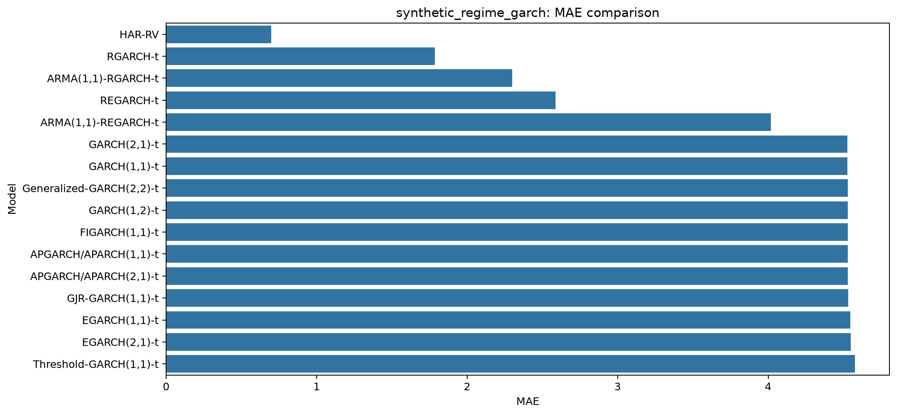
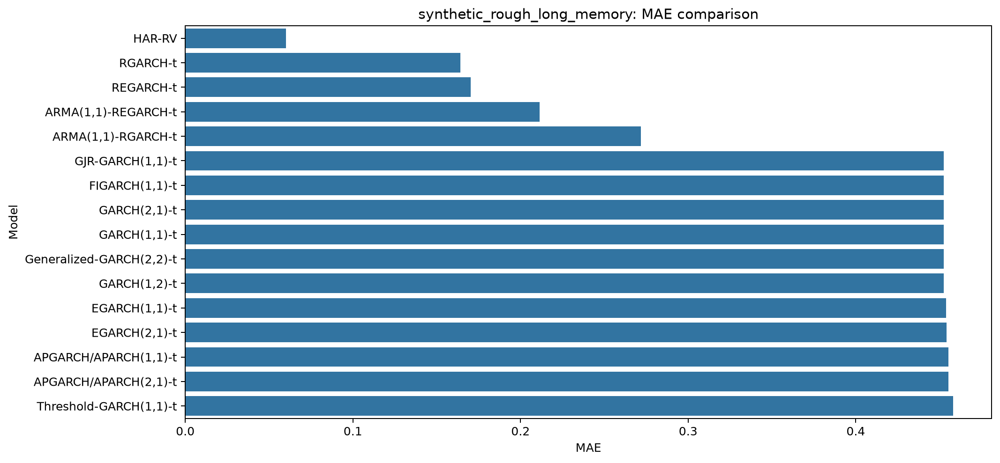
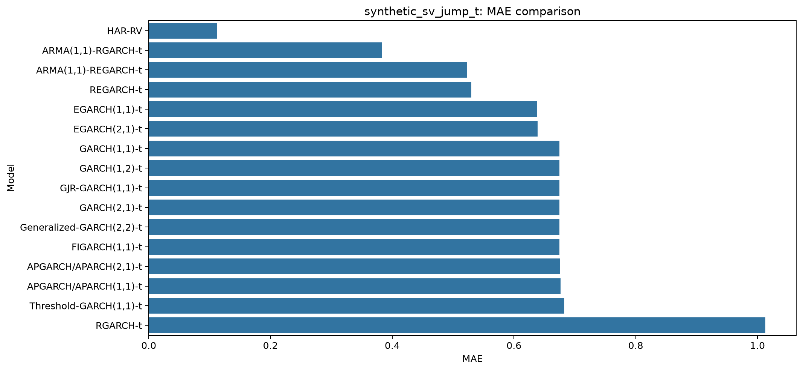

# Classical Volatility Benchmarks

Classical volatility forecasting benchmarks with realized-volatility measures, GARCH-family models, realized GARCH-based models, risk evaluation, statistical tests, visualization, and sensitivity analysis.

All tables and figures below are rendered directly in this README from the already-generated result files under `docs/results/`.

## Main Capabilities

- **Realized volatility measures**: RV, RBV, RTV, and TrueSD/proxy TrueSD.
- **Classical volatility models**: HAR-RV, GARCH, GJR-GARCH, Threshold-GARCH/TARCH, FIGARCH, EGARCH, Generalized GARCH, and APGARCH/APARCH with multiple orders.
- **Realized GARCH-based models**: RGARCH, ARMA-RGARCH, REGARCH, and ARMA-REGARCH under standardized Student's t innovations.
- **Risk metrics**: VaR, ES, CRPS, and coverage probability.
- **Statistical tests**: Kupiec unconditional coverage, Christoffersen independence/conditional coverage, Diebold-Mariano, and Ljung-Box tests.
- **Synthetic datasets**: Three high-variation complex synthetic data generators.
- **Visualization suite**: Forecast plots, risk plots, heatmaps, rank plots, and sensitivity plots using matplotlib and seaborn.

## Installation

```bash
git clone https://github.com/statsdl/classical-volatility-benchmarks.git
cd classical-volatility-benchmarks
python3 -m venv .venv
source .venv/bin/activate
python -m pip install --upgrade pip
python -m pip install -e ".[dev]"
```

## Results

<details open>
<summary><strong>Forecast accuracy results</strong></summary>

| Dataset                     | Model                    |      RMSE |       MAE |     MAPE |       QLIKE |
|:----------------------------|:-------------------------|----------:|----------:|---------:|------------:|
| synthetic_regime_garch      | HAR-RV                   |  2.51109  | 0.698847  |  21.5444 |  1.73666    |
| synthetic_regime_garch      | RGARCH-t                 |  4.88707  | 1.78458   |  30.0161 |  1.83482    |
| synthetic_regime_garch      | ARMA(1,1)-RGARCH-t       |  5.94207  | 2.29809   |  42.2785 |  1.97698    |
| synthetic_regime_garch      | REGARCH-t                |  8.20001  | 2.58798   |  33.7826 |  1.86766    |
| synthetic_regime_garch      | ARMA(1,1)-REGARCH-t      |  9.92605  | 4.0174    |  74.5482 |  3.71988    |
| synthetic_regime_garch      | GARCH(2,1)-t             | 10.9129   | 4.52789   |  94.236  | 16.569      |
| synthetic_regime_garch      | GARCH(1,1)-t             | 10.9129   | 4.52789   |  94.236  | 16.5691     |
| synthetic_regime_garch      | APGARCH/APARCH(1,1)-t    | 10.9133   | 4.52928   |  94.2223 | 16.5918     |
| synthetic_regime_garch      | APGARCH/APARCH(2,1)-t    | 10.9133   | 4.52929   |  94.2225 | 16.5925     |
| synthetic_regime_garch      | Generalized-GARCH(2,2)-t | 10.9187   | 4.52825   |  94.2198 | 16.5869     |
| synthetic_regime_garch      | GARCH(1,2)-t             | 10.9187   | 4.52825   |  94.22   | 16.5873     |
| synthetic_regime_garch      | GJR-GARCH(1,1)-t         | 10.9232   | 4.53291   |  94.2554 | 16.7295     |
| synthetic_regime_garch      | FIGARCH(1,1)-t           | 10.9516   | 4.52896   |  93.6167 | 15.6965     |
| synthetic_regime_garch      | EGARCH(1,1)-t            | 10.9813   | 4.54505   |  93.9612 | 16.263      |
| synthetic_regime_garch      | EGARCH(2,1)-t            | 10.9996   | 4.54863   |  93.9656 | 16.3458     |
| synthetic_regime_garch      | Threshold-GARCH(1,1)-t   | 11.0698   | 4.5777    |  94.0603 | 17.9044     |
| synthetic_rough_long_memory | HAR-RV                   |  0.134657 | 0.0600353 |  18.2959 | -0.132605   |
| synthetic_rough_long_memory | RGARCH-t                 |  0.230587 | 0.164172  |  41.7544 |  0.112023   |
| synthetic_rough_long_memory | ARMA(1,1)-REGARCH-t      |  0.294599 | 0.211287  |  85.1342 |  0.0121891  |
| synthetic_rough_long_memory | REGARCH-t                |  0.336917 | 0.170413  |  31.1699 | -0.0492103  |
| synthetic_rough_long_memory | ARMA(1,1)-RGARCH-t       |  0.452622 | 0.271673  |  44.3142 |  0.23292    |
| synthetic_rough_long_memory | GJR-GARCH(1,1)-t         |  0.64356  | 0.452396  |  94.2647 | 15.0848     |
| synthetic_rough_long_memory | FIGARCH(1,1)-t           |  0.643736 | 0.452451  |  94.2615 | 15.0761     |
| synthetic_rough_long_memory | GARCH(2,1)-t             |  0.64374  | 0.452461  |  94.2669 | 15.091      |
| synthetic_rough_long_memory | GARCH(1,1)-t             |  0.64374  | 0.452461  |  94.267  | 15.0913     |
| synthetic_rough_long_memory | Generalized-GARCH(2,2)-t |  0.643818 | 0.452472  |  94.2633 | 15.156      |
| synthetic_rough_long_memory | GARCH(1,2)-t             |  0.643818 | 0.452472  |  94.2633 | 15.1561     |
| synthetic_rough_long_memory | EGARCH(1,1)-t            |  0.648203 | 0.453977  |  94.2149 | 15.5162     |
| synthetic_rough_long_memory | APGARCH/APARCH(1,1)-t    |  0.648392 | 0.455163  |  94.6695 | 16.774      |
| synthetic_rough_long_memory | APGARCH/APARCH(2,1)-t    |  0.648394 | 0.455164  |  94.6696 | 16.7745     |
| synthetic_rough_long_memory | EGARCH(2,1)-t            |  0.648409 | 0.45403   |  94.2131 | 15.8565     |
| synthetic_rough_long_memory | Threshold-GARCH(1,1)-t   |  0.654706 | 0.458151  |  94.8372 | 18.9988     |
| synthetic_sv_jump_t         | HAR-RV                   |  0.224329 | 0.111652  |  25.5385 |  1.5869e+09 |
| synthetic_sv_jump_t         | ARMA(1,1)-RGARCH-t       |  0.666498 | 0.382449  |  64.9991 |  0.656789   |
| synthetic_sv_jump_t         | ARMA(1,1)-REGARCH-t      |  0.760162 | 0.522579  |  54.001  |  1.18514    |
| synthetic_sv_jump_t         | REGARCH-t                |  0.774511 | 0.530102  |  53.8044 |  1.23711    |
| synthetic_sv_jump_t         | EGARCH(1,1)-t            |  0.865222 | 0.637449  |  89.0694 | 11.6351     |
| synthetic_sv_jump_t         | EGARCH(2,1)-t            |  0.866414 | 0.638719  |  89.2629 | 12.0569     |
| synthetic_sv_jump_t         | GARCH(1,1)-t             |  0.909622 | 0.67454   |  94.9097 | 25.5026     |
| synthetic_sv_jump_t         | GARCH(1,2)-t             |  0.909622 | 0.67454   |  94.9098 | 25.5023     |
| synthetic_sv_jump_t         | GJR-GARCH(1,1)-t         |  0.909641 | 0.674601  |  94.918  | 25.6586     |
| synthetic_sv_jump_t         | GARCH(2,1)-t             |  0.909659 | 0.674602  |  94.9298 | 26.5658     |
| synthetic_sv_jump_t         | Generalized-GARCH(2,2)-t |  0.909701 | 0.67461   |  94.9293 | 26.1751     |
| synthetic_sv_jump_t         | FIGARCH(1,1)-t           |  0.909911 | 0.674676  |  94.8943 | 25.7879     |
| synthetic_sv_jump_t         | APGARCH/APARCH(2,1)-t    |  0.911645 | 0.6761    |  95.0833 | 28.3221     |
| synthetic_sv_jump_t         | APGARCH/APARCH(1,1)-t    |  0.91231  | 0.676532  |  95.1211 | 27.3088     |
| synthetic_sv_jump_t         | Threshold-GARCH(1,1)-t   |  0.922262 | 0.682934  |  95.4264 | 34.981      |
| synthetic_sv_jump_t         | RGARCH-t                 |  1.74055  | 1.01312   | 117.952  |  0.518464   |

</details>


<details open>
<summary><strong>Risk metric results</strong></summary>

| Dataset                     | Model                    |      CRPS |       CovP |   N |
|:----------------------------|:-------------------------|----------:|-----------:|----:|
| synthetic_regime_garch      | EGARCH(2,1)-t            | 0.184984  | 0.0365079  | 630 |
| synthetic_regime_garch      | Generalized-GARCH(2,2)-t | 0.185124  | 0.047619   | 630 |
| synthetic_regime_garch      | GARCH(1,2)-t             | 0.185124  | 0.047619   | 630 |
| synthetic_regime_garch      | Threshold-GARCH(1,1)-t   | 0.185766  | 0.047619   | 630 |
| synthetic_regime_garch      | EGARCH(1,1)-t            | 0.186207  | 0.0444444  | 630 |
| synthetic_regime_garch      | FIGARCH(1,1)-t           | 0.186229  | 0.0396825  | 630 |
| synthetic_regime_garch      | GJR-GARCH(1,1)-t         | 0.186529  | 0.052381   | 630 |
| synthetic_regime_garch      | APGARCH/APARCH(1,1)-t    | 0.186616  | 0.052381   | 630 |
| synthetic_regime_garch      | APGARCH/APARCH(2,1)-t    | 0.186616  | 0.052381   | 630 |
| synthetic_regime_garch      | GARCH(2,1)-t             | 0.186798  | 0.052381   | 630 |
| synthetic_regime_garch      | GARCH(1,1)-t             | 0.186798  | 0.052381   | 630 |
| synthetic_regime_garch      | ARMA(1,1)-REGARCH-t      | 0.258612  | 0.00459418 | 653 |
| synthetic_regime_garch      | ARMA(1,1)-RGARCH-t       | 0.350461  | 0.00153139 | 653 |
| synthetic_regime_garch      | RGARCH-t                 | 0.38001   | 0.00153139 | 653 |
| synthetic_regime_garch      | REGARCH-t                | 0.392032  | 0          | 653 |
| synthetic_regime_garch      | HAR-RV                   | 0.45057   | 0          | 653 |
| synthetic_rough_long_memory | EGARCH(2,1)-t            | 0.0697361 | 0.0349206  | 630 |
| synthetic_rough_long_memory | GARCH(1,2)-t             | 0.070684  | 0.0396825  | 630 |
| synthetic_rough_long_memory | Generalized-GARCH(2,2)-t | 0.0706841 | 0.0396825  | 630 |
| synthetic_rough_long_memory | Threshold-GARCH(1,1)-t   | 0.0709418 | 0.047619   | 630 |
| synthetic_rough_long_memory | APGARCH/APARCH(1,1)-t    | 0.0709817 | 0.0460317  | 630 |
| synthetic_rough_long_memory | APGARCH/APARCH(2,1)-t    | 0.0709817 | 0.0460317  | 630 |
| synthetic_rough_long_memory | EGARCH(1,1)-t            | 0.0711139 | 0.0380952  | 630 |
| synthetic_rough_long_memory | GJR-GARCH(1,1)-t         | 0.0712148 | 0.0412698  | 630 |
| synthetic_rough_long_memory | GARCH(1,1)-t             | 0.0712167 | 0.0412698  | 630 |
| synthetic_rough_long_memory | GARCH(2,1)-t             | 0.0712168 | 0.0412698  | 630 |
| synthetic_rough_long_memory | FIGARCH(1,1)-t           | 0.0712214 | 0.0412698  | 630 |
| synthetic_rough_long_memory | ARMA(1,1)-RGARCH-t       | 0.1171    | 0          | 653 |
| synthetic_rough_long_memory | RGARCH-t                 | 0.131691  | 0          | 653 |
| synthetic_rough_long_memory | REGARCH-t                | 0.14236   | 0          | 653 |
| synthetic_rough_long_memory | HAR-RV                   | 0.159759  | 0          | 653 |
| synthetic_rough_long_memory | ARMA(1,1)-REGARCH-t      | 0.177563  | 0          | 653 |
| synthetic_sv_jump_t         | Threshold-GARCH(1,1)-t   | 0.0801827 | 0.106349   | 630 |
| synthetic_sv_jump_t         | APGARCH/APARCH(1,1)-t    | 0.0806959 | 0.0984127  | 630 |
| synthetic_sv_jump_t         | GARCH(1,1)-t             | 0.0808445 | 0.0936508  | 630 |
| synthetic_sv_jump_t         | GARCH(1,2)-t             | 0.0808446 | 0.0936508  | 630 |
| synthetic_sv_jump_t         | GJR-GARCH(1,1)-t         | 0.0808518 | 0.0936508  | 630 |
| synthetic_sv_jump_t         | FIGARCH(1,1)-t           | 0.0810845 | 0.0936508  | 630 |
| synthetic_sv_jump_t         | GARCH(2,1)-t             | 0.0818514 | 0.0968254  | 630 |
| synthetic_sv_jump_t         | APGARCH/APARCH(2,1)-t    | 0.0819408 | 0.106349   | 630 |
| synthetic_sv_jump_t         | Generalized-GARCH(2,2)-t | 0.0819543 | 0.101587   | 630 |
| synthetic_sv_jump_t         | EGARCH(1,1)-t            | 0.0854751 | 0.0285714  | 630 |
| synthetic_sv_jump_t         | EGARCH(2,1)-t            | 0.0861984 | 0.0349206  | 630 |
| synthetic_sv_jump_t         | REGARCH-t                | 0.130377  | 0.00918836 | 653 |
| synthetic_sv_jump_t         | ARMA(1,1)-REGARCH-t      | 0.130867  | 0.00918836 | 653 |
| synthetic_sv_jump_t         | HAR-RV                   | 0.195447  | 0.0122511  | 653 |
| synthetic_sv_jump_t         | ARMA(1,1)-RGARCH-t       | 0.206579  | 0.00918836 | 653 |
| synthetic_sv_jump_t         | RGARCH-t                 | 0.260381  | 0.00612557 | 653 |

</details>


<details open>
<summary><strong>Statistical test results</strong></summary>

| Dataset                     | Model                    |   Kupiec_pvalue |   Christoffersen_pvalue |   DM_stat |   DM_pvalue |
|:----------------------------|:-------------------------|----------------:|------------------------:|----------:|------------:|
| synthetic_regime_garch      | HAR-RV                   |     2.22045e-16 |             1           |           |             |
| synthetic_regime_garch      | GARCH(1,1)-t             |     0.785481    |             0.113234    |   5.4577  | 6.94608e-08 |
| synthetic_regime_garch      | GARCH(1,2)-t             |     0.782311    |             0.0586882   |   5.45522 | 7.03946e-08 |
| synthetic_regime_garch      | GARCH(2,1)-t             |     0.785481    |             0.113234    |   5.4577  | 6.94605e-08 |
| synthetic_regime_garch      | Generalized-GARCH(2,2)-t |     0.782311    |             0.0586882   |   5.45522 | 7.03944e-08 |
| synthetic_regime_garch      | GJR-GARCH(1,1)-t         |     0.785481    |             0.0285327   |   5.46339 | 6.73686e-08 |
| synthetic_regime_garch      | Threshold-GARCH(1,1)-t   |     0.782311    |             0.720277    |   5.47388 | 6.36702e-08 |
| synthetic_regime_garch      | EGARCH(1,1)-t            |     0.514661    |             0.15696     |   5.46851 | 6.55371e-08 |
| synthetic_regime_garch      | EGARCH(2,1)-t            |     0.103325    |             0.861022    |   5.46466 | 6.69083e-08 |
| synthetic_regime_garch      | FIGARCH(1,1)-t           |     0.218415    |             0.350206    |   5.44958 | 7.25575e-08 |
| synthetic_regime_garch      | APGARCH/APARCH(1,1)-t    |     0.785481    |             0.0285327   |   5.46275 | 6.75996e-08 |
| synthetic_regime_garch      | APGARCH/APARCH(2,1)-t    |     0.785481    |             0.0285327   |   5.46276 | 6.75985e-08 |
| synthetic_regime_garch      | RGARCH-t                 |     2.73115e-14 |             0.955798    |   4.34503 | 1.61486e-05 |
| synthetic_regime_garch      | ARMA(1,1)-RGARCH-t       |     2.73115e-14 |             0.955798    |   4.87265 | 1.38399e-06 |
| synthetic_regime_garch      | REGARCH-t                |     2.22045e-16 |             1           |   4.89126 | 1.26354e-06 |
| synthetic_regime_garch      | ARMA(1,1)-REGARCH-t      |     9.78184e-12 |             0.867733    |   5.49793 | 5.52028e-08 |
| synthetic_sv_jump_t         | HAR-RV                   |     1.37031e-07 |             2.50971e-07 |           |             |
| synthetic_sv_jump_t         | GARCH(1,1)-t             |     6.50253e-06 |             0.117177    |  16.2713  | 0           |
| synthetic_sv_jump_t         | GARCH(1,2)-t             |     6.50253e-06 |             0.117177    |  16.2713  | 0           |
| synthetic_sv_jump_t         | GARCH(2,1)-t             |     1.53257e-06 |             0.075562    |  16.2787  | 0           |
| synthetic_sv_jump_t         | Generalized-GARCH(2,2)-t |     1.54174e-07 |             0.277309    |  16.2788  | 0           |
| synthetic_sv_jump_t         | GJR-GARCH(1,1)-t         |     6.50253e-06 |             0.117177    |  16.2753  | 0           |
| synthetic_sv_jump_t         | Threshold-GARCH(1,1)-t   |     1.33544e-08 |             0.687602    |  16.3694  | 0           |
| synthetic_sv_jump_t         | EGARCH(1,1)-t            |     0.00747103  |             0.31708     |  15.713   | 0           |
| synthetic_sv_jump_t         | EGARCH(2,1)-t            |     0.0669435   |             0.217422    |  15.7734  | 0           |
| synthetic_sv_jump_t         | FIGARCH(1,1)-t           |     6.50253e-06 |             0.117177    |  16.2689  | 0           |
| synthetic_sv_jump_t         | APGARCH/APARCH(1,1)-t    |     7.24963e-07 |             0.201606    |  16.3017  | 0           |
| synthetic_sv_jump_t         | APGARCH/APARCH(2,1)-t    |     1.33544e-08 |             0.232257    |  16.3046  | 0           |
| synthetic_sv_jump_t         | RGARCH-t                 |     1.0075e-10  |             0.82414     |  10.2724  | 0           |
| synthetic_sv_jump_t         | ARMA(1,1)-RGARCH-t       |     5.23567e-09 |             0.738492    |   8.04963 | 3.9968e-15  |
| synthetic_sv_jump_t         | REGARCH-t                |     5.23567e-09 |             0.760637    |  14.8043  | 0           |
| synthetic_sv_jump_t         | ARMA(1,1)-REGARCH-t      |     5.23567e-09 |             0.760637    |  14.7976  | 0           |
| synthetic_rough_long_memory | HAR-RV                   |     2.22045e-16 |             1           |           |             |
| synthetic_rough_long_memory | GARCH(1,1)-t             |     0.300481    |             0.134236    |  10.7069  | 0           |
| synthetic_rough_long_memory | GARCH(1,2)-t             |     0.218415    |             0.150209    |  10.7005  | 0           |
| synthetic_rough_long_memory | GARCH(2,1)-t             |     0.300481    |             0.134236    |  10.7069  | 0           |
| synthetic_rough_long_memory | Generalized-GARCH(2,2)-t |     0.218415    |             0.150209    |  10.7005  | 0           |
| synthetic_rough_long_memory | GJR-GARCH(1,1)-t         |     0.300481    |             0.134236    |  10.7097  | 0           |
| synthetic_rough_long_memory | Threshold-GARCH(1,1)-t   |     0.782311    |             0.0829432   |  10.6538  | 0           |
| synthetic_rough_long_memory | EGARCH(1,1)-t            |     0.153131    |             0.167561    |  10.6528  | 0           |
| synthetic_rough_long_memory | EGARCH(2,1)-t            |     0.0669435   |             0.206602    |  10.6362  | 0           |
| synthetic_rough_long_memory | FIGARCH(1,1)-t           |     0.300481    |             0.134236    |  10.7067  | 0           |
| synthetic_rough_long_memory | APGARCH/APARCH(1,1)-t    |     0.643411    |             0.0940045   |  10.6948  | 0           |
| synthetic_rough_long_memory | APGARCH/APARCH(2,1)-t    |     0.643411    |             0.0940045   |  10.6948  | 0           |
| synthetic_rough_long_memory | RGARCH-t                 |     2.22045e-16 |             1           |   7.778   | 2.88658e-14 |
| synthetic_rough_long_memory | ARMA(1,1)-RGARCH-t       |     2.22045e-16 |             1           |   8.58311 | 0           |
| synthetic_rough_long_memory | REGARCH-t                |     2.22045e-16 |             1           |   6.56754 | 1.04577e-10 |
| synthetic_rough_long_memory | ARMA(1,1)-REGARCH-t      |     2.22045e-16 |             1           |   7.24824 | 1.19837e-12 |

</details>


<details open>
<summary><strong>Sensitivity analysis results</strong></summary>

| Dataset                     |   realized_window |   alpha |   train_fraction | Model                    |      RMSE |       MAE |        QLIKE |      CRPS |       CovP |
|:----------------------------|------------------:|--------:|-----------------:|:-------------------------|----------:|----------:|-------------:|----------:|-----------:|
| synthetic_regime_garch      |                10 |   0.01  |              0.6 | HAR-RV                   |  2.23073  | 0.611077  |  1.83205e+09 | 0.329329  | 0          |
| synthetic_regime_garch      |                10 |   0.01  |              0.6 | ARMA(1,1)-REGARCH-t      |  3.8112   | 1.03296   |  1.04825     | 0.30168   | 0          |
| synthetic_regime_garch      |                10 |   0.01  |              0.6 | REGARCH-t                |  4.58864  | 1.22803   |  1.13663     | 0.287532  | 0          |
| synthetic_regime_garch      |                10 |   0.01  |              0.6 | RGARCH-t                 |  5.04579  | 1.81686   |  1.09156     | 0.393359  | 0          |
| synthetic_regime_garch      |                10 |   0.01  |              0.6 | FIGARCH(1,1)-t           |  5.23119  | 1.86821   |  5.28468     | 0.201496  | 0          |
| synthetic_regime_garch      |                10 |   0.01  |              0.6 | GARCH(2,1)-t             |  5.23147  | 1.87437   |  6.13889     | 0.201839  | 0          |
| synthetic_regime_garch      |                10 |   0.01  |              0.6 | GARCH(1,1)-t             |  5.23147  | 1.87437   |  6.13894     | 0.201838  | 0          |
| synthetic_regime_garch      |                10 |   0.01  |              0.6 | Generalized-GARCH(2,2)-t |  5.23181  | 1.87444   |  6.15186     | 0.202134  | 0.00115607 |
| synthetic_regime_garch      |                10 |   0.01  |              0.6 | GARCH(1,2)-t             |  5.23358  | 1.87434   |  6.15796     | 0.199775  | 0          |
| synthetic_regime_garch      |                10 |   0.01  |              0.6 | GJR-GARCH(1,1)-t         |  5.2478   | 1.88073   |  6.1667      | 0.201514  | 0          |
| synthetic_regime_garch      |                10 |   0.01  |              0.6 | APGARCH/APARCH(2,1)-t    |  5.26128  | 1.88526   |  6.23379     | 0.201436  | 0          |
| synthetic_regime_garch      |                10 |   0.01  |              0.6 | APGARCH/APARCH(1,1)-t    |  5.26131  | 1.88527   |  6.23412     | 0.201436  | 0          |
| synthetic_regime_garch      |                10 |   0.01  |              0.6 | EGARCH(1,1)-t            |  5.32637  | 1.89593   |  6.00703     | 0.201447  | 0.00115607 |
| synthetic_regime_garch      |                10 |   0.01  |              0.6 | EGARCH(2,1)-t            |  5.33776  | 1.89804   |  6.04063     | 0.200405  | 0          |
| synthetic_regime_garch      |                10 |   0.01  |              0.6 | Threshold-GARCH(1,1)-t   |  5.40911  | 1.92978   |  6.91264     | 0.201346  | 0.00115607 |
| synthetic_regime_garch      |                10 |   0.01  |              0.6 | ARMA(1,1)-RGARCH-t       |  6.52191  | 2.34321   |  1.14217     | 0.414436  | 0          |
| synthetic_regime_garch      |                10 |   0.01  |              0.7 | HAR-RV                   |  2.55225  | 0.684724  |  2.44273e+09 | 0.327213  | 0          |
| synthetic_regime_garch      |                10 |   0.01  |              0.7 | ARMA(1,1)-RGARCH-t       |  3.48995  | 0.968727  |  0.985485    | 0.284427  | 0          |
| synthetic_regime_garch      |                10 |   0.01  |              0.7 | RGARCH-t                 |  3.58545  | 0.997644  |  1.00442     | 0.280574  | 0          |
| synthetic_regime_garch      |                10 |   0.01  |              0.7 | ARMA(1,1)-REGARCH-t      |  4.87987  | 1.55733   |  1.03296     | 0.321147  | 0          |
| synthetic_regime_garch      |                10 |   0.01  |              0.7 | REGARCH-t                |  5.39901  | 1.46074   |  1.1511      | 0.289201  | 0          |
| synthetic_regime_garch      |                10 |   0.01  |              0.7 | FIGARCH(1,1)-t           |  5.92149  | 2.02893   |  5.3283      | 0.198791  | 0          |
| synthetic_regime_garch      |                10 |   0.01  |              0.7 | Generalized-GARCH(2,2)-t |  5.92174  | 2.02999   |  5.86671     | 0.199514  | 0          |
| synthetic_regime_garch      |                10 |   0.01  |              0.7 | GARCH(1,1)-t             |  5.92203  | 2.02995   |  5.85869     | 0.19933   | 0          |
| synthetic_regime_garch      |                10 |   0.01  |              0.7 | GARCH(2,1)-t             |  5.92203  | 2.02995   |  5.85869     | 0.19933   | 0          |
| synthetic_regime_garch      |                10 |   0.01  |              0.7 | GARCH(1,2)-t             |  5.92827  | 2.02998   |  5.86865     | 0.197625  | 0          |
| synthetic_regime_garch      |                10 |   0.01  |              0.7 | GJR-GARCH(1,1)-t         |  5.94665  | 2.03848   |  5.91288     | 0.199051  | 0          |
| synthetic_regime_garch      |                10 |   0.01  |              0.7 | APGARCH/APARCH(2,1)-t    |  5.96627  | 2.04494   |  5.98886     | 0.198959  | 0          |
| synthetic_regime_garch      |                10 |   0.01  |              0.7 | APGARCH/APARCH(1,1)-t    |  5.96628  | 2.04494   |  5.98884     | 0.198959  | 0          |
| synthetic_regime_garch      |                10 |   0.01  |              0.7 | EGARCH(1,1)-t            |  6.04541  | 2.06196   |  5.87819     | 0.198972  | 0          |
| synthetic_regime_garch      |                10 |   0.01  |              0.7 | EGARCH(2,1)-t            |  6.05437  | 2.06362   |  5.90149     | 0.198399  | 0          |
| synthetic_regime_garch      |                10 |   0.01  |              0.7 | Threshold-GARCH(1,1)-t   |  6.13207  | 2.09422   |  6.56493     | 0.199054  | 0.00154799 |
| synthetic_regime_garch      |                10 |   0.01  |              0.8 | RGARCH-t                 |  0.249937 | 0.157859  |  0.341844    | 0.200193  | 0          |
| synthetic_regime_garch      |                10 |   0.01  |              0.8 | ARMA(1,1)-RGARCH-t       |  0.279882 | 0.188431  |  0.398781    | 0.185717  | 0          |
| synthetic_regime_garch      |                10 |   0.01  |              0.8 | REGARCH-t                |  0.2917   | 0.231849  |  0.373692    | 0.221933  | 0          |
| synthetic_regime_garch      |                10 |   0.01  |              0.8 | ARMA(1,1)-REGARCH-t      |  0.296604 | 0.193425  |  0.361481    | 0.189996  | 0          |
| synthetic_regime_garch      |                10 |   0.01  |              0.8 | HAR-RV                   |  0.303131 | 0.254098  |  0.387732    | 0.231952  | 0          |
| synthetic_regime_garch      |                10 |   0.01  |              0.8 | EGARCH(1,1)-t            |  0.637485 | 0.518705  |  4.44839     | 0.130795  | 0          |
| synthetic_regime_garch      |                10 |   0.01  |              0.8 | EGARCH(2,1)-t            |  0.638147 | 0.519121  |  4.49653     | 0.130113  | 0          |
| synthetic_regime_garch      |                10 |   0.01  |              0.8 | FIGARCH(1,1)-t           |  0.639654 | 0.5201    |  4.44032     | 0.13047   | 0          |
| synthetic_regime_garch      |                10 |   0.01  |              0.8 | GJR-GARCH(1,1)-t         |  0.641856 | 0.524067  |  4.80338     | 0.130543  | 0          |
| synthetic_regime_garch      |                10 |   0.01  |              0.8 | APGARCH/APARCH(1,1)-t    |  0.642362 | 0.524228  |  4.808       | 0.130553  | 0          |
| synthetic_regime_garch      |                10 |   0.01  |              0.8 | APGARCH/APARCH(2,1)-t    |  0.642362 | 0.524228  |  4.80801     | 0.130553  | 0          |
| synthetic_regime_garch      |                10 |   0.01  |              0.8 | Threshold-GARCH(1,1)-t   |  0.642995 | 0.520694  |  4.48287     | 0.13097   | 0.00234192 |
| synthetic_regime_garch      |                10 |   0.01  |              0.8 | GARCH(2,1)-t             |  0.643341 | 0.525085  |  4.86699     | 0.130569  | 0          |
| synthetic_regime_garch      |                10 |   0.01  |              0.8 | GARCH(1,1)-t             |  0.643341 | 0.525086  |  4.86708     | 0.130569  | 0          |
| synthetic_regime_garch      |                10 |   0.01  |              0.8 | Generalized-GARCH(2,2)-t |  0.643347 | 0.52511   |  4.87205     | 0.130672  | 0          |
| synthetic_regime_garch      |                10 |   0.01  |              0.8 | GARCH(1,2)-t             |  0.643792 | 0.525324  |  4.90647     | 0.129728  | 0          |
| synthetic_regime_garch      |                10 |   0.025 |              0.6 | HAR-RV                   |  2.23073  | 0.611077  |  1.83205e+09 | 0.329329  | 0          |
| synthetic_regime_garch      |                10 |   0.025 |              0.6 | ARMA(1,1)-REGARCH-t      |  3.8112   | 1.03296   |  1.04825     | 0.30168   | 0          |
| synthetic_regime_garch      |                10 |   0.025 |              0.6 | REGARCH-t                |  4.58864  | 1.22803   |  1.13663     | 0.287532  | 0          |
| synthetic_regime_garch      |                10 |   0.025 |              0.6 | RGARCH-t                 |  5.04579  | 1.81686   |  1.09156     | 0.393359  | 0          |
| synthetic_regime_garch      |                10 |   0.025 |              0.6 | FIGARCH(1,1)-t           |  5.23119  | 1.86821   |  5.28468     | 0.201496  | 0.00231214 |
| synthetic_regime_garch      |                10 |   0.025 |              0.6 | GARCH(2,1)-t             |  5.23147  | 1.87437   |  6.13889     | 0.201839  | 0.00346821 |
| synthetic_regime_garch      |                10 |   0.025 |              0.6 | GARCH(1,1)-t             |  5.23147  | 1.87437   |  6.13894     | 0.201838  | 0.00346821 |
| synthetic_regime_garch      |                10 |   0.025 |              0.6 | Generalized-GARCH(2,2)-t |  5.23181  | 1.87444   |  6.15186     | 0.202134  | 0.00346821 |
| synthetic_regime_garch      |                10 |   0.025 |              0.6 | GARCH(1,2)-t             |  5.23358  | 1.87434   |  6.15796     | 0.199775  | 0.00231214 |
| synthetic_regime_garch      |                10 |   0.025 |              0.6 | GJR-GARCH(1,1)-t         |  5.2478   | 1.88073   |  6.1667      | 0.201514  | 0.00231214 |
| synthetic_regime_garch      |                10 |   0.025 |              0.6 | APGARCH/APARCH(2,1)-t    |  5.26128  | 1.88526   |  6.23379     | 0.201436  | 0.00231214 |
| synthetic_regime_garch      |                10 |   0.025 |              0.6 | APGARCH/APARCH(1,1)-t    |  5.26131  | 1.88527   |  6.23412     | 0.201436  | 0.00231214 |
| synthetic_regime_garch      |                10 |   0.025 |              0.6 | EGARCH(1,1)-t            |  5.32637  | 1.89593   |  6.00703     | 0.201447  | 0.00346821 |
| synthetic_regime_garch      |                10 |   0.025 |              0.6 | EGARCH(2,1)-t            |  5.33776  | 1.89804   |  6.04063     | 0.200405  | 0.00231214 |
| synthetic_regime_garch      |                10 |   0.025 |              0.6 | Threshold-GARCH(1,1)-t   |  5.40911  | 1.92978   |  6.91264     | 0.201346  | 0.00346821 |
| synthetic_regime_garch      |                10 |   0.025 |              0.6 | ARMA(1,1)-RGARCH-t       |  6.52191  | 2.34321   |  1.14217     | 0.414436  | 0          |
| synthetic_regime_garch      |                10 |   0.025 |              0.7 | HAR-RV                   |  2.55225  | 0.684724  |  2.44273e+09 | 0.327213  | 0          |
| synthetic_regime_garch      |                10 |   0.025 |              0.7 | ARMA(1,1)-RGARCH-t       |  3.48995  | 0.968727  |  0.985485    | 0.284427  | 0          |
| synthetic_regime_garch      |                10 |   0.025 |              0.7 | RGARCH-t                 |  3.58545  | 0.997644  |  1.00442     | 0.280574  | 0          |
| synthetic_regime_garch      |                10 |   0.025 |              0.7 | ARMA(1,1)-REGARCH-t      |  4.87987  | 1.55733   |  1.03296     | 0.321147  | 0          |
| synthetic_regime_garch      |                10 |   0.025 |              0.7 | REGARCH-t                |  5.39901  | 1.46074   |  1.1511      | 0.289201  | 0          |
| synthetic_regime_garch      |                10 |   0.025 |              0.7 | FIGARCH(1,1)-t           |  5.92149  | 2.02893   |  5.3283      | 0.198791  | 0.00309598 |
| synthetic_regime_garch      |                10 |   0.025 |              0.7 | Generalized-GARCH(2,2)-t |  5.92174  | 2.02999   |  5.86671     | 0.199514  | 0.00309598 |
| synthetic_regime_garch      |                10 |   0.025 |              0.7 | GARCH(1,1)-t             |  5.92203  | 2.02995   |  5.85869     | 0.19933   | 0.00309598 |
| synthetic_regime_garch      |                10 |   0.025 |              0.7 | GARCH(2,1)-t             |  5.92203  | 2.02995   |  5.85869     | 0.19933   | 0.00309598 |
| synthetic_regime_garch      |                10 |   0.025 |              0.7 | GARCH(1,2)-t             |  5.92827  | 2.02998   |  5.86865     | 0.197625  | 0.00309598 |
| synthetic_regime_garch      |                10 |   0.025 |              0.7 | GJR-GARCH(1,1)-t         |  5.94665  | 2.03848   |  5.91288     | 0.199051  | 0.00309598 |
| synthetic_regime_garch      |                10 |   0.025 |              0.7 | APGARCH/APARCH(2,1)-t    |  5.96627  | 2.04494   |  5.98886     | 0.198959  | 0.00309598 |
| synthetic_regime_garch      |                10 |   0.025 |              0.7 | APGARCH/APARCH(1,1)-t    |  5.96628  | 2.04494   |  5.98884     | 0.198959  | 0.00309598 |
| synthetic_regime_garch      |                10 |   0.025 |              0.7 | EGARCH(1,1)-t            |  6.04541  | 2.06196   |  5.87819     | 0.198972  | 0.00309598 |
| synthetic_regime_garch      |                10 |   0.025 |              0.7 | EGARCH(2,1)-t            |  6.05437  | 2.06362   |  5.90149     | 0.198399  | 0.00309598 |
| synthetic_regime_garch      |                10 |   0.025 |              0.7 | Threshold-GARCH(1,1)-t   |  6.13207  | 2.09422   |  6.56493     | 0.199054  | 0.00309598 |
| synthetic_regime_garch      |                10 |   0.025 |              0.8 | RGARCH-t                 |  0.249937 | 0.157859  |  0.341844    | 0.200193  | 0          |
| synthetic_regime_garch      |                10 |   0.025 |              0.8 | ARMA(1,1)-RGARCH-t       |  0.279882 | 0.188431  |  0.398781    | 0.185717  | 0          |
| synthetic_regime_garch      |                10 |   0.025 |              0.8 | REGARCH-t                |  0.2917   | 0.231849  |  0.373692    | 0.221933  | 0          |
| synthetic_regime_garch      |                10 |   0.025 |              0.8 | ARMA(1,1)-REGARCH-t      |  0.296604 | 0.193425  |  0.361481    | 0.189996  | 0          |
| synthetic_regime_garch      |                10 |   0.025 |              0.8 | HAR-RV                   |  0.303131 | 0.254098  |  0.387732    | 0.231952  | 0          |
| synthetic_regime_garch      |                10 |   0.025 |              0.8 | EGARCH(1,1)-t            |  0.637485 | 0.518705  |  4.44839     | 0.130795  | 0.00234192 |
| synthetic_regime_garch      |                10 |   0.025 |              0.8 | EGARCH(2,1)-t            |  0.638147 | 0.519121  |  4.49653     | 0.130113  | 0.00234192 |
| synthetic_regime_garch      |                10 |   0.025 |              0.8 | FIGARCH(1,1)-t           |  0.639654 | 0.5201    |  4.44032     | 0.13047   | 0.00234192 |
| synthetic_regime_garch      |                10 |   0.025 |              0.8 | GJR-GARCH(1,1)-t         |  0.641856 | 0.524067  |  4.80338     | 0.130543  | 0.00234192 |
| synthetic_regime_garch      |                10 |   0.025 |              0.8 | APGARCH/APARCH(1,1)-t    |  0.642362 | 0.524228  |  4.808       | 0.130553  | 0.00234192 |
| synthetic_regime_garch      |                10 |   0.025 |              0.8 | APGARCH/APARCH(2,1)-t    |  0.642362 | 0.524228  |  4.80801     | 0.130553  | 0.00234192 |
| synthetic_regime_garch      |                10 |   0.025 |              0.8 | Threshold-GARCH(1,1)-t   |  0.642995 | 0.520694  |  4.48287     | 0.13097   | 0.00234192 |
| synthetic_regime_garch      |                10 |   0.025 |              0.8 | GARCH(2,1)-t             |  0.643341 | 0.525085  |  4.86699     | 0.130569  | 0.00234192 |
| synthetic_regime_garch      |                10 |   0.025 |              0.8 | GARCH(1,1)-t             |  0.643341 | 0.525086  |  4.86708     | 0.130569  | 0.00234192 |
| synthetic_regime_garch      |                10 |   0.025 |              0.8 | Generalized-GARCH(2,2)-t |  0.643347 | 0.52511   |  4.87205     | 0.130672  | 0.00234192 |
| synthetic_regime_garch      |                10 |   0.025 |              0.8 | GARCH(1,2)-t             |  0.643792 | 0.525324  |  4.90647     | 0.129728  | 0.00234192 |
| synthetic_regime_garch      |                10 |   0.05  |              0.6 | HAR-RV                   |  2.23073  | 0.611077  |  1.83205e+09 | 0.329329  | 0.00114155 |
| synthetic_regime_garch      |                10 |   0.05  |              0.6 | ARMA(1,1)-REGARCH-t      |  3.8112   | 1.03296   |  1.04825     | 0.30168   | 0.00114155 |
| synthetic_regime_garch      |                10 |   0.05  |              0.6 | REGARCH-t                |  4.58864  | 1.22803   |  1.13663     | 0.287532  | 0.00114155 |
| synthetic_regime_garch      |                10 |   0.05  |              0.6 | RGARCH-t                 |  5.04579  | 1.81686   |  1.09156     | 0.393359  | 0          |
| synthetic_regime_garch      |                10 |   0.05  |              0.6 | FIGARCH(1,1)-t           |  5.23119  | 1.86821   |  5.28468     | 0.201496  | 0.0508671  |
| synthetic_regime_garch      |                10 |   0.05  |              0.6 | GARCH(2,1)-t             |  5.23147  | 1.87437   |  6.13889     | 0.201839  | 0.0716763  |
| synthetic_regime_garch      |                10 |   0.05  |              0.6 | GARCH(1,1)-t             |  5.23147  | 1.87437   |  6.13894     | 0.201838  | 0.0716763  |
| synthetic_regime_garch      |                10 |   0.05  |              0.6 | Generalized-GARCH(2,2)-t |  5.23181  | 1.87444   |  6.15186     | 0.202134  | 0.0739884  |
| synthetic_regime_garch      |                10 |   0.05  |              0.6 | GARCH(1,2)-t             |  5.23358  | 1.87434   |  6.15796     | 0.199775  | 0.067052   |
| synthetic_regime_garch      |                10 |   0.05  |              0.6 | GJR-GARCH(1,1)-t         |  5.2478   | 1.88073   |  6.1667      | 0.201514  | 0.0705202  |
| synthetic_regime_garch      |                10 |   0.05  |              0.6 | APGARCH/APARCH(2,1)-t    |  5.26128  | 1.88526   |  6.23379     | 0.201436  | 0.0716763  |
| synthetic_regime_garch      |                10 |   0.05  |              0.6 | APGARCH/APARCH(1,1)-t    |  5.26131  | 1.88527   |  6.23412     | 0.201436  | 0.0716763  |
| synthetic_regime_garch      |                10 |   0.05  |              0.6 | EGARCH(1,1)-t            |  5.32637  | 1.89593   |  6.00703     | 0.201447  | 0.0543353  |
| synthetic_regime_garch      |                10 |   0.05  |              0.6 | EGARCH(2,1)-t            |  5.33776  | 1.89804   |  6.04063     | 0.200405  | 0.0531792  |
| synthetic_regime_garch      |                10 |   0.05  |              0.6 | Threshold-GARCH(1,1)-t   |  5.40911  | 1.92978   |  6.91264     | 0.201346  | 0.0624277  |
| synthetic_regime_garch      |                10 |   0.05  |              0.6 | ARMA(1,1)-RGARCH-t       |  6.52191  | 2.34321   |  1.14217     | 0.414436  | 0          |
| synthetic_regime_garch      |                10 |   0.05  |              0.7 | HAR-RV                   |  2.55225  | 0.684724  |  2.44273e+09 | 0.327213  | 0.00152207 |
| synthetic_regime_garch      |                10 |   0.05  |              0.7 | ARMA(1,1)-RGARCH-t       |  3.48995  | 0.968727  |  0.985485    | 0.284427  | 0.00304414 |
| synthetic_regime_garch      |                10 |   0.05  |              0.7 | RGARCH-t                 |  3.58545  | 0.997644  |  1.00442     | 0.280574  | 0.00304414 |
| synthetic_regime_garch      |                10 |   0.05  |              0.7 | ARMA(1,1)-REGARCH-t      |  4.87987  | 1.55733   |  1.03296     | 0.321147  | 0.00152207 |
| synthetic_regime_garch      |                10 |   0.05  |              0.7 | REGARCH-t                |  5.39901  | 1.46074   |  1.1511      | 0.289201  | 0.00152207 |
| synthetic_regime_garch      |                10 |   0.05  |              0.7 | FIGARCH(1,1)-t           |  5.92149  | 2.02893   |  5.3283      | 0.198791  | 0.0464396  |
| synthetic_regime_garch      |                10 |   0.05  |              0.7 | Generalized-GARCH(2,2)-t |  5.92174  | 2.02999   |  5.86671     | 0.199514  | 0.0634675  |
| synthetic_regime_garch      |                10 |   0.05  |              0.7 | GARCH(1,1)-t             |  5.92203  | 2.02995   |  5.85869     | 0.19933   | 0.0634675  |
| synthetic_regime_garch      |                10 |   0.05  |              0.7 | GARCH(2,1)-t             |  5.92203  | 2.02995   |  5.85869     | 0.19933   | 0.0634675  |
| synthetic_regime_garch      |                10 |   0.05  |              0.7 | GARCH(1,2)-t             |  5.92827  | 2.02998   |  5.86865     | 0.197625  | 0.0526316  |
| synthetic_regime_garch      |                10 |   0.05  |              0.7 | GJR-GARCH(1,1)-t         |  5.94665  | 2.03848   |  5.91288     | 0.199051  | 0.0603715  |
| synthetic_regime_garch      |                10 |   0.05  |              0.7 | APGARCH/APARCH(2,1)-t    |  5.96627  | 2.04494   |  5.98886     | 0.198959  | 0.0603715  |
| synthetic_regime_garch      |                10 |   0.05  |              0.7 | APGARCH/APARCH(1,1)-t    |  5.96628  | 2.04494   |  5.98884     | 0.198959  | 0.0603715  |
| synthetic_regime_garch      |                10 |   0.05  |              0.7 | EGARCH(1,1)-t            |  6.04541  | 2.06196   |  5.87819     | 0.198972  | 0.0479876  |
| synthetic_regime_garch      |                10 |   0.05  |              0.7 | EGARCH(2,1)-t            |  6.05437  | 2.06362   |  5.90149     | 0.198399  | 0.0464396  |
| synthetic_regime_garch      |                10 |   0.05  |              0.7 | Threshold-GARCH(1,1)-t   |  6.13207  | 2.09422   |  6.56493     | 0.199054  | 0.0557276  |
| synthetic_regime_garch      |                10 |   0.05  |              0.8 | RGARCH-t                 |  0.249937 | 0.157859  |  0.341844    | 0.200193  | 0.00456621 |
| synthetic_regime_garch      |                10 |   0.05  |              0.8 | ARMA(1,1)-RGARCH-t       |  0.279882 | 0.188431  |  0.398781    | 0.185717  | 0.00684932 |
| synthetic_regime_garch      |                10 |   0.05  |              0.8 | REGARCH-t                |  0.2917   | 0.231849  |  0.373692    | 0.221933  | 0.00228311 |
| synthetic_regime_garch      |                10 |   0.05  |              0.8 | ARMA(1,1)-REGARCH-t      |  0.296604 | 0.193425  |  0.361481    | 0.189996  | 0.00228311 |
| synthetic_regime_garch      |                10 |   0.05  |              0.8 | HAR-RV                   |  0.303131 | 0.254098  |  0.387732    | 0.231952  | 0.00228311 |
| synthetic_regime_garch      |                10 |   0.05  |              0.8 | EGARCH(1,1)-t            |  0.637485 | 0.518705  |  4.44839     | 0.130795  | 0.0491803  |
| synthetic_regime_garch      |                10 |   0.05  |              0.8 | EGARCH(2,1)-t            |  0.638147 | 0.519121  |  4.49653     | 0.130113  | 0.0444965  |
| synthetic_regime_garch      |                10 |   0.05  |              0.8 | FIGARCH(1,1)-t           |  0.639654 | 0.5201    |  4.44032     | 0.13047   | 0.0444965  |
| synthetic_regime_garch      |                10 |   0.05  |              0.8 | GJR-GARCH(1,1)-t         |  0.641856 | 0.524067  |  4.80338     | 0.130543  | 0.0608899  |
| synthetic_regime_garch      |                10 |   0.05  |              0.8 | APGARCH/APARCH(1,1)-t    |  0.642362 | 0.524228  |  4.808       | 0.130553  | 0.0562061  |
| synthetic_regime_garch      |                10 |   0.05  |              0.8 | APGARCH/APARCH(2,1)-t    |  0.642362 | 0.524228  |  4.80801     | 0.130553  | 0.0562061  |
| synthetic_regime_garch      |                10 |   0.05  |              0.8 | Threshold-GARCH(1,1)-t   |  0.642995 | 0.520694  |  4.48287     | 0.13097   | 0.0468384  |
| synthetic_regime_garch      |                10 |   0.05  |              0.8 | GARCH(2,1)-t             |  0.643341 | 0.525085  |  4.86699     | 0.130569  | 0.0608899  |
| synthetic_regime_garch      |                10 |   0.05  |              0.8 | GARCH(1,1)-t             |  0.643341 | 0.525086  |  4.86708     | 0.130569  | 0.0608899  |
| synthetic_regime_garch      |                10 |   0.05  |              0.8 | Generalized-GARCH(2,2)-t |  0.643347 | 0.52511   |  4.87205     | 0.130672  | 0.0608899  |
| synthetic_regime_garch      |                10 |   0.05  |              0.8 | GARCH(1,2)-t             |  0.643792 | 0.525324  |  4.90647     | 0.129728  | 0.0538642  |
| synthetic_regime_garch      |                22 |   0.01  |              0.6 | HAR-RV                   |  2.19696  | 0.62935   |  1.80218     | 0.451565  | 0          |
| synthetic_regime_garch      |                22 |   0.01  |              0.6 | RGARCH-t                 |  4.01432  | 1.37996   |  1.84518     | 0.398897  | 0          |
| synthetic_regime_garch      |                22 |   0.01  |              0.6 | ARMA(1,1)-RGARCH-t       |  4.30991  | 1.47119   |  1.85143     | 0.394422  | 0          |
| synthetic_regime_garch      |                22 |   0.01  |              0.6 | REGARCH-t                |  5.71108  | 1.79766   |  1.86498     | 0.407637  | 0          |
| synthetic_regime_garch      |                22 |   0.01  |              0.6 | ARMA(1,1)-REGARCH-t      |  9.21085  | 3.6616    |  3.12443     | 0.273977  | 0          |
| synthetic_regime_garch      |                22 |   0.01  |              0.6 | Generalized-GARCH(2,2)-t | 10.0056   | 4.43485   | 17.1878      | 0.202578  | 0.00117925 |
| synthetic_regime_garch      |                22 |   0.01  |              0.6 | GARCH(1,1)-t             | 10.0059   | 4.43477   | 17.1624      | 0.202247  | 0          |
| synthetic_regime_garch      |                22 |   0.01  |              0.6 | GARCH(2,1)-t             | 10.0059   | 4.43477   | 17.1624      | 0.202247  | 0          |
| synthetic_regime_garch      |                22 |   0.01  |              0.6 | GARCH(1,2)-t             | 10.0115   | 4.43543   | 17.221       | 0.200264  | 0          |
| synthetic_regime_garch      |                22 |   0.01  |              0.6 | GJR-GARCH(1,1)-t         | 10.0192   | 4.44086   | 17.3436      | 0.201939  | 0          |
| synthetic_regime_garch      |                22 |   0.01  |              0.6 | FIGARCH(1,1)-t           | 10.0301   | 4.43027   | 15.7833      | 0.201816  | 0          |
| synthetic_regime_garch      |                22 |   0.01  |              0.6 | APGARCH/APARCH(2,1)-t    | 10.0362   | 4.44719   | 17.5945      | 0.201839  | 0          |
| synthetic_regime_garch      |                22 |   0.01  |              0.6 | APGARCH/APARCH(1,1)-t    | 10.0362   | 4.44719   | 17.5942      | 0.201839  | 0          |
| synthetic_regime_garch      |                22 |   0.01  |              0.6 | EGARCH(1,1)-t            | 10.0935   | 4.45827   | 17.1387      | 0.201844  | 0.00117925 |
| synthetic_regime_garch      |                22 |   0.01  |              0.6 | EGARCH(2,1)-t            | 10.1037   | 4.46025   | 17.1911      | 0.200889  | 0          |
| synthetic_regime_garch      |                22 |   0.01  |              0.6 | Threshold-GARCH(1,1)-t   | 10.1742   | 4.4909    | 19.2324      | 0.201767  | 0.00117925 |
| synthetic_regime_garch      |                22 |   0.01  |              0.7 | HAR-RV                   |  2.51109  | 0.698847  |  1.73666     | 0.45057   | 0          |
| synthetic_regime_garch      |                22 |   0.01  |              0.7 | RGARCH-t                 |  4.88707  | 1.78458   |  1.83482     | 0.38001   | 0          |
| synthetic_regime_garch      |                22 |   0.01  |              0.7 | ARMA(1,1)-RGARCH-t       |  5.94207  | 2.29809   |  1.97698     | 0.350461  | 0          |
| synthetic_regime_garch      |                22 |   0.01  |              0.7 | REGARCH-t                |  8.20001  | 2.58798   |  1.86766     | 0.392032  | 0          |
| synthetic_regime_garch      |                22 |   0.01  |              0.7 | ARMA(1,1)-REGARCH-t      |  9.92605  | 4.0174    |  3.71988     | 0.258612  | 0          |
| synthetic_regime_garch      |                22 |   0.01  |              0.7 | GARCH(2,1)-t             | 10.9129   | 4.52789   | 16.569       | 0.186798  | 0          |
| synthetic_regime_garch      |                22 |   0.01  |              0.7 | GARCH(1,1)-t             | 10.9129   | 4.52789   | 16.5691      | 0.186798  | 0          |
| synthetic_regime_garch      |                22 |   0.01  |              0.7 | APGARCH/APARCH(1,1)-t    | 10.9133   | 4.52928   | 16.5918      | 0.186616  | 0          |
| synthetic_regime_garch      |                22 |   0.01  |              0.7 | APGARCH/APARCH(2,1)-t    | 10.9133   | 4.52929   | 16.5925      | 0.186616  | 0          |
| synthetic_regime_garch      |                22 |   0.01  |              0.7 | Generalized-GARCH(2,2)-t | 10.9187   | 4.52825   | 16.5869      | 0.185124  | 0          |
| synthetic_regime_garch      |                22 |   0.01  |              0.7 | GARCH(1,2)-t             | 10.9187   | 4.52825   | 16.5873      | 0.185124  | 0          |
| synthetic_regime_garch      |                22 |   0.01  |              0.7 | GJR-GARCH(1,1)-t         | 10.9232   | 4.53291   | 16.7295      | 0.186529  | 0          |
| synthetic_regime_garch      |                22 |   0.01  |              0.7 | FIGARCH(1,1)-t           | 10.9516   | 4.52896   | 15.6965      | 0.186229  | 0          |
| synthetic_regime_garch      |                22 |   0.01  |              0.7 | EGARCH(1,1)-t            | 10.9813   | 4.54505   | 16.263       | 0.186207  | 0          |
| synthetic_regime_garch      |                22 |   0.01  |              0.7 | EGARCH(2,1)-t            | 10.9996   | 4.54863   | 16.3458      | 0.184984  | 0          |
| synthetic_regime_garch      |                22 |   0.01  |              0.7 | Threshold-GARCH(1,1)-t   | 11.0698   | 4.5777    | 17.9044      | 0.185766  | 0.0015873  |
| synthetic_regime_garch      |                22 |   0.01  |              0.8 | HAR-RV                   |  0.346213 | 0.295128  |  1.14938     | 0.304453  | 0          |
| synthetic_regime_garch      |                22 |   0.01  |              0.8 | RGARCH-t                 |  0.474062 | 0.425635  |  1.19055     | 0.316983  | 0          |
| synthetic_regime_garch      |                22 |   0.01  |              0.8 | ARMA(1,1)-RGARCH-t       |  0.733609 | 0.620942  |  1.4043      | 0.215119  | 0          |
| synthetic_regime_garch      |                22 |   0.01  |              0.8 | ARMA(1,1)-REGARCH-t      |  1.03912  | 0.842017  |  1.85911     | 0.190866  | 0          |
| synthetic_regime_garch      |                22 |   0.01  |              0.8 | REGARCH-t                |  1.12495  | 0.951982  |  2.40687     | 0.174363  | 0          |
| synthetic_regime_garch      |                22 |   0.01  |              0.8 | EGARCH(1,1)-t            |  1.39003  | 1.2117    | 13.5401      | 0.129699  | 0          |
| synthetic_regime_garch      |                22 |   0.01  |              0.8 | EGARCH(2,1)-t            |  1.39052  | 1.21211   | 13.6131      | 0.129093  | 0          |
| synthetic_regime_garch      |                22 |   0.01  |              0.8 | FIGARCH(1,1)-t           |  1.39348  | 1.2128    | 13.5685      | 0.129406  | 0          |
| synthetic_regime_garch      |                22 |   0.01  |              0.8 | Threshold-GARCH(1,1)-t   |  1.39449  | 1.2128    | 13.3535      | 0.129948  | 0.00242131 |
| synthetic_regime_garch      |                22 |   0.01  |              0.8 | GJR-GARCH(1,1)-t         |  1.39485  | 1.21603   | 14.3199      | 0.12949   | 0          |
| synthetic_regime_garch      |                22 |   0.01  |              0.8 | APGARCH/APARCH(1,1)-t    |  1.39551  | 1.21638   | 14.3297      | 0.129503  | 0          |
| synthetic_regime_garch      |                22 |   0.01  |              0.8 | APGARCH/APARCH(2,1)-t    |  1.39553  | 1.21639   | 14.3322      | 0.129503  | 0          |
| synthetic_regime_garch      |                22 |   0.01  |              0.8 | GARCH(2,1)-t             |  1.39569  | 1.21662   | 14.3447      | 0.129523  | 0          |
| synthetic_regime_garch      |                22 |   0.01  |              0.8 | GARCH(1,1)-t             |  1.39569  | 1.21662   | 14.3447      | 0.129523  | 0          |
| synthetic_regime_garch      |                22 |   0.01  |              0.8 | Generalized-GARCH(2,2)-t |  1.39573  | 1.21667   | 14.3656      | 0.12962   | 0          |
| synthetic_regime_garch      |                22 |   0.01  |              0.8 | GARCH(1,2)-t             |  1.39601  | 1.21688   | 14.4006      | 0.128712  | 0          |
| synthetic_regime_garch      |                22 |   0.025 |              0.6 | HAR-RV                   |  2.19696  | 0.62935   |  1.80218     | 0.451565  | 0          |
| synthetic_regime_garch      |                22 |   0.025 |              0.6 | RGARCH-t                 |  4.01432  | 1.37996   |  1.84518     | 0.398897  | 0          |
| synthetic_regime_garch      |                22 |   0.025 |              0.6 | ARMA(1,1)-RGARCH-t       |  4.30991  | 1.47119   |  1.85143     | 0.394422  | 0          |
| synthetic_regime_garch      |                22 |   0.025 |              0.6 | REGARCH-t                |  5.71108  | 1.79766   |  1.86498     | 0.407637  | 0          |
| synthetic_regime_garch      |                22 |   0.025 |              0.6 | ARMA(1,1)-REGARCH-t      |  9.21085  | 3.6616    |  3.12443     | 0.273977  | 0          |
| synthetic_regime_garch      |                22 |   0.025 |              0.6 | Generalized-GARCH(2,2)-t | 10.0056   | 4.43485   | 17.1878      | 0.202578  | 0.00353774 |
| synthetic_regime_garch      |                22 |   0.025 |              0.6 | GARCH(1,1)-t             | 10.0059   | 4.43477   | 17.1624      | 0.202247  | 0.00353774 |
| synthetic_regime_garch      |                22 |   0.025 |              0.6 | GARCH(2,1)-t             | 10.0059   | 4.43477   | 17.1624      | 0.202247  | 0.00353774 |
| synthetic_regime_garch      |                22 |   0.025 |              0.6 | GARCH(1,2)-t             | 10.0115   | 4.43543   | 17.221       | 0.200264  | 0.00235849 |
| synthetic_regime_garch      |                22 |   0.025 |              0.6 | GJR-GARCH(1,1)-t         | 10.0192   | 4.44086   | 17.3436      | 0.201939  | 0.00235849 |
| synthetic_regime_garch      |                22 |   0.025 |              0.6 | FIGARCH(1,1)-t           | 10.0301   | 4.43027   | 15.7833      | 0.201816  | 0.00235849 |
| synthetic_regime_garch      |                22 |   0.025 |              0.6 | APGARCH/APARCH(2,1)-t    | 10.0362   | 4.44719   | 17.5945      | 0.201839  | 0.00235849 |
| synthetic_regime_garch      |                22 |   0.025 |              0.6 | APGARCH/APARCH(1,1)-t    | 10.0362   | 4.44719   | 17.5942      | 0.201839  | 0.00235849 |
| synthetic_regime_garch      |                22 |   0.025 |              0.6 | EGARCH(1,1)-t            | 10.0935   | 4.45827   | 17.1387      | 0.201844  | 0.00353774 |
| synthetic_regime_garch      |                22 |   0.025 |              0.6 | EGARCH(2,1)-t            | 10.1037   | 4.46025   | 17.1911      | 0.200889  | 0.00353774 |
| synthetic_regime_garch      |                22 |   0.025 |              0.6 | Threshold-GARCH(1,1)-t   | 10.1742   | 4.4909    | 19.2324      | 0.201767  | 0.00353774 |
| synthetic_regime_garch      |                22 |   0.025 |              0.7 | HAR-RV                   |  2.51109  | 0.698847  |  1.73666     | 0.45057   | 0          |
| synthetic_regime_garch      |                22 |   0.025 |              0.7 | RGARCH-t                 |  4.88707  | 1.78458   |  1.83482     | 0.38001   | 0          |
| synthetic_regime_garch      |                22 |   0.025 |              0.7 | ARMA(1,1)-RGARCH-t       |  5.94207  | 2.29809   |  1.97698     | 0.350461  | 0          |
| synthetic_regime_garch      |                22 |   0.025 |              0.7 | REGARCH-t                |  8.20001  | 2.58798   |  1.86766     | 0.392032  | 0          |
| synthetic_regime_garch      |                22 |   0.025 |              0.7 | ARMA(1,1)-REGARCH-t      |  9.92605  | 4.0174    |  3.71988     | 0.258612  | 0.00153139 |
| synthetic_regime_garch      |                22 |   0.025 |              0.7 | GARCH(2,1)-t             | 10.9129   | 4.52789   | 16.569       | 0.186798  | 0.0015873  |
| synthetic_regime_garch      |                22 |   0.025 |              0.7 | GARCH(1,1)-t             | 10.9129   | 4.52789   | 16.5691      | 0.186798  | 0.0015873  |
| synthetic_regime_garch      |                22 |   0.025 |              0.7 | APGARCH/APARCH(1,1)-t    | 10.9133   | 4.52928   | 16.5918      | 0.186616  | 0.0015873  |
| synthetic_regime_garch      |                22 |   0.025 |              0.7 | APGARCH/APARCH(2,1)-t    | 10.9133   | 4.52929   | 16.5925      | 0.186616  | 0.0015873  |
| synthetic_regime_garch      |                22 |   0.025 |              0.7 | Generalized-GARCH(2,2)-t | 10.9187   | 4.52825   | 16.5869      | 0.185124  | 0.0015873  |
| synthetic_regime_garch      |                22 |   0.025 |              0.7 | GARCH(1,2)-t             | 10.9187   | 4.52825   | 16.5873      | 0.185124  | 0.0015873  |
| synthetic_regime_garch      |                22 |   0.025 |              0.7 | GJR-GARCH(1,1)-t         | 10.9232   | 4.53291   | 16.7295      | 0.186529  | 0.0015873  |
| synthetic_regime_garch      |                22 |   0.025 |              0.7 | FIGARCH(1,1)-t           | 10.9516   | 4.52896   | 15.6965      | 0.186229  | 0.0015873  |
| synthetic_regime_garch      |                22 |   0.025 |              0.7 | EGARCH(1,1)-t            | 10.9813   | 4.54505   | 16.263       | 0.186207  | 0.0015873  |
| synthetic_regime_garch      |                22 |   0.025 |              0.7 | EGARCH(2,1)-t            | 10.9996   | 4.54863   | 16.3458      | 0.184984  | 0.0015873  |
| synthetic_regime_garch      |                22 |   0.025 |              0.7 | Threshold-GARCH(1,1)-t   | 11.0698   | 4.5777    | 17.9044      | 0.185766  | 0.0015873  |
| synthetic_regime_garch      |                22 |   0.025 |              0.8 | HAR-RV                   |  0.346213 | 0.295128  |  1.14938     | 0.304453  | 0          |
| synthetic_regime_garch      |                22 |   0.025 |              0.8 | RGARCH-t                 |  0.474062 | 0.425635  |  1.19055     | 0.316983  | 0          |
| synthetic_regime_garch      |                22 |   0.025 |              0.8 | ARMA(1,1)-RGARCH-t       |  0.733609 | 0.620942  |  1.4043      | 0.215119  | 0          |
| synthetic_regime_garch      |                22 |   0.025 |              0.8 | ARMA(1,1)-REGARCH-t      |  1.03912  | 0.842017  |  1.85911     | 0.190866  | 0          |
| synthetic_regime_garch      |                22 |   0.025 |              0.8 | REGARCH-t                |  1.12495  | 0.951982  |  2.40687     | 0.174363  | 0.00229358 |
| synthetic_regime_garch      |                22 |   0.025 |              0.8 | EGARCH(1,1)-t            |  1.39003  | 1.2117    | 13.5401      | 0.129699  | 0.00242131 |
| synthetic_regime_garch      |                22 |   0.025 |              0.8 | EGARCH(2,1)-t            |  1.39052  | 1.21211   | 13.6131      | 0.129093  | 0.00242131 |
| synthetic_regime_garch      |                22 |   0.025 |              0.8 | FIGARCH(1,1)-t           |  1.39348  | 1.2128    | 13.5685      | 0.129406  | 0.00242131 |
| synthetic_regime_garch      |                22 |   0.025 |              0.8 | Threshold-GARCH(1,1)-t   |  1.39449  | 1.2128    | 13.3535      | 0.129948  | 0.00242131 |
| synthetic_regime_garch      |                22 |   0.025 |              0.8 | GJR-GARCH(1,1)-t         |  1.39485  | 1.21603   | 14.3199      | 0.12949   | 0.00242131 |
| synthetic_regime_garch      |                22 |   0.025 |              0.8 | APGARCH/APARCH(1,1)-t    |  1.39551  | 1.21638   | 14.3297      | 0.129503  | 0.00242131 |
| synthetic_regime_garch      |                22 |   0.025 |              0.8 | APGARCH/APARCH(2,1)-t    |  1.39553  | 1.21639   | 14.3322      | 0.129503  | 0.00242131 |
| synthetic_regime_garch      |                22 |   0.025 |              0.8 | GARCH(2,1)-t             |  1.39569  | 1.21662   | 14.3447      | 0.129523  | 0.00242131 |
| synthetic_regime_garch      |                22 |   0.025 |              0.8 | GARCH(1,1)-t             |  1.39569  | 1.21662   | 14.3447      | 0.129523  | 0.00242131 |
| synthetic_regime_garch      |                22 |   0.025 |              0.8 | Generalized-GARCH(2,2)-t |  1.39573  | 1.21667   | 14.3656      | 0.12962   | 0.00242131 |
| synthetic_regime_garch      |                22 |   0.025 |              0.8 | GARCH(1,2)-t             |  1.39601  | 1.21688   | 14.4006      | 0.128712  | 0.00242131 |
| synthetic_regime_garch      |                22 |   0.05  |              0.6 | HAR-RV                   |  2.19696  | 0.62935   |  1.80218     | 0.451565  | 0          |
| synthetic_regime_garch      |                22 |   0.05  |              0.6 | RGARCH-t                 |  4.01432  | 1.37996   |  1.84518     | 0.398897  | 0          |
| synthetic_regime_garch      |                22 |   0.05  |              0.6 | ARMA(1,1)-RGARCH-t       |  4.30991  | 1.47119   |  1.85143     | 0.394422  | 0          |
| synthetic_regime_garch      |                22 |   0.05  |              0.6 | REGARCH-t                |  5.71108  | 1.79766   |  1.86498     | 0.407637  | 0          |
| synthetic_regime_garch      |                22 |   0.05  |              0.6 | ARMA(1,1)-REGARCH-t      |  9.21085  | 3.6616    |  3.12443     | 0.273977  | 0.00344432 |
| synthetic_regime_garch      |                22 |   0.05  |              0.6 | Generalized-GARCH(2,2)-t | 10.0056   | 4.43485   | 17.1878      | 0.202578  | 0.0742925  |
| synthetic_regime_garch      |                22 |   0.05  |              0.6 | GARCH(1,1)-t             | 10.0059   | 4.43477   | 17.1624      | 0.202247  | 0.0707547  |
| synthetic_regime_garch      |                22 |   0.05  |              0.6 | GARCH(2,1)-t             | 10.0059   | 4.43477   | 17.1624      | 0.202247  | 0.0707547  |
| synthetic_regime_garch      |                22 |   0.05  |              0.6 | GARCH(1,2)-t             | 10.0115   | 4.43543   | 17.221       | 0.200264  | 0.0636792  |
| synthetic_regime_garch      |                22 |   0.05  |              0.6 | GJR-GARCH(1,1)-t         | 10.0192   | 4.44086   | 17.3436      | 0.201939  | 0.0683962  |
| synthetic_regime_garch      |                22 |   0.05  |              0.6 | FIGARCH(1,1)-t           | 10.0301   | 4.43027   | 15.7833      | 0.201816  | 0.0518868  |
| synthetic_regime_garch      |                22 |   0.05  |              0.6 | APGARCH/APARCH(2,1)-t    | 10.0362   | 4.44719   | 17.5945      | 0.201839  | 0.0683962  |
| synthetic_regime_garch      |                22 |   0.05  |              0.6 | APGARCH/APARCH(1,1)-t    | 10.0362   | 4.44719   | 17.5942      | 0.201839  | 0.0683962  |
| synthetic_regime_garch      |                22 |   0.05  |              0.6 | EGARCH(1,1)-t            | 10.0935   | 4.45827   | 17.1387      | 0.201844  | 0.0566038  |
| synthetic_regime_garch      |                22 |   0.05  |              0.6 | EGARCH(2,1)-t            | 10.1037   | 4.46025   | 17.1911      | 0.200889  | 0.053066   |
| synthetic_regime_garch      |                22 |   0.05  |              0.6 | Threshold-GARCH(1,1)-t   | 10.1742   | 4.4909    | 19.2324      | 0.201767  | 0.0613208  |
| synthetic_regime_garch      |                22 |   0.05  |              0.7 | HAR-RV                   |  2.51109  | 0.698847  |  1.73666     | 0.45057   | 0          |
| synthetic_regime_garch      |                22 |   0.05  |              0.7 | RGARCH-t                 |  4.88707  | 1.78458   |  1.83482     | 0.38001   | 0.00153139 |
| synthetic_regime_garch      |                22 |   0.05  |              0.7 | ARMA(1,1)-RGARCH-t       |  5.94207  | 2.29809   |  1.97698     | 0.350461  | 0.00153139 |
| synthetic_regime_garch      |                22 |   0.05  |              0.7 | REGARCH-t                |  8.20001  | 2.58798   |  1.86766     | 0.392032  | 0          |
| synthetic_regime_garch      |                22 |   0.05  |              0.7 | ARMA(1,1)-REGARCH-t      |  9.92605  | 4.0174    |  3.71988     | 0.258612  | 0.00459418 |
| synthetic_regime_garch      |                22 |   0.05  |              0.7 | GARCH(2,1)-t             | 10.9129   | 4.52789   | 16.569       | 0.186798  | 0.052381   |
| synthetic_regime_garch      |                22 |   0.05  |              0.7 | GARCH(1,1)-t             | 10.9129   | 4.52789   | 16.5691      | 0.186798  | 0.052381   |
| synthetic_regime_garch      |                22 |   0.05  |              0.7 | APGARCH/APARCH(1,1)-t    | 10.9133   | 4.52928   | 16.5918      | 0.186616  | 0.052381   |
| synthetic_regime_garch      |                22 |   0.05  |              0.7 | APGARCH/APARCH(2,1)-t    | 10.9133   | 4.52929   | 16.5925      | 0.186616  | 0.052381   |
| synthetic_regime_garch      |                22 |   0.05  |              0.7 | Generalized-GARCH(2,2)-t | 10.9187   | 4.52825   | 16.5869      | 0.185124  | 0.047619   |
| synthetic_regime_garch      |                22 |   0.05  |              0.7 | GARCH(1,2)-t             | 10.9187   | 4.52825   | 16.5873      | 0.185124  | 0.047619   |
| synthetic_regime_garch      |                22 |   0.05  |              0.7 | GJR-GARCH(1,1)-t         | 10.9232   | 4.53291   | 16.7295      | 0.186529  | 0.052381   |
| synthetic_regime_garch      |                22 |   0.05  |              0.7 | FIGARCH(1,1)-t           | 10.9516   | 4.52896   | 15.6965      | 0.186229  | 0.0396825  |
| synthetic_regime_garch      |                22 |   0.05  |              0.7 | EGARCH(1,1)-t            | 10.9813   | 4.54505   | 16.263       | 0.186207  | 0.0444444  |
| synthetic_regime_garch      |                22 |   0.05  |              0.7 | EGARCH(2,1)-t            | 10.9996   | 4.54863   | 16.3458      | 0.184984  | 0.0365079  |
| synthetic_regime_garch      |                22 |   0.05  |              0.7 | Threshold-GARCH(1,1)-t   | 11.0698   | 4.5777    | 17.9044      | 0.185766  | 0.047619   |
| synthetic_regime_garch      |                22 |   0.05  |              0.8 | HAR-RV                   |  0.346213 | 0.295128  |  1.14938     | 0.304453  | 0          |
| synthetic_regime_garch      |                22 |   0.05  |              0.8 | RGARCH-t                 |  0.474062 | 0.425635  |  1.19055     | 0.316983  | 0          |
| synthetic_regime_garch      |                22 |   0.05  |              0.8 | ARMA(1,1)-RGARCH-t       |  0.733609 | 0.620942  |  1.4043      | 0.215119  | 0.00229358 |
| synthetic_regime_garch      |                22 |   0.05  |              0.8 | ARMA(1,1)-REGARCH-t      |  1.03912  | 0.842017  |  1.85911     | 0.190866  | 0.00229358 |
| synthetic_regime_garch      |                22 |   0.05  |              0.8 | REGARCH-t                |  1.12495  | 0.951982  |  2.40687     | 0.174363  | 0.00229358 |
| synthetic_regime_garch      |                22 |   0.05  |              0.8 | EGARCH(1,1)-t            |  1.39003  | 1.2117    | 13.5401      | 0.129699  | 0.0460048  |
| synthetic_regime_garch      |                22 |   0.05  |              0.8 | EGARCH(2,1)-t            |  1.39052  | 1.21211   | 13.6131      | 0.129093  | 0.0411622  |
| synthetic_regime_garch      |                22 |   0.05  |              0.8 | FIGARCH(1,1)-t           |  1.39348  | 1.2128    | 13.5685      | 0.129406  | 0.0411622  |
| synthetic_regime_garch      |                22 |   0.05  |              0.8 | Threshold-GARCH(1,1)-t   |  1.39449  | 1.2128    | 13.3535      | 0.129948  | 0.0435835  |
| synthetic_regime_garch      |                22 |   0.05  |              0.8 | GJR-GARCH(1,1)-t         |  1.39485  | 1.21603   | 14.3199      | 0.12949   | 0.0532688  |
| synthetic_regime_garch      |                22 |   0.05  |              0.8 | APGARCH/APARCH(1,1)-t    |  1.39551  | 1.21638   | 14.3297      | 0.129503  | 0.0532688  |
| synthetic_regime_garch      |                22 |   0.05  |              0.8 | APGARCH/APARCH(2,1)-t    |  1.39553  | 1.21639   | 14.3322      | 0.129503  | 0.0532688  |
| synthetic_regime_garch      |                22 |   0.05  |              0.8 | GARCH(2,1)-t             |  1.39569  | 1.21662   | 14.3447      | 0.129523  | 0.0581114  |
| synthetic_regime_garch      |                22 |   0.05  |              0.8 | GARCH(1,1)-t             |  1.39569  | 1.21662   | 14.3447      | 0.129523  | 0.0581114  |
| synthetic_regime_garch      |                22 |   0.05  |              0.8 | Generalized-GARCH(2,2)-t |  1.39573  | 1.21667   | 14.3656      | 0.12962   | 0.0581114  |
| synthetic_regime_garch      |                22 |   0.05  |              0.8 | GARCH(1,2)-t             |  1.39601  | 1.21688   | 14.4006      | 0.128712  | 0.0508475  |
| synthetic_regime_garch      |                44 |   0.01  |              0.6 | HAR-RV                   |  2.28517  | 0.643016  |  2.57398     | 0.625976  | 0          |
| synthetic_regime_garch      |                44 |   0.01  |              0.6 | RGARCH-t                 |  6.3763   | 2.60722   |  2.60323     | 0.55587   | 0          |
| synthetic_regime_garch      |                44 |   0.01  |              0.6 | REGARCH-t                | 15.299    | 7.95663   |  6.01568     | 0.292825  | 0          |
| synthetic_regime_garch      |                44 |   0.01  |              0.6 | ARMA(1,1)-REGARCH-t      | 15.309    | 8.04423   |  6.82141     | 0.283519  | 0          |
| synthetic_regime_garch      |                44 |   0.01  |              0.6 | ARMA(1,1)-RGARCH-t       | 15.6184   | 7.49996   |  4.1748      | 0.348541  | 0          |
| synthetic_regime_garch      |                44 |   0.01  |              0.6 | Generalized-GARCH(2,2)-t | 17.366    | 9.25951   | 43.8589      | 0.203913  | 0.00122399 |
| synthetic_regime_garch      |                44 |   0.01  |              0.6 | GARCH(2,1)-t             | 17.3673   | 9.26006   | 43.7861      | 0.203462  | 0          |
| synthetic_regime_garch      |                44 |   0.01  |              0.6 | GARCH(1,1)-t             | 17.3673   | 9.26006   | 43.7861      | 0.203462  | 0          |
| synthetic_regime_garch      |                44 |   0.01  |              0.6 | GARCH(1,2)-t             | 17.37     | 9.26109   | 43.5919      | 0.2018    | 0          |
| synthetic_regime_garch      |                44 |   0.01  |              0.6 | GJR-GARCH(1,1)-t         | 17.3768   | 9.26462   | 44.1693      | 0.203183  | 0          |
| synthetic_regime_garch      |                44 |   0.01  |              0.6 | FIGARCH(1,1)-t           | 17.3851   | 9.25623   | 40.9875      | 0.20296   | 0          |
| synthetic_regime_garch      |                44 |   0.01  |              0.6 | APGARCH/APARCH(2,1)-t    | 17.3949   | 9.273     | 44.9203      | 0.203059  | 0          |
| synthetic_regime_garch      |                44 |   0.01  |              0.6 | APGARCH/APARCH(1,1)-t    | 17.3949   | 9.27301   | 44.9208      | 0.203059  | 0          |
| synthetic_regime_garch      |                44 |   0.01  |              0.6 | EGARCH(1,1)-t            | 17.4352   | 9.28427   | 43.6761      | 0.203057  | 0.00122399 |
| synthetic_regime_garch      |                44 |   0.01  |              0.6 | EGARCH(2,1)-t            | 17.438    | 9.28523   | 43.6483      | 0.202639  | 0          |
| synthetic_regime_garch      |                44 |   0.01  |              0.6 | Threshold-GARCH(1,1)-t   | 17.5037   | 9.31616   | 48.1109      | 0.203005  | 0.00122399 |
| synthetic_regime_garch      |                44 |   0.01  |              0.7 | HAR-RV                   |  2.61579  | 0.721197  |  2.51533     | 0.63051   | 0          |
| synthetic_regime_garch      |                44 |   0.01  |              0.7 | RGARCH-t                 |  4.01883  | 1.62694   |  2.52603     | 0.6622    | 0          |
| synthetic_regime_garch      |                44 |   0.01  |              0.7 | ARMA(1,1)-RGARCH-t       |  9.68133  | 4.24231   |  2.5996      | 0.516574  | 0          |
| synthetic_regime_garch      |                44 |   0.01  |              0.7 | FIGARCH(1,1)-t           | 13.4785   | 7.05635   | 39.8042      | 0.166033  | 0          |
| synthetic_regime_garch      |                44 |   0.01  |              0.7 | GARCH(1,2)-t             | 13.4801   | 7.06432   | 43.6538      | 0.164541  | 0          |
| synthetic_regime_garch      |                44 |   0.01  |              0.7 | Generalized-GARCH(2,2)-t | 13.4801   | 7.06432   | 43.6539      | 0.164541  | 0          |
| synthetic_regime_garch      |                44 |   0.01  |              0.7 | GARCH(1,1)-t             | 13.4817   | 7.06473   | 43.978       | 0.166147  | 0          |
| synthetic_regime_garch      |                44 |   0.01  |              0.7 | GARCH(2,1)-t             | 13.4817   | 7.06473   | 43.9778      | 0.166147  | 0          |
| synthetic_regime_garch      |                44 |   0.01  |              0.7 | APGARCH/APARCH(1,1)-t    | 13.4906   | 7.06845   | 44.4623      | 0.165853  | 0          |
| synthetic_regime_garch      |                44 |   0.01  |              0.7 | APGARCH/APARCH(2,1)-t    | 13.4906   | 7.06845   | 44.4615      | 0.165853  | 0          |
| synthetic_regime_garch      |                44 |   0.01  |              0.7 | GJR-GARCH(1,1)-t         | 13.4911   | 7.06884   | 44.5427      | 0.16585   | 0          |
| synthetic_regime_garch      |                44 |   0.01  |              0.7 | EGARCH(2,1)-t            | 13.5069   | 7.07186   | 42.9152      | 0.164706  | 0          |
| synthetic_regime_garch      |                44 |   0.01  |              0.7 | EGARCH(1,1)-t            | 13.5072   | 7.07174   | 43.034       | 0.165623  | 0          |
| synthetic_regime_garch      |                44 |   0.01  |              0.7 | Threshold-GARCH(1,1)-t   | 13.538    | 7.08749   | 46.3019      | 0.16522   | 0.00166113 |
| synthetic_regime_garch      |                44 |   0.01  |              0.7 | REGARCH-t                | 17.8324   | 8.7182    |  4.9032      | 0.314854  | 0          |
| synthetic_regime_garch      |                44 |   0.01  |              0.7 | ARMA(1,1)-REGARCH-t      | 17.9897   | 8.90455   |  5.56439     | 0.297809  | 0          |
| synthetic_regime_garch      |                44 |   0.01  |              0.8 | HAR-RV                   |  0.298637 | 0.23898   |  1.85967     | 0.397507  | 0          |
| synthetic_regime_garch      |                44 |   0.01  |              0.8 | RGARCH-t                 |  1.49302  | 1.34343   |  2.19621     | 0.277446  | 0          |
| synthetic_regime_garch      |                44 |   0.01  |              0.8 | REGARCH-t                |  2.28137  | 2.04256   |  3.87897     | 0.203469  | 0          |
| synthetic_regime_garch      |                44 |   0.01  |              0.8 | ARMA(1,1)-RGARCH-t       |  2.28497  | 2.07939   |  4.21193     | 0.19728   | 0          |
| synthetic_regime_garch      |                44 |   0.01  |              0.8 | ARMA(1,1)-REGARCH-t      |  2.31724  | 2.08946   |  4.21559     | 0.196914  | 0          |
| synthetic_regime_garch      |                44 |   0.01  |              0.8 | EGARCH(1,1)-t            |  2.66217  | 2.4134    | 32.2831      | 0.128116  | 0          |
| synthetic_regime_garch      |                44 |   0.01  |              0.8 | EGARCH(2,1)-t            |  2.66255  | 2.41377   | 32.3609      | 0.127588  | 0          |
| synthetic_regime_garch      |                44 |   0.01  |              0.8 | Threshold-GARCH(1,1)-t   |  2.66491  | 2.41339   | 30.6295      | 0.128459  | 0.00259067 |
| synthetic_regime_garch      |                44 |   0.01  |              0.8 | FIGARCH(1,1)-t           |  2.66584  | 2.41431   | 31.4809      | 0.127913  | 0          |
| synthetic_regime_garch      |                44 |   0.01  |              0.8 | GJR-GARCH(1,1)-t         |  2.66612  | 2.41596   | 33.0979      | 0.128035  | 0          |
| synthetic_regime_garch      |                44 |   0.01  |              0.8 | APGARCH/APARCH(2,1)-t    |  2.66677  | 2.41644   | 33.0609      | 0.128045  | 0          |
| synthetic_regime_garch      |                44 |   0.01  |              0.8 | APGARCH/APARCH(1,1)-t    |  2.66677  | 2.41644   | 33.0615      | 0.128045  | 0          |
| synthetic_regime_garch      |                44 |   0.01  |              0.8 | Generalized-GARCH(2,2)-t |  2.66745  | 2.41691   | 33.358       | 0.128221  | 0          |
| synthetic_regime_garch      |                44 |   0.01  |              0.8 | GARCH(1,1)-t             |  2.66748  | 2.41692   | 33.2996      | 0.128093  | 0          |
| synthetic_regime_garch      |                44 |   0.01  |              0.8 | GARCH(2,1)-t             |  2.66748  | 2.41692   | 33.3001      | 0.128093  | 0          |
| synthetic_regime_garch      |                44 |   0.01  |              0.8 | GARCH(1,2)-t             |  2.66789  | 2.4173    | 33.3542      | 0.127334  | 0          |
| synthetic_regime_garch      |                44 |   0.025 |              0.6 | HAR-RV                   |  2.28517  | 0.643016  |  2.57398     | 0.625976  | 0          |
| synthetic_regime_garch      |                44 |   0.025 |              0.6 | RGARCH-t                 |  6.3763   | 2.60722   |  2.60323     | 0.55587   | 0          |
| synthetic_regime_garch      |                44 |   0.025 |              0.6 | REGARCH-t                | 15.299    | 7.95663   |  6.01568     | 0.292825  | 0          |
| synthetic_regime_garch      |                44 |   0.025 |              0.6 | ARMA(1,1)-REGARCH-t      | 15.309    | 8.04423   |  6.82141     | 0.283519  | 0.00116009 |
| synthetic_regime_garch      |                44 |   0.025 |              0.6 | ARMA(1,1)-RGARCH-t       | 15.6184   | 7.49996   |  4.1748      | 0.348541  | 0          |
| synthetic_regime_garch      |                44 |   0.025 |              0.6 | Generalized-GARCH(2,2)-t | 17.366    | 9.25951   | 43.8589      | 0.203913  | 0.00367197 |
| synthetic_regime_garch      |                44 |   0.025 |              0.6 | GARCH(2,1)-t             | 17.3673   | 9.26006   | 43.7861      | 0.203462  | 0.00367197 |
| synthetic_regime_garch      |                44 |   0.025 |              0.6 | GARCH(1,1)-t             | 17.3673   | 9.26006   | 43.7861      | 0.203462  | 0.00367197 |
| synthetic_regime_garch      |                44 |   0.025 |              0.6 | GARCH(1,2)-t             | 17.37     | 9.26109   | 43.5919      | 0.2018    | 0.00244798 |
| synthetic_regime_garch      |                44 |   0.025 |              0.6 | GJR-GARCH(1,1)-t         | 17.3768   | 9.26462   | 44.1693      | 0.203183  | 0.00244798 |
| synthetic_regime_garch      |                44 |   0.025 |              0.6 | FIGARCH(1,1)-t           | 17.3851   | 9.25623   | 40.9875      | 0.20296   | 0.00244798 |
| synthetic_regime_garch      |                44 |   0.025 |              0.6 | APGARCH/APARCH(2,1)-t    | 17.3949   | 9.273     | 44.9203      | 0.203059  | 0.00244798 |
| synthetic_regime_garch      |                44 |   0.025 |              0.6 | APGARCH/APARCH(1,1)-t    | 17.3949   | 9.27301   | 44.9208      | 0.203059  | 0.00244798 |
| synthetic_regime_garch      |                44 |   0.025 |              0.6 | EGARCH(1,1)-t            | 17.4352   | 9.28427   | 43.6761      | 0.203057  | 0.00367197 |
| synthetic_regime_garch      |                44 |   0.025 |              0.6 | EGARCH(2,1)-t            | 17.438    | 9.28523   | 43.6483      | 0.202639  | 0.00367197 |
| synthetic_regime_garch      |                44 |   0.025 |              0.6 | Threshold-GARCH(1,1)-t   | 17.5037   | 9.31616   | 48.1109      | 0.203005  | 0.00367197 |
| synthetic_regime_garch      |                44 |   0.025 |              0.7 | HAR-RV                   |  2.61579  | 0.721197  |  2.51533     | 0.63051   | 0          |
| synthetic_regime_garch      |                44 |   0.025 |              0.7 | RGARCH-t                 |  4.01883  | 1.62694   |  2.52603     | 0.6622    | 0          |
| synthetic_regime_garch      |                44 |   0.025 |              0.7 | ARMA(1,1)-RGARCH-t       |  9.68133  | 4.24231   |  2.5996      | 0.516574  | 0          |
| synthetic_regime_garch      |                44 |   0.025 |              0.7 | FIGARCH(1,1)-t           | 13.4785   | 7.05635   | 39.8042      | 0.166033  | 0.00166113 |
| synthetic_regime_garch      |                44 |   0.025 |              0.7 | GARCH(1,2)-t             | 13.4801   | 7.06432   | 43.6538      | 0.164541  | 0.00166113 |
| synthetic_regime_garch      |                44 |   0.025 |              0.7 | Generalized-GARCH(2,2)-t | 13.4801   | 7.06432   | 43.6539      | 0.164541  | 0.00166113 |
| synthetic_regime_garch      |                44 |   0.025 |              0.7 | GARCH(1,1)-t             | 13.4817   | 7.06473   | 43.978       | 0.166147  | 0.00166113 |
| synthetic_regime_garch      |                44 |   0.025 |              0.7 | GARCH(2,1)-t             | 13.4817   | 7.06473   | 43.9778      | 0.166147  | 0.00166113 |
| synthetic_regime_garch      |                44 |   0.025 |              0.7 | APGARCH/APARCH(1,1)-t    | 13.4906   | 7.06845   | 44.4623      | 0.165853  | 0.00166113 |
| synthetic_regime_garch      |                44 |   0.025 |              0.7 | APGARCH/APARCH(2,1)-t    | 13.4906   | 7.06845   | 44.4615      | 0.165853  | 0.00166113 |
| synthetic_regime_garch      |                44 |   0.025 |              0.7 | GJR-GARCH(1,1)-t         | 13.4911   | 7.06884   | 44.5427      | 0.16585   | 0.00166113 |
| synthetic_regime_garch      |                44 |   0.025 |              0.7 | EGARCH(2,1)-t            | 13.5069   | 7.07186   | 42.9152      | 0.164706  | 0.00166113 |
| synthetic_regime_garch      |                44 |   0.025 |              0.7 | EGARCH(1,1)-t            | 13.5072   | 7.07174   | 43.034       | 0.165623  | 0.00166113 |
| synthetic_regime_garch      |                44 |   0.025 |              0.7 | Threshold-GARCH(1,1)-t   | 13.538    | 7.08749   | 46.3019      | 0.16522   | 0.00166113 |
| synthetic_regime_garch      |                44 |   0.025 |              0.7 | REGARCH-t                | 17.8324   | 8.7182    |  4.9032      | 0.314854  | 0          |
| synthetic_regime_garch      |                44 |   0.025 |              0.7 | ARMA(1,1)-REGARCH-t      | 17.9897   | 8.90455   |  5.56439     | 0.297809  | 0          |
| synthetic_regime_garch      |                44 |   0.025 |              0.8 | HAR-RV                   |  0.298637 | 0.23898   |  1.85967     | 0.397507  | 0          |
| synthetic_regime_garch      |                44 |   0.025 |              0.8 | RGARCH-t                 |  1.49302  | 1.34343   |  2.19621     | 0.277446  | 0          |
| synthetic_regime_garch      |                44 |   0.025 |              0.8 | REGARCH-t                |  2.28137  | 2.04256   |  3.87897     | 0.203469  | 0          |
| synthetic_regime_garch      |                44 |   0.025 |              0.8 | ARMA(1,1)-RGARCH-t       |  2.28497  | 2.07939   |  4.21193     | 0.19728   | 0          |
| synthetic_regime_garch      |                44 |   0.025 |              0.8 | ARMA(1,1)-REGARCH-t      |  2.31724  | 2.08946   |  4.21559     | 0.196914  | 0          |
| synthetic_regime_garch      |                44 |   0.025 |              0.8 | EGARCH(1,1)-t            |  2.66217  | 2.4134    | 32.2831      | 0.128116  | 0.00259067 |
| synthetic_regime_garch      |                44 |   0.025 |              0.8 | EGARCH(2,1)-t            |  2.66255  | 2.41377   | 32.3609      | 0.127588  | 0.00259067 |
| synthetic_regime_garch      |                44 |   0.025 |              0.8 | Threshold-GARCH(1,1)-t   |  2.66491  | 2.41339   | 30.6295      | 0.128459  | 0.00259067 |
| synthetic_regime_garch      |                44 |   0.025 |              0.8 | FIGARCH(1,1)-t           |  2.66584  | 2.41431   | 31.4809      | 0.127913  | 0.00259067 |
| synthetic_regime_garch      |                44 |   0.025 |              0.8 | GJR-GARCH(1,1)-t         |  2.66612  | 2.41596   | 33.0979      | 0.128035  | 0.00259067 |
| synthetic_regime_garch      |                44 |   0.025 |              0.8 | APGARCH/APARCH(2,1)-t    |  2.66677  | 2.41644   | 33.0609      | 0.128045  | 0.00259067 |
| synthetic_regime_garch      |                44 |   0.025 |              0.8 | APGARCH/APARCH(1,1)-t    |  2.66677  | 2.41644   | 33.0615      | 0.128045  | 0.00259067 |
| synthetic_regime_garch      |                44 |   0.025 |              0.8 | Generalized-GARCH(2,2)-t |  2.66745  | 2.41691   | 33.358       | 0.128221  | 0.00259067 |
| synthetic_regime_garch      |                44 |   0.025 |              0.8 | GARCH(1,1)-t             |  2.66748  | 2.41692   | 33.2996      | 0.128093  | 0.00259067 |
| synthetic_regime_garch      |                44 |   0.025 |              0.8 | GARCH(2,1)-t             |  2.66748  | 2.41692   | 33.3001      | 0.128093  | 0.00259067 |
| synthetic_regime_garch      |                44 |   0.025 |              0.8 | GARCH(1,2)-t             |  2.66789  | 2.4173    | 33.3542      | 0.127334  | 0.00259067 |
| synthetic_regime_garch      |                44 |   0.05  |              0.6 | HAR-RV                   |  2.28517  | 0.643016  |  2.57398     | 0.625976  | 0          |
| synthetic_regime_garch      |                44 |   0.05  |              0.6 | RGARCH-t                 |  6.3763   | 2.60722   |  2.60323     | 0.55587   | 0          |
| synthetic_regime_garch      |                44 |   0.05  |              0.6 | REGARCH-t                | 15.299    | 7.95663   |  6.01568     | 0.292825  | 0.00348028 |
| synthetic_regime_garch      |                44 |   0.05  |              0.6 | ARMA(1,1)-REGARCH-t      | 15.309    | 8.04423   |  6.82141     | 0.283519  | 0.00580046 |
| synthetic_regime_garch      |                44 |   0.05  |              0.6 | ARMA(1,1)-RGARCH-t       | 15.6184   | 7.49996   |  4.1748      | 0.348541  | 0.00116009 |
| synthetic_regime_garch      |                44 |   0.05  |              0.6 | Generalized-GARCH(2,2)-t | 17.366    | 9.25951   | 43.8589      | 0.203913  | 0.0771114  |
| synthetic_regime_garch      |                44 |   0.05  |              0.6 | GARCH(2,1)-t             | 17.3673   | 9.26006   | 43.7861      | 0.203462  | 0.0722154  |
| synthetic_regime_garch      |                44 |   0.05  |              0.6 | GARCH(1,1)-t             | 17.3673   | 9.26006   | 43.7861      | 0.203462  | 0.0722154  |
| synthetic_regime_garch      |                44 |   0.05  |              0.6 | GARCH(1,2)-t             | 17.37     | 9.26109   | 43.5919      | 0.2018    | 0.0648715  |
| synthetic_regime_garch      |                44 |   0.05  |              0.6 | GJR-GARCH(1,1)-t         | 17.3768   | 9.26462   | 44.1693      | 0.203183  | 0.0673195  |
| synthetic_regime_garch      |                44 |   0.05  |              0.6 | FIGARCH(1,1)-t           | 17.3851   | 9.25623   | 40.9875      | 0.20296   | 0.0550796  |
| synthetic_regime_garch      |                44 |   0.05  |              0.6 | APGARCH/APARCH(2,1)-t    | 17.3949   | 9.273     | 44.9203      | 0.203059  | 0.0685435  |
| synthetic_regime_garch      |                44 |   0.05  |              0.6 | APGARCH/APARCH(1,1)-t    | 17.3949   | 9.27301   | 44.9208      | 0.203059  | 0.0685435  |
| synthetic_regime_garch      |                44 |   0.05  |              0.6 | EGARCH(1,1)-t            | 17.4352   | 9.28427   | 43.6761      | 0.203057  | 0.0563035  |
| synthetic_regime_garch      |                44 |   0.05  |              0.6 | EGARCH(2,1)-t            | 17.438    | 9.28523   | 43.6483      | 0.202639  | 0.0550796  |
| synthetic_regime_garch      |                44 |   0.05  |              0.6 | Threshold-GARCH(1,1)-t   | 17.5037   | 9.31616   | 48.1109      | 0.203005  | 0.0611995  |
| synthetic_regime_garch      |                44 |   0.05  |              0.7 | HAR-RV                   |  2.61579  | 0.721197  |  2.51533     | 0.63051   | 0          |
| synthetic_regime_garch      |                44 |   0.05  |              0.7 | RGARCH-t                 |  4.01883  | 1.62694   |  2.52603     | 0.6622    | 0          |
| synthetic_regime_garch      |                44 |   0.05  |              0.7 | ARMA(1,1)-RGARCH-t       |  9.68133  | 4.24231   |  2.5996      | 0.516574  | 0          |
| synthetic_regime_garch      |                44 |   0.05  |              0.7 | FIGARCH(1,1)-t           | 13.4785   | 7.05635   | 39.8042      | 0.166033  | 0.038206   |
| synthetic_regime_garch      |                44 |   0.05  |              0.7 | GARCH(1,2)-t             | 13.4801   | 7.06432   | 43.6538      | 0.164541  | 0.0481728  |
| synthetic_regime_garch      |                44 |   0.05  |              0.7 | Generalized-GARCH(2,2)-t | 13.4801   | 7.06432   | 43.6539      | 0.164541  | 0.0481728  |
| synthetic_regime_garch      |                44 |   0.05  |              0.7 | GARCH(1,1)-t             | 13.4817   | 7.06473   | 43.978       | 0.166147  | 0.051495   |
| synthetic_regime_garch      |                44 |   0.05  |              0.7 | GARCH(2,1)-t             | 13.4817   | 7.06473   | 43.9778      | 0.166147  | 0.051495   |
| synthetic_regime_garch      |                44 |   0.05  |              0.7 | APGARCH/APARCH(1,1)-t    | 13.4906   | 7.06845   | 44.4623      | 0.165853  | 0.051495   |
| synthetic_regime_garch      |                44 |   0.05  |              0.7 | APGARCH/APARCH(2,1)-t    | 13.4906   | 7.06845   | 44.4615      | 0.165853  | 0.051495   |
| synthetic_regime_garch      |                44 |   0.05  |              0.7 | GJR-GARCH(1,1)-t         | 13.4911   | 7.06884   | 44.5427      | 0.16585   | 0.051495   |
| synthetic_regime_garch      |                44 |   0.05  |              0.7 | EGARCH(2,1)-t            | 13.5069   | 7.07186   | 42.9152      | 0.164706  | 0.038206   |
| synthetic_regime_garch      |                44 |   0.05  |              0.7 | EGARCH(1,1)-t            | 13.5072   | 7.07174   | 43.034       | 0.165623  | 0.0431894  |
| synthetic_regime_garch      |                44 |   0.05  |              0.7 | Threshold-GARCH(1,1)-t   | 13.538    | 7.08749   | 46.3019      | 0.16522   | 0.0465116  |
| synthetic_regime_garch      |                44 |   0.05  |              0.7 | REGARCH-t                | 17.8324   | 8.7182    |  4.9032      | 0.314854  | 0.00309119 |
| synthetic_regime_garch      |                44 |   0.05  |              0.7 | ARMA(1,1)-REGARCH-t      | 17.9897   | 8.90455   |  5.56439     | 0.297809  | 0.00463679 |
| synthetic_regime_garch      |                44 |   0.05  |              0.8 | HAR-RV                   |  0.298637 | 0.23898   |  1.85967     | 0.397507  | 0          |
| synthetic_regime_garch      |                44 |   0.05  |              0.8 | RGARCH-t                 |  1.49302  | 1.34343   |  2.19621     | 0.277446  | 0          |
| synthetic_regime_garch      |                44 |   0.05  |              0.8 | REGARCH-t                |  2.28137  | 2.04256   |  3.87897     | 0.203469  | 0.00232019 |
| synthetic_regime_garch      |                44 |   0.05  |              0.8 | ARMA(1,1)-RGARCH-t       |  2.28497  | 2.07939   |  4.21193     | 0.19728   | 0.00232019 |
| synthetic_regime_garch      |                44 |   0.05  |              0.8 | ARMA(1,1)-REGARCH-t      |  2.31724  | 2.08946   |  4.21559     | 0.196914  | 0.00232019 |
| synthetic_regime_garch      |                44 |   0.05  |              0.8 | EGARCH(1,1)-t            |  2.66217  | 2.4134    | 32.2831      | 0.128116  | 0.0466321  |
| synthetic_regime_garch      |                44 |   0.05  |              0.8 | EGARCH(2,1)-t            |  2.66255  | 2.41377   | 32.3609      | 0.127588  | 0.0440415  |
| synthetic_regime_garch      |                44 |   0.05  |              0.8 | Threshold-GARCH(1,1)-t   |  2.66491  | 2.41339   | 30.6295      | 0.128459  | 0.0440415  |
| synthetic_regime_garch      |                44 |   0.05  |              0.8 | FIGARCH(1,1)-t           |  2.66584  | 2.41431   | 31.4809      | 0.127913  | 0.0414508  |
| synthetic_regime_garch      |                44 |   0.05  |              0.8 | GJR-GARCH(1,1)-t         |  2.66612  | 2.41596   | 33.0979      | 0.128035  | 0.0466321  |
| synthetic_regime_garch      |                44 |   0.05  |              0.8 | APGARCH/APARCH(2,1)-t    |  2.66677  | 2.41644   | 33.0609      | 0.128045  | 0.0492228  |
| synthetic_regime_garch      |                44 |   0.05  |              0.8 | APGARCH/APARCH(1,1)-t    |  2.66677  | 2.41644   | 33.0615      | 0.128045  | 0.0492228  |
| synthetic_regime_garch      |                44 |   0.05  |              0.8 | Generalized-GARCH(2,2)-t |  2.66745  | 2.41691   | 33.358       | 0.128221  | 0.0544041  |
| synthetic_regime_garch      |                44 |   0.05  |              0.8 | GARCH(1,1)-t             |  2.66748  | 2.41692   | 33.2996      | 0.128093  | 0.0544041  |
| synthetic_regime_garch      |                44 |   0.05  |              0.8 | GARCH(2,1)-t             |  2.66748  | 2.41692   | 33.3001      | 0.128093  | 0.0544041  |
| synthetic_regime_garch      |                44 |   0.05  |              0.8 | GARCH(1,2)-t             |  2.66789  | 2.4173    | 33.3542      | 0.127334  | 0.0544041  |
| synthetic_rough_long_memory |                10 |   0.01  |              0.6 | HAR-RV                   |  0.11637  | 0.0577865 | -1.16127     | 0.108846  | 0          |
| synthetic_rough_long_memory |                10 |   0.01  |              0.6 | ARMA(1,1)-RGARCH-t       |  0.182511 | 0.108396  | -1.09068     | 0.119984  | 0          |
| synthetic_rough_long_memory |                10 |   0.01  |              0.6 | RGARCH-t                 |  0.210889 | 0.179123  | -0.785082    | 0.136926  | 0          |
| synthetic_rough_long_memory |                10 |   0.01  |              0.6 | ARMA(1,1)-REGARCH-t      |  0.217777 | 0.110201  | -0.716025    | 0.0817112 | 0.00114155 |
| synthetic_rough_long_memory |                10 |   0.01  |              0.6 | REGARCH-t                |  0.250532 | 0.135848  |  0.460589    | 0.0726877 | 0.00114155 |
| synthetic_rough_long_memory |                10 |   0.01  |              0.6 | GARCH(1,1)-t             |  0.275788 | 0.156846  |  3.63054     | 0.0643313 | 0          |
| synthetic_rough_long_memory |                10 |   0.01  |              0.6 | GARCH(2,1)-t             |  0.275789 | 0.156846  |  3.6308      | 0.0643313 | 0          |
| synthetic_rough_long_memory |                10 |   0.01  |              0.6 | FIGARCH(1,1)-t           |  0.275793 | 0.156832  |  3.62344     | 0.0643383 | 0          |
| synthetic_rough_long_memory |                10 |   0.01  |              0.6 | Generalized-GARCH(2,2)-t |  0.275836 | 0.156849  |  3.65304     | 0.0638419 | 0          |
| synthetic_rough_long_memory |                10 |   0.01  |              0.6 | GARCH(1,2)-t             |  0.275836 | 0.156849  |  3.65288     | 0.0638422 | 0          |
| synthetic_rough_long_memory |                10 |   0.01  |              0.6 | GJR-GARCH(1,1)-t         |  0.276244 | 0.15698   |  3.63923     | 0.0643372 | 0          |
| synthetic_rough_long_memory |                10 |   0.01  |              0.6 | EGARCH(2,1)-t            |  0.278221 | 0.156876  |  3.3897      | 0.0633394 | 0          |
| synthetic_rough_long_memory |                10 |   0.01  |              0.6 | EGARCH(1,1)-t            |  0.278234 | 0.156828  |  3.3072      | 0.064399  | 0          |
| synthetic_rough_long_memory |                10 |   0.01  |              0.6 | APGARCH/APARCH(1,1)-t    |  0.278877 | 0.158376  |  4.00474     | 0.0642112 | 0          |
| synthetic_rough_long_memory |                10 |   0.01  |              0.6 | APGARCH/APARCH(2,1)-t    |  0.278878 | 0.158377  |  4.00502     | 0.0642112 | 0          |
| synthetic_rough_long_memory |                10 |   0.01  |              0.6 | Threshold-GARCH(1,1)-t   |  0.284767 | 0.160537  |  4.54752     | 0.0642601 | 0.00346821 |
| synthetic_rough_long_memory |                10 |   0.01  |              0.7 | HAR-RV                   |  0.131619 | 0.063358  | -0.987853    | 0.116563  | 0          |
| synthetic_rough_long_memory |                10 |   0.01  |              0.7 | ARMA(1,1)-REGARCH-t      |  0.238758 | 0.118296  | -0.808154    | 0.104281  | 0          |
| synthetic_rough_long_memory |                10 |   0.01  |              0.7 | REGARCH-t                |  0.285885 | 0.167202  |  1.22569     | 0.0783106 | 0          |
| synthetic_rough_long_memory |                10 |   0.01  |              0.7 | GARCH(1,1)-t             |  0.316245 | 0.190552  |  4.0709      | 0.0713503 | 0          |
| synthetic_rough_long_memory |                10 |   0.01  |              0.7 | GARCH(2,1)-t             |  0.316245 | 0.190552  |  4.07091     | 0.0713504 | 0          |
| synthetic_rough_long_memory |                10 |   0.01  |              0.7 | FIGARCH(1,1)-t           |  0.316252 | 0.190541  |  4.06573     | 0.071357  | 0          |
| synthetic_rough_long_memory |                10 |   0.01  |              0.7 | GJR-GARCH(1,1)-t         |  0.316269 | 0.190561  |  4.07192     | 0.0713505 | 0          |
| synthetic_rough_long_memory |                10 |   0.01  |              0.7 | Generalized-GARCH(2,2)-t |  0.316314 | 0.190585  |  4.11005     | 0.0707415 | 0          |
| synthetic_rough_long_memory |                10 |   0.01  |              0.7 | GARCH(1,2)-t             |  0.316316 | 0.190586  |  4.11038     | 0.0707412 | 0          |
| synthetic_rough_long_memory |                10 |   0.01  |              0.7 | RGARCH-t                 |  0.317422 | 0.200671  | -0.815558    | 0.145133  | 0          |
| synthetic_rough_long_memory |                10 |   0.01  |              0.7 | EGARCH(2,1)-t            |  0.32083  | 0.192258  |  4.40416     | 0.0697888 | 0          |
| synthetic_rough_long_memory |                10 |   0.01  |              0.7 | EGARCH(1,1)-t            |  0.320869 | 0.192222  |  4.28708     | 0.0712464 | 0.00309598 |
| synthetic_rough_long_memory |                10 |   0.01  |              0.7 | APGARCH/APARCH(2,1)-t    |  0.321137 | 0.193414  |  4.8093      | 0.0711261 | 0.00154799 |
| synthetic_rough_long_memory |                10 |   0.01  |              0.7 | APGARCH/APARCH(1,1)-t    |  0.321139 | 0.193415  |  4.80944     | 0.0711263 | 0.00154799 |
| synthetic_rough_long_memory |                10 |   0.01  |              0.7 | Threshold-GARCH(1,1)-t   |  0.3271   | 0.196252  |  5.74035     | 0.0711237 | 0.00464396 |
| synthetic_rough_long_memory |                10 |   0.01  |              0.7 | ARMA(1,1)-RGARCH-t       |  0.423541 | 0.303614  | -0.62692     | 0.164692  | 0          |
| synthetic_rough_long_memory |                10 |   0.01  |              0.8 | HAR-RV                   |  0.132522 | 0.06309   | -1.06394     | 0.114576  | 0          |
| synthetic_rough_long_memory |                10 |   0.01  |              0.8 | RGARCH-t                 |  0.173868 | 0.115798  | -0.929416    | 0.125868  | 0          |
| synthetic_rough_long_memory |                10 |   0.01  |              0.8 | ARMA(1,1)-RGARCH-t       |  0.201793 | 0.129771  | -0.941018    | 0.131903  | 0          |
| synthetic_rough_long_memory |                10 |   0.01  |              0.8 | FIGARCH(1,1)-t           |  0.254754 | 0.156121  |  3.3075      | 0.0658856 | 0          |
| synthetic_rough_long_memory |                10 |   0.01  |              0.8 | GARCH(1,1)-t             |  0.254754 | 0.156138  |  3.31392     | 0.0658772 | 0          |
| synthetic_rough_long_memory |                10 |   0.01  |              0.8 | GARCH(2,1)-t             |  0.254754 | 0.156138  |  3.31388     | 0.0658773 | 0          |
| synthetic_rough_long_memory |                10 |   0.01  |              0.8 | GJR-GARCH(1,1)-t         |  0.254781 | 0.156146  |  3.31425     | 0.0658774 | 0          |
| synthetic_rough_long_memory |                10 |   0.01  |              0.8 | GARCH(1,2)-t             |  0.254787 | 0.156149  |  3.34222     | 0.0653589 | 0          |
| synthetic_rough_long_memory |                10 |   0.01  |              0.8 | Generalized-GARCH(2,2)-t |  0.254788 | 0.156149  |  3.34239     | 0.0653591 | 0          |
| synthetic_rough_long_memory |                10 |   0.01  |              0.8 | EGARCH(1,1)-t            |  0.257395 | 0.157043  |  3.3572      | 0.0657292 | 0.00468384 |
| synthetic_rough_long_memory |                10 |   0.01  |              0.8 | EGARCH(2,1)-t            |  0.257551 | 0.157143  |  3.45827     | 0.0643541 | 0          |
| synthetic_rough_long_memory |                10 |   0.01  |              0.8 | APGARCH/APARCH(2,1)-t    |  0.258181 | 0.15833   |  3.84936     | 0.0655679 | 0.00234192 |
| synthetic_rough_long_memory |                10 |   0.01  |              0.8 | APGARCH/APARCH(1,1)-t    |  0.258181 | 0.15833   |  3.84942     | 0.0655678 | 0.00234192 |
| synthetic_rough_long_memory |                10 |   0.01  |              0.8 | Threshold-GARCH(1,1)-t   |  0.262633 | 0.160556  |  4.39834     | 0.0653534 | 0.00468384 |
| synthetic_rough_long_memory |                10 |   0.01  |              0.8 | ARMA(1,1)-REGARCH-t      |  0.289112 | 0.159251  |  0.694397    | 0.0773973 | 0          |
| synthetic_rough_long_memory |                10 |   0.01  |              0.8 | REGARCH-t                |  0.299189 | 0.164637  |  0.976997    | 0.0757447 | 0          |
| synthetic_rough_long_memory |                10 |   0.025 |              0.6 | HAR-RV                   |  0.11637  | 0.0577865 | -1.16127     | 0.108846  | 0          |
| synthetic_rough_long_memory |                10 |   0.025 |              0.6 | ARMA(1,1)-RGARCH-t       |  0.182511 | 0.108396  | -1.09068     | 0.119984  | 0          |
| synthetic_rough_long_memory |                10 |   0.025 |              0.6 | RGARCH-t                 |  0.210889 | 0.179123  | -0.785082    | 0.136926  | 0          |
| synthetic_rough_long_memory |                10 |   0.025 |              0.6 | ARMA(1,1)-REGARCH-t      |  0.217777 | 0.110201  | -0.716025    | 0.0817112 | 0.00114155 |
| synthetic_rough_long_memory |                10 |   0.025 |              0.6 | REGARCH-t                |  0.250532 | 0.135848  |  0.460589    | 0.0726877 | 0.00456621 |
| synthetic_rough_long_memory |                10 |   0.025 |              0.6 | GARCH(1,1)-t             |  0.275788 | 0.156846  |  3.63054     | 0.0643313 | 0.00924855 |
| synthetic_rough_long_memory |                10 |   0.025 |              0.6 | GARCH(2,1)-t             |  0.275789 | 0.156846  |  3.6308      | 0.0643313 | 0.00924855 |
| synthetic_rough_long_memory |                10 |   0.025 |              0.6 | FIGARCH(1,1)-t           |  0.275793 | 0.156832  |  3.62344     | 0.0643383 | 0.00924855 |
| synthetic_rough_long_memory |                10 |   0.025 |              0.6 | Generalized-GARCH(2,2)-t |  0.275836 | 0.156849  |  3.65304     | 0.0638419 | 0.00693642 |
| synthetic_rough_long_memory |                10 |   0.025 |              0.6 | GARCH(1,2)-t             |  0.275836 | 0.156849  |  3.65288     | 0.0638422 | 0.00693642 |
| synthetic_rough_long_memory |                10 |   0.025 |              0.6 | GJR-GARCH(1,1)-t         |  0.276244 | 0.15698   |  3.63923     | 0.0643372 | 0.00924855 |
| synthetic_rough_long_memory |                10 |   0.025 |              0.6 | EGARCH(2,1)-t            |  0.278221 | 0.156876  |  3.3897      | 0.0633394 | 0.00462428 |
| synthetic_rough_long_memory |                10 |   0.025 |              0.6 | EGARCH(1,1)-t            |  0.278234 | 0.156828  |  3.3072      | 0.064399  | 0.00809249 |
| synthetic_rough_long_memory |                10 |   0.025 |              0.6 | APGARCH/APARCH(1,1)-t    |  0.278877 | 0.158376  |  4.00474     | 0.0642112 | 0.0104046  |
| synthetic_rough_long_memory |                10 |   0.025 |              0.6 | APGARCH/APARCH(2,1)-t    |  0.278878 | 0.158377  |  4.00502     | 0.0642112 | 0.0104046  |
| synthetic_rough_long_memory |                10 |   0.025 |              0.6 | Threshold-GARCH(1,1)-t   |  0.284767 | 0.160537  |  4.54752     | 0.0642601 | 0.0138728  |
| synthetic_rough_long_memory |                10 |   0.025 |              0.7 | HAR-RV                   |  0.131619 | 0.063358  | -0.987853    | 0.116563  | 0          |
| synthetic_rough_long_memory |                10 |   0.025 |              0.7 | ARMA(1,1)-REGARCH-t      |  0.238758 | 0.118296  | -0.808154    | 0.104281  | 0          |
| synthetic_rough_long_memory |                10 |   0.025 |              0.7 | REGARCH-t                |  0.285885 | 0.167202  |  1.22569     | 0.0783106 | 0.00456621 |
| synthetic_rough_long_memory |                10 |   0.025 |              0.7 | GARCH(1,1)-t             |  0.316245 | 0.190552  |  4.0709      | 0.0713503 | 0.00928793 |
| synthetic_rough_long_memory |                10 |   0.025 |              0.7 | GARCH(2,1)-t             |  0.316245 | 0.190552  |  4.07091     | 0.0713504 | 0.00928793 |
| synthetic_rough_long_memory |                10 |   0.025 |              0.7 | FIGARCH(1,1)-t           |  0.316252 | 0.190541  |  4.06573     | 0.071357  | 0.00928793 |
| synthetic_rough_long_memory |                10 |   0.025 |              0.7 | GJR-GARCH(1,1)-t         |  0.316269 | 0.190561  |  4.07192     | 0.0713505 | 0.00928793 |
| synthetic_rough_long_memory |                10 |   0.025 |              0.7 | Generalized-GARCH(2,2)-t |  0.316314 | 0.190585  |  4.11005     | 0.0707415 | 0.00619195 |
| synthetic_rough_long_memory |                10 |   0.025 |              0.7 | GARCH(1,2)-t             |  0.316316 | 0.190586  |  4.11038     | 0.0707412 | 0.00619195 |
| synthetic_rough_long_memory |                10 |   0.025 |              0.7 | RGARCH-t                 |  0.317422 | 0.200671  | -0.815558    | 0.145133  | 0          |
| synthetic_rough_long_memory |                10 |   0.025 |              0.7 | EGARCH(2,1)-t            |  0.32083  | 0.192258  |  4.40416     | 0.0697888 | 0.00464396 |
| synthetic_rough_long_memory |                10 |   0.025 |              0.7 | EGARCH(1,1)-t            |  0.320869 | 0.192222  |  4.28708     | 0.0712464 | 0.00928793 |
| synthetic_rough_long_memory |                10 |   0.025 |              0.7 | APGARCH/APARCH(2,1)-t    |  0.321137 | 0.193414  |  4.8093      | 0.0711261 | 0.0123839  |
| synthetic_rough_long_memory |                10 |   0.025 |              0.7 | APGARCH/APARCH(1,1)-t    |  0.321139 | 0.193415  |  4.80944     | 0.0711263 | 0.0123839  |
| synthetic_rough_long_memory |                10 |   0.025 |              0.7 | Threshold-GARCH(1,1)-t   |  0.3271   | 0.196252  |  5.74035     | 0.0711237 | 0.0170279  |
| synthetic_rough_long_memory |                10 |   0.025 |              0.7 | ARMA(1,1)-RGARCH-t       |  0.423541 | 0.303614  | -0.62692     | 0.164692  | 0          |
| synthetic_rough_long_memory |                10 |   0.025 |              0.8 | HAR-RV                   |  0.132522 | 0.06309   | -1.06394     | 0.114576  | 0          |
| synthetic_rough_long_memory |                10 |   0.025 |              0.8 | RGARCH-t                 |  0.173868 | 0.115798  | -0.929416    | 0.125868  | 0          |
| synthetic_rough_long_memory |                10 |   0.025 |              0.8 | ARMA(1,1)-RGARCH-t       |  0.201793 | 0.129771  | -0.941018    | 0.131903  | 0          |
| synthetic_rough_long_memory |                10 |   0.025 |              0.8 | FIGARCH(1,1)-t           |  0.254754 | 0.156121  |  3.3075      | 0.0658856 | 0.0117096  |
| synthetic_rough_long_memory |                10 |   0.025 |              0.8 | GARCH(1,1)-t             |  0.254754 | 0.156138  |  3.31392     | 0.0658772 | 0.0117096  |
| synthetic_rough_long_memory |                10 |   0.025 |              0.8 | GARCH(2,1)-t             |  0.254754 | 0.156138  |  3.31388     | 0.0658773 | 0.0117096  |
| synthetic_rough_long_memory |                10 |   0.025 |              0.8 | GJR-GARCH(1,1)-t         |  0.254781 | 0.156146  |  3.31425     | 0.0658774 | 0.0117096  |
| synthetic_rough_long_memory |                10 |   0.025 |              0.8 | GARCH(1,2)-t             |  0.254787 | 0.156149  |  3.34222     | 0.0653589 | 0.00702576 |
| synthetic_rough_long_memory |                10 |   0.025 |              0.8 | Generalized-GARCH(2,2)-t |  0.254788 | 0.156149  |  3.34239     | 0.0653591 | 0.00702576 |
| synthetic_rough_long_memory |                10 |   0.025 |              0.8 | EGARCH(1,1)-t            |  0.257395 | 0.157043  |  3.3572      | 0.0657292 | 0.00936768 |
| synthetic_rough_long_memory |                10 |   0.025 |              0.8 | EGARCH(2,1)-t            |  0.257551 | 0.157143  |  3.45827     | 0.0643541 | 0.00468384 |
| synthetic_rough_long_memory |                10 |   0.025 |              0.8 | APGARCH/APARCH(2,1)-t    |  0.258181 | 0.15833   |  3.84936     | 0.0655679 | 0.0117096  |
| synthetic_rough_long_memory |                10 |   0.025 |              0.8 | APGARCH/APARCH(1,1)-t    |  0.258181 | 0.15833   |  3.84942     | 0.0655678 | 0.0117096  |
| synthetic_rough_long_memory |                10 |   0.025 |              0.8 | Threshold-GARCH(1,1)-t   |  0.262633 | 0.160556  |  4.39834     | 0.0653534 | 0.0163934  |
| synthetic_rough_long_memory |                10 |   0.025 |              0.8 | ARMA(1,1)-REGARCH-t      |  0.289112 | 0.159251  |  0.694397    | 0.0773973 | 0.00684932 |
| synthetic_rough_long_memory |                10 |   0.025 |              0.8 | REGARCH-t                |  0.299189 | 0.164637  |  0.976997    | 0.0757447 | 0.00913242 |
| synthetic_rough_long_memory |                10 |   0.05  |              0.6 | HAR-RV                   |  0.11637  | 0.0577865 | -1.16127     | 0.108846  | 0.00114155 |
| synthetic_rough_long_memory |                10 |   0.05  |              0.6 | ARMA(1,1)-RGARCH-t       |  0.182511 | 0.108396  | -1.09068     | 0.119984  | 0.00114155 |
| synthetic_rough_long_memory |                10 |   0.05  |              0.6 | RGARCH-t                 |  0.210889 | 0.179123  | -0.785082    | 0.136926  | 0          |
| synthetic_rough_long_memory |                10 |   0.05  |              0.6 | ARMA(1,1)-REGARCH-t      |  0.217777 | 0.110201  | -0.716025    | 0.0817112 | 0.010274   |
| synthetic_rough_long_memory |                10 |   0.05  |              0.6 | REGARCH-t                |  0.250532 | 0.135848  |  0.460589    | 0.0726877 | 0.0205479  |
| synthetic_rough_long_memory |                10 |   0.05  |              0.6 | GARCH(1,1)-t             |  0.275788 | 0.156846  |  3.63054     | 0.0643313 | 0.0416185  |
| synthetic_rough_long_memory |                10 |   0.05  |              0.6 | GARCH(2,1)-t             |  0.275789 | 0.156846  |  3.6308      | 0.0643313 | 0.0416185  |
| synthetic_rough_long_memory |                10 |   0.05  |              0.6 | FIGARCH(1,1)-t           |  0.275793 | 0.156832  |  3.62344     | 0.0643383 | 0.0416185  |
| synthetic_rough_long_memory |                10 |   0.05  |              0.6 | Generalized-GARCH(2,2)-t |  0.275836 | 0.156849  |  3.65304     | 0.0638419 | 0.0393064  |
| synthetic_rough_long_memory |                10 |   0.05  |              0.6 | GARCH(1,2)-t             |  0.275836 | 0.156849  |  3.65288     | 0.0638422 | 0.0393064  |
| synthetic_rough_long_memory |                10 |   0.05  |              0.6 | GJR-GARCH(1,1)-t         |  0.276244 | 0.15698   |  3.63923     | 0.0643372 | 0.0393064  |
| synthetic_rough_long_memory |                10 |   0.05  |              0.6 | EGARCH(2,1)-t            |  0.278221 | 0.156876  |  3.3897      | 0.0633394 | 0.0300578  |
| synthetic_rough_long_memory |                10 |   0.05  |              0.6 | EGARCH(1,1)-t            |  0.278234 | 0.156828  |  3.3072      | 0.064399  | 0.0323699  |
| synthetic_rough_long_memory |                10 |   0.05  |              0.6 | APGARCH/APARCH(1,1)-t    |  0.278877 | 0.158376  |  4.00474     | 0.0642112 | 0.0416185  |
| synthetic_rough_long_memory |                10 |   0.05  |              0.6 | APGARCH/APARCH(2,1)-t    |  0.278878 | 0.158377  |  4.00502     | 0.0642112 | 0.0416185  |
| synthetic_rough_long_memory |                10 |   0.05  |              0.6 | Threshold-GARCH(1,1)-t   |  0.284767 | 0.160537  |  4.54752     | 0.0642601 | 0.0381503  |
| synthetic_rough_long_memory |                10 |   0.05  |              0.7 | HAR-RV                   |  0.131619 | 0.063358  | -0.987853    | 0.116563  | 0          |
| synthetic_rough_long_memory |                10 |   0.05  |              0.7 | ARMA(1,1)-REGARCH-t      |  0.238758 | 0.118296  | -0.808154    | 0.104281  | 0          |
| synthetic_rough_long_memory |                10 |   0.05  |              0.7 | REGARCH-t                |  0.285885 | 0.167202  |  1.22569     | 0.0783106 | 0.0289193  |
| synthetic_rough_long_memory |                10 |   0.05  |              0.7 | GARCH(1,1)-t             |  0.316245 | 0.190552  |  4.0709      | 0.0713503 | 0.0402477  |
| synthetic_rough_long_memory |                10 |   0.05  |              0.7 | GARCH(2,1)-t             |  0.316245 | 0.190552  |  4.07091     | 0.0713504 | 0.0402477  |
| synthetic_rough_long_memory |                10 |   0.05  |              0.7 | FIGARCH(1,1)-t           |  0.316252 | 0.190541  |  4.06573     | 0.071357  | 0.0402477  |
| synthetic_rough_long_memory |                10 |   0.05  |              0.7 | GJR-GARCH(1,1)-t         |  0.316269 | 0.190561  |  4.07192     | 0.0713505 | 0.0402477  |
| synthetic_rough_long_memory |                10 |   0.05  |              0.7 | Generalized-GARCH(2,2)-t |  0.316314 | 0.190585  |  4.11005     | 0.0707415 | 0.0386997  |
| synthetic_rough_long_memory |                10 |   0.05  |              0.7 | GARCH(1,2)-t             |  0.316316 | 0.190586  |  4.11038     | 0.0707412 | 0.0386997  |
| synthetic_rough_long_memory |                10 |   0.05  |              0.7 | RGARCH-t                 |  0.317422 | 0.200671  | -0.815558    | 0.145133  | 0          |
| synthetic_rough_long_memory |                10 |   0.05  |              0.7 | EGARCH(2,1)-t            |  0.32083  | 0.192258  |  4.40416     | 0.0697888 | 0.0325077  |
| synthetic_rough_long_memory |                10 |   0.05  |              0.7 | EGARCH(1,1)-t            |  0.320869 | 0.192222  |  4.28708     | 0.0712464 | 0.0386997  |
| synthetic_rough_long_memory |                10 |   0.05  |              0.7 | APGARCH/APARCH(2,1)-t    |  0.321137 | 0.193414  |  4.8093      | 0.0711261 | 0.0464396  |
| synthetic_rough_long_memory |                10 |   0.05  |              0.7 | APGARCH/APARCH(1,1)-t    |  0.321139 | 0.193415  |  4.80944     | 0.0711263 | 0.0464396  |
| synthetic_rough_long_memory |                10 |   0.05  |              0.7 | Threshold-GARCH(1,1)-t   |  0.3271   | 0.196252  |  5.74035     | 0.0711237 | 0.0464396  |
| synthetic_rough_long_memory |                10 |   0.05  |              0.7 | ARMA(1,1)-RGARCH-t       |  0.423541 | 0.303614  | -0.62692     | 0.164692  | 0          |
| synthetic_rough_long_memory |                10 |   0.05  |              0.8 | HAR-RV                   |  0.132522 | 0.06309   | -1.06394     | 0.114576  | 0          |
| synthetic_rough_long_memory |                10 |   0.05  |              0.8 | RGARCH-t                 |  0.173868 | 0.115798  | -0.929416    | 0.125868  | 0          |
| synthetic_rough_long_memory |                10 |   0.05  |              0.8 | ARMA(1,1)-RGARCH-t       |  0.201793 | 0.129771  | -0.941018    | 0.131903  | 0          |
| synthetic_rough_long_memory |                10 |   0.05  |              0.8 | FIGARCH(1,1)-t           |  0.254754 | 0.156121  |  3.3075      | 0.0658856 | 0.0351288  |
| synthetic_rough_long_memory |                10 |   0.05  |              0.8 | GARCH(1,1)-t             |  0.254754 | 0.156138  |  3.31392     | 0.0658772 | 0.0351288  |
| synthetic_rough_long_memory |                10 |   0.05  |              0.8 | GARCH(2,1)-t             |  0.254754 | 0.156138  |  3.31388     | 0.0658773 | 0.0351288  |
| synthetic_rough_long_memory |                10 |   0.05  |              0.8 | GJR-GARCH(1,1)-t         |  0.254781 | 0.156146  |  3.31425     | 0.0658774 | 0.0351288  |
| synthetic_rough_long_memory |                10 |   0.05  |              0.8 | GARCH(1,2)-t             |  0.254787 | 0.156149  |  3.34222     | 0.0653589 | 0.0351288  |
| synthetic_rough_long_memory |                10 |   0.05  |              0.8 | Generalized-GARCH(2,2)-t |  0.254788 | 0.156149  |  3.34239     | 0.0653591 | 0.0351288  |
| synthetic_rough_long_memory |                10 |   0.05  |              0.8 | EGARCH(1,1)-t            |  0.257395 | 0.157043  |  3.3572      | 0.0657292 | 0.0351288  |
| synthetic_rough_long_memory |                10 |   0.05  |              0.8 | EGARCH(2,1)-t            |  0.257551 | 0.157143  |  3.45827     | 0.0643541 | 0.030445   |
| synthetic_rough_long_memory |                10 |   0.05  |              0.8 | APGARCH/APARCH(2,1)-t    |  0.258181 | 0.15833   |  3.84936     | 0.0655679 | 0.0421546  |
| synthetic_rough_long_memory |                10 |   0.05  |              0.8 | APGARCH/APARCH(1,1)-t    |  0.258181 | 0.15833   |  3.84942     | 0.0655678 | 0.0421546  |
| synthetic_rough_long_memory |                10 |   0.05  |              0.8 | Threshold-GARCH(1,1)-t   |  0.262633 | 0.160556  |  4.39834     | 0.0653534 | 0.0421546  |
| synthetic_rough_long_memory |                10 |   0.05  |              0.8 | ARMA(1,1)-REGARCH-t      |  0.289112 | 0.159251  |  0.694397    | 0.0773973 | 0.0273973  |
| synthetic_rough_long_memory |                10 |   0.05  |              0.8 | REGARCH-t                |  0.299189 | 0.164637  |  0.976997    | 0.0757447 | 0.0273973  |
| synthetic_rough_long_memory |                22 |   0.01  |              0.6 | HAR-RV                   |  0.119092 | 0.0552945 | -0.335244    | 0.146881  | 0          |
| synthetic_rough_long_memory |                22 |   0.01  |              0.6 | ARMA(1,1)-RGARCH-t       |  0.25142  | 0.124308  | -0.298778    | 0.128962  | 0          |
| synthetic_rough_long_memory |                22 |   0.01  |              0.6 | REGARCH-t                |  0.2957   | 0.139879  | -0.266191    | 0.134702  | 0          |
| synthetic_rough_long_memory |                22 |   0.01  |              0.6 | RGARCH-t                 |  0.317892 | 0.192309  | -0.0940529   | 0.110869  | 0          |
| synthetic_rough_long_memory |                22 |   0.01  |              0.6 | ARMA(1,1)-REGARCH-t      |  0.491628 | 0.325732  |  3.52454     | 0.0778791 | 0          |
| synthetic_rough_long_memory |                22 |   0.01  |              0.6 | FIGARCH(1,1)-t           |  0.560972 | 0.372544  | 14.3471      | 0.0644874 | 0          |
| synthetic_rough_long_memory |                22 |   0.01  |              0.6 | GARCH(2,1)-t             |  0.560976 | 0.372555  | 14.3652      | 0.0644827 | 0          |
| synthetic_rough_long_memory |                22 |   0.01  |              0.6 | GARCH(1,1)-t             |  0.560977 | 0.372556  | 14.3656      | 0.0644827 | 0          |
| synthetic_rough_long_memory |                22 |   0.01  |              0.6 | GJR-GARCH(1,1)-t         |  0.560978 | 0.372556  | 14.3651      | 0.0644827 | 0          |
| synthetic_rough_long_memory |                22 |   0.01  |              0.6 | GARCH(1,2)-t             |  0.561053 | 0.372559  | 14.4109      | 0.0640062 | 0          |
| synthetic_rough_long_memory |                22 |   0.01  |              0.6 | Generalized-GARCH(2,2)-t |  0.561054 | 0.372559  | 14.4109      | 0.0640062 | 0          |
| synthetic_rough_long_memory |                22 |   0.01  |              0.6 | EGARCH(1,1)-t            |  0.563379 | 0.372624  | 13.7005      | 0.0645083 | 0.00117925 |
| synthetic_rough_long_memory |                22 |   0.01  |              0.6 | APGARCH/APARCH(2,1)-t    |  0.563526 | 0.373903  | 15.2271      | 0.0643511 | 0          |
| synthetic_rough_long_memory |                22 |   0.01  |              0.6 | APGARCH/APARCH(1,1)-t    |  0.563526 | 0.373903  | 15.2272      | 0.0643511 | 0          |
| synthetic_rough_long_memory |                22 |   0.01  |              0.6 | EGARCH(2,1)-t            |  0.563554 | 0.372693  | 13.9658      | 0.0634617 | 0          |
| synthetic_rough_long_memory |                22 |   0.01  |              0.6 | Threshold-GARCH(1,1)-t   |  0.569902 | 0.376269  | 16.5085      | 0.0643491 | 0.00353774 |
| synthetic_rough_long_memory |                22 |   0.01  |              0.7 | HAR-RV                   |  0.134657 | 0.0600353 | -0.132605    | 0.159759  | 0          |
| synthetic_rough_long_memory |                22 |   0.01  |              0.7 | RGARCH-t                 |  0.230587 | 0.164172  |  0.112023    | 0.131691  | 0          |
| synthetic_rough_long_memory |                22 |   0.01  |              0.7 | ARMA(1,1)-REGARCH-t      |  0.294599 | 0.211287  |  0.0121891   | 0.177563  | 0          |
| synthetic_rough_long_memory |                22 |   0.01  |              0.7 | REGARCH-t                |  0.336917 | 0.170413  | -0.0492103   | 0.14236   | 0          |
| synthetic_rough_long_memory |                22 |   0.01  |              0.7 | ARMA(1,1)-RGARCH-t       |  0.452622 | 0.271673  |  0.23292     | 0.1171    | 0          |
| synthetic_rough_long_memory |                22 |   0.01  |              0.7 | GJR-GARCH(1,1)-t         |  0.64356  | 0.452396  | 15.0848      | 0.0712148 | 0          |
| synthetic_rough_long_memory |                22 |   0.01  |              0.7 | FIGARCH(1,1)-t           |  0.643736 | 0.452451  | 15.0761      | 0.0712214 | 0          |
| synthetic_rough_long_memory |                22 |   0.01  |              0.7 | GARCH(2,1)-t             |  0.64374  | 0.452461  | 15.091       | 0.0712168 | 0          |
| synthetic_rough_long_memory |                22 |   0.01  |              0.7 | GARCH(1,1)-t             |  0.64374  | 0.452461  | 15.0913      | 0.0712167 | 0          |
| synthetic_rough_long_memory |                22 |   0.01  |              0.7 | Generalized-GARCH(2,2)-t |  0.643818 | 0.452472  | 15.156       | 0.0706841 | 0          |
| synthetic_rough_long_memory |                22 |   0.01  |              0.7 | GARCH(1,2)-t             |  0.643818 | 0.452472  | 15.1561      | 0.070684  | 0          |
| synthetic_rough_long_memory |                22 |   0.01  |              0.7 | EGARCH(1,1)-t            |  0.648203 | 0.453977  | 15.5162      | 0.0711139 | 0.0031746  |
| synthetic_rough_long_memory |                22 |   0.01  |              0.7 | APGARCH/APARCH(1,1)-t    |  0.648392 | 0.455163  | 16.774       | 0.0709817 | 0.0015873  |
| synthetic_rough_long_memory |                22 |   0.01  |              0.7 | APGARCH/APARCH(2,1)-t    |  0.648394 | 0.455164  | 16.7745      | 0.0709817 | 0.0015873  |
| synthetic_rough_long_memory |                22 |   0.01  |              0.7 | EGARCH(2,1)-t            |  0.648409 | 0.45403   | 15.8565      | 0.0697361 | 0          |
| synthetic_rough_long_memory |                22 |   0.01  |              0.7 | Threshold-GARCH(1,1)-t   |  0.654706 | 0.458151  | 18.9988      | 0.0709418 | 0.0047619  |
| synthetic_rough_long_memory |                22 |   0.01  |              0.8 | HAR-RV                   |  0.126834 | 0.0587187 | -0.193317    | 0.156942  | 0          |
| synthetic_rough_long_memory |                22 |   0.01  |              0.8 | ARMA(1,1)-RGARCH-t       |  0.254906 | 0.140463  |  0.0465717   | 0.139467  | 0          |
| synthetic_rough_long_memory |                22 |   0.01  |              0.8 | RGARCH-t                 |  0.290198 | 0.147626  | -0.00799702  | 0.14406   | 0          |
| synthetic_rough_long_memory |                22 |   0.01  |              0.8 | FIGARCH(1,1)-t           |  0.462154 | 0.351682  | 13.7866      | 0.0639513 | 0          |
| synthetic_rough_long_memory |                22 |   0.01  |              0.8 | GARCH(2,1)-t             |  0.462165 | 0.351697  | 13.8051      | 0.0639452 | 0          |
| synthetic_rough_long_memory |                22 |   0.01  |              0.8 | GARCH(1,1)-t             |  0.462165 | 0.351697  | 13.8052      | 0.0639452 | 0          |
| synthetic_rough_long_memory |                22 |   0.01  |              0.8 | GARCH(1,2)-t             |  0.462194 | 0.351693  | 13.8645      | 0.0634585 | 0          |
| synthetic_rough_long_memory |                22 |   0.01  |              0.8 | Generalized-GARCH(2,2)-t |  0.462194 | 0.351693  | 13.8645      | 0.0634585 | 0          |
| synthetic_rough_long_memory |                22 |   0.01  |              0.8 | GJR-GARCH(1,1)-t         |  0.462219 | 0.351706  | 13.794       | 0.0639523 | 0          |
| synthetic_rough_long_memory |                22 |   0.01  |              0.8 | EGARCH(1,1)-t            |  0.463952 | 0.352128  | 13.982       | 0.0638803 | 0.00484262 |
| synthetic_rough_long_memory |                22 |   0.01  |              0.8 | EGARCH(2,1)-t            |  0.464077 | 0.352132  | 14.271       | 0.0625299 | 0          |
| synthetic_rough_long_memory |                22 |   0.01  |              0.8 | APGARCH/APARCH(1,1)-t    |  0.465187 | 0.353643  | 15.3081      | 0.0636893 | 0.00484262 |
| synthetic_rough_long_memory |                22 |   0.01  |              0.8 | APGARCH/APARCH(2,1)-t    |  0.465187 | 0.353643  | 15.3082      | 0.0636893 | 0.00484262 |
| synthetic_rough_long_memory |                22 |   0.01  |              0.8 | ARMA(1,1)-REGARCH-t      |  0.467549 | 0.261088  |  0.143403    | 0.116046  | 0          |
| synthetic_rough_long_memory |                22 |   0.01  |              0.8 | Threshold-GARCH(1,1)-t   |  0.468212 | 0.355117  | 16.6465      | 0.0635621 | 0.00484262 |
| synthetic_rough_long_memory |                22 |   0.01  |              0.8 | REGARCH-t                |  0.550051 | 0.355683  |  1.74072     | 0.0908321 | 0          |
| synthetic_rough_long_memory |                22 |   0.025 |              0.6 | HAR-RV                   |  0.119092 | 0.0552945 | -0.335244    | 0.146881  | 0          |
| synthetic_rough_long_memory |                22 |   0.025 |              0.6 | ARMA(1,1)-RGARCH-t       |  0.25142  | 0.124308  | -0.298778    | 0.128962  | 0          |
| synthetic_rough_long_memory |                22 |   0.025 |              0.6 | REGARCH-t                |  0.2957   | 0.139879  | -0.266191    | 0.134702  | 0          |
| synthetic_rough_long_memory |                22 |   0.025 |              0.6 | RGARCH-t                 |  0.317892 | 0.192309  | -0.0940529   | 0.110869  | 0          |
| synthetic_rough_long_memory |                22 |   0.025 |              0.6 | ARMA(1,1)-REGARCH-t      |  0.491628 | 0.325732  |  3.52454     | 0.0778791 | 0.00459242 |
| synthetic_rough_long_memory |                22 |   0.025 |              0.6 | FIGARCH(1,1)-t           |  0.560972 | 0.372544  | 14.3471      | 0.0644874 | 0.00943396 |
| synthetic_rough_long_memory |                22 |   0.025 |              0.6 | GARCH(2,1)-t             |  0.560976 | 0.372555  | 14.3652      | 0.0644827 | 0.00943396 |
| synthetic_rough_long_memory |                22 |   0.025 |              0.6 | GARCH(1,1)-t             |  0.560977 | 0.372556  | 14.3656      | 0.0644827 | 0.00943396 |
| synthetic_rough_long_memory |                22 |   0.025 |              0.6 | GJR-GARCH(1,1)-t         |  0.560978 | 0.372556  | 14.3651      | 0.0644827 | 0.00943396 |
| synthetic_rough_long_memory |                22 |   0.025 |              0.6 | GARCH(1,2)-t             |  0.561053 | 0.372559  | 14.4109      | 0.0640062 | 0.00707547 |
| synthetic_rough_long_memory |                22 |   0.025 |              0.6 | Generalized-GARCH(2,2)-t |  0.561054 | 0.372559  | 14.4109      | 0.0640062 | 0.00707547 |
| synthetic_rough_long_memory |                22 |   0.025 |              0.6 | EGARCH(1,1)-t            |  0.563379 | 0.372624  | 13.7005      | 0.0645083 | 0.00825472 |
| synthetic_rough_long_memory |                22 |   0.025 |              0.6 | APGARCH/APARCH(2,1)-t    |  0.563526 | 0.373903  | 15.2271      | 0.0643511 | 0.0117925  |
| synthetic_rough_long_memory |                22 |   0.025 |              0.6 | APGARCH/APARCH(1,1)-t    |  0.563526 | 0.373903  | 15.2272      | 0.0643511 | 0.0117925  |
| synthetic_rough_long_memory |                22 |   0.025 |              0.6 | EGARCH(2,1)-t            |  0.563554 | 0.372693  | 13.9658      | 0.0634617 | 0.00589623 |
| synthetic_rough_long_memory |                22 |   0.025 |              0.6 | Threshold-GARCH(1,1)-t   |  0.569902 | 0.376269  | 16.5085      | 0.0643491 | 0.0141509  |
| synthetic_rough_long_memory |                22 |   0.025 |              0.7 | HAR-RV                   |  0.134657 | 0.0600353 | -0.132605    | 0.159759  | 0          |
| synthetic_rough_long_memory |                22 |   0.025 |              0.7 | RGARCH-t                 |  0.230587 | 0.164172  |  0.112023    | 0.131691  | 0          |
| synthetic_rough_long_memory |                22 |   0.025 |              0.7 | ARMA(1,1)-REGARCH-t      |  0.294599 | 0.211287  |  0.0121891   | 0.177563  | 0          |
| synthetic_rough_long_memory |                22 |   0.025 |              0.7 | REGARCH-t                |  0.336917 | 0.170413  | -0.0492103   | 0.14236   | 0          |
| synthetic_rough_long_memory |                22 |   0.025 |              0.7 | ARMA(1,1)-RGARCH-t       |  0.452622 | 0.271673  |  0.23292     | 0.1171    | 0          |
| synthetic_rough_long_memory |                22 |   0.025 |              0.7 | GJR-GARCH(1,1)-t         |  0.64356  | 0.452396  | 15.0848      | 0.0712148 | 0.00793651 |
| synthetic_rough_long_memory |                22 |   0.025 |              0.7 | FIGARCH(1,1)-t           |  0.643736 | 0.452451  | 15.0761      | 0.0712214 | 0.00793651 |
| synthetic_rough_long_memory |                22 |   0.025 |              0.7 | GARCH(2,1)-t             |  0.64374  | 0.452461  | 15.091       | 0.0712168 | 0.00793651 |
| synthetic_rough_long_memory |                22 |   0.025 |              0.7 | GARCH(1,1)-t             |  0.64374  | 0.452461  | 15.0913      | 0.0712167 | 0.00793651 |
| synthetic_rough_long_memory |                22 |   0.025 |              0.7 | Generalized-GARCH(2,2)-t |  0.643818 | 0.452472  | 15.156       | 0.0706841 | 0.00634921 |
| synthetic_rough_long_memory |                22 |   0.025 |              0.7 | GARCH(1,2)-t             |  0.643818 | 0.452472  | 15.1561      | 0.070684  | 0.00634921 |
| synthetic_rough_long_memory |                22 |   0.025 |              0.7 | EGARCH(1,1)-t            |  0.648203 | 0.453977  | 15.5162      | 0.0711139 | 0.00793651 |
| synthetic_rough_long_memory |                22 |   0.025 |              0.7 | APGARCH/APARCH(1,1)-t    |  0.648392 | 0.455163  | 16.774       | 0.0709817 | 0.0111111  |
| synthetic_rough_long_memory |                22 |   0.025 |              0.7 | APGARCH/APARCH(2,1)-t    |  0.648394 | 0.455164  | 16.7745      | 0.0709817 | 0.0111111  |
| synthetic_rough_long_memory |                22 |   0.025 |              0.7 | EGARCH(2,1)-t            |  0.648409 | 0.45403   | 15.8565      | 0.0697361 | 0.0047619  |
| synthetic_rough_long_memory |                22 |   0.025 |              0.7 | Threshold-GARCH(1,1)-t   |  0.654706 | 0.458151  | 18.9988      | 0.0709418 | 0.015873   |
| synthetic_rough_long_memory |                22 |   0.025 |              0.8 | HAR-RV                   |  0.126834 | 0.0587187 | -0.193317    | 0.156942  | 0          |
| synthetic_rough_long_memory |                22 |   0.025 |              0.8 | ARMA(1,1)-RGARCH-t       |  0.254906 | 0.140463  |  0.0465717   | 0.139467  | 0          |
| synthetic_rough_long_memory |                22 |   0.025 |              0.8 | RGARCH-t                 |  0.290198 | 0.147626  | -0.00799702  | 0.14406   | 0          |
| synthetic_rough_long_memory |                22 |   0.025 |              0.8 | FIGARCH(1,1)-t           |  0.462154 | 0.351682  | 13.7866      | 0.0639513 | 0.0121065  |
| synthetic_rough_long_memory |                22 |   0.025 |              0.8 | GARCH(2,1)-t             |  0.462165 | 0.351697  | 13.8051      | 0.0639452 | 0.0121065  |
| synthetic_rough_long_memory |                22 |   0.025 |              0.8 | GARCH(1,1)-t             |  0.462165 | 0.351697  | 13.8052      | 0.0639452 | 0.0121065  |
| synthetic_rough_long_memory |                22 |   0.025 |              0.8 | GARCH(1,2)-t             |  0.462194 | 0.351693  | 13.8645      | 0.0634585 | 0.00726392 |
| synthetic_rough_long_memory |                22 |   0.025 |              0.8 | Generalized-GARCH(2,2)-t |  0.462194 | 0.351693  | 13.8645      | 0.0634585 | 0.00726392 |
| synthetic_rough_long_memory |                22 |   0.025 |              0.8 | GJR-GARCH(1,1)-t         |  0.462219 | 0.351706  | 13.794       | 0.0639523 | 0.00968523 |
| synthetic_rough_long_memory |                22 |   0.025 |              0.8 | EGARCH(1,1)-t            |  0.463952 | 0.352128  | 13.982       | 0.0638803 | 0.00968523 |
| synthetic_rough_long_memory |                22 |   0.025 |              0.8 | EGARCH(2,1)-t            |  0.464077 | 0.352132  | 14.271       | 0.0625299 | 0.00484262 |
| synthetic_rough_long_memory |                22 |   0.025 |              0.8 | APGARCH/APARCH(1,1)-t    |  0.465187 | 0.353643  | 15.3081      | 0.0636893 | 0.0121065  |
| synthetic_rough_long_memory |                22 |   0.025 |              0.8 | APGARCH/APARCH(2,1)-t    |  0.465187 | 0.353643  | 15.3082      | 0.0636893 | 0.0121065  |
| synthetic_rough_long_memory |                22 |   0.025 |              0.8 | ARMA(1,1)-REGARCH-t      |  0.467549 | 0.261088  |  0.143403    | 0.116046  | 0          |
| synthetic_rough_long_memory |                22 |   0.025 |              0.8 | Threshold-GARCH(1,1)-t   |  0.468212 | 0.355117  | 16.6465      | 0.0635621 | 0.0169492  |
| synthetic_rough_long_memory |                22 |   0.025 |              0.8 | REGARCH-t                |  0.550051 | 0.355683  |  1.74072     | 0.0908321 | 0          |
| synthetic_rough_long_memory |                22 |   0.05  |              0.6 | HAR-RV                   |  0.119092 | 0.0552945 | -0.335244    | 0.146881  | 0          |
| synthetic_rough_long_memory |                22 |   0.05  |              0.6 | ARMA(1,1)-RGARCH-t       |  0.25142  | 0.124308  | -0.298778    | 0.128962  | 0          |
| synthetic_rough_long_memory |                22 |   0.05  |              0.6 | REGARCH-t                |  0.2957   | 0.139879  | -0.266191    | 0.134702  | 0          |
| synthetic_rough_long_memory |                22 |   0.05  |              0.6 | RGARCH-t                 |  0.317892 | 0.192309  | -0.0940529   | 0.110869  | 0.00114811 |
| synthetic_rough_long_memory |                22 |   0.05  |              0.6 | ARMA(1,1)-REGARCH-t      |  0.491628 | 0.325732  |  3.52454     | 0.0778791 | 0.0160735  |
| synthetic_rough_long_memory |                22 |   0.05  |              0.6 | FIGARCH(1,1)-t           |  0.560972 | 0.372544  | 14.3471      | 0.0644874 | 0.0448113  |
| synthetic_rough_long_memory |                22 |   0.05  |              0.6 | GARCH(2,1)-t             |  0.560976 | 0.372555  | 14.3652      | 0.0644827 | 0.0448113  |
| synthetic_rough_long_memory |                22 |   0.05  |              0.6 | GARCH(1,1)-t             |  0.560977 | 0.372556  | 14.3656      | 0.0644827 | 0.0448113  |
| synthetic_rough_long_memory |                22 |   0.05  |              0.6 | GJR-GARCH(1,1)-t         |  0.560978 | 0.372556  | 14.3651      | 0.0644827 | 0.0448113  |
| synthetic_rough_long_memory |                22 |   0.05  |              0.6 | GARCH(1,2)-t             |  0.561053 | 0.372559  | 14.4109      | 0.0640062 | 0.0436321  |
| synthetic_rough_long_memory |                22 |   0.05  |              0.6 | Generalized-GARCH(2,2)-t |  0.561054 | 0.372559  | 14.4109      | 0.0640062 | 0.0436321  |
| synthetic_rough_long_memory |                22 |   0.05  |              0.6 | EGARCH(1,1)-t            |  0.563379 | 0.372624  | 13.7005      | 0.0645083 | 0.0365566  |
| synthetic_rough_long_memory |                22 |   0.05  |              0.6 | APGARCH/APARCH(2,1)-t    |  0.563526 | 0.373903  | 15.2271      | 0.0643511 | 0.0483491  |
| synthetic_rough_long_memory |                22 |   0.05  |              0.6 | APGARCH/APARCH(1,1)-t    |  0.563526 | 0.373903  | 15.2272      | 0.0643511 | 0.0483491  |
| synthetic_rough_long_memory |                22 |   0.05  |              0.6 | EGARCH(2,1)-t            |  0.563554 | 0.372693  | 13.9658      | 0.0634617 | 0.0306604  |
| synthetic_rough_long_memory |                22 |   0.05  |              0.6 | Threshold-GARCH(1,1)-t   |  0.569902 | 0.376269  | 16.5085      | 0.0643491 | 0.0424528  |
| synthetic_rough_long_memory |                22 |   0.05  |              0.7 | HAR-RV                   |  0.134657 | 0.0600353 | -0.132605    | 0.159759  | 0          |
| synthetic_rough_long_memory |                22 |   0.05  |              0.7 | RGARCH-t                 |  0.230587 | 0.164172  |  0.112023    | 0.131691  | 0          |
| synthetic_rough_long_memory |                22 |   0.05  |              0.7 | ARMA(1,1)-REGARCH-t      |  0.294599 | 0.211287  |  0.0121891   | 0.177563  | 0          |
| synthetic_rough_long_memory |                22 |   0.05  |              0.7 | REGARCH-t                |  0.336917 | 0.170413  | -0.0492103   | 0.14236   | 0          |
| synthetic_rough_long_memory |                22 |   0.05  |              0.7 | ARMA(1,1)-RGARCH-t       |  0.452622 | 0.271673  |  0.23292     | 0.1171    | 0          |
| synthetic_rough_long_memory |                22 |   0.05  |              0.7 | GJR-GARCH(1,1)-t         |  0.64356  | 0.452396  | 15.0848      | 0.0712148 | 0.0412698  |
| synthetic_rough_long_memory |                22 |   0.05  |              0.7 | FIGARCH(1,1)-t           |  0.643736 | 0.452451  | 15.0761      | 0.0712214 | 0.0412698  |
| synthetic_rough_long_memory |                22 |   0.05  |              0.7 | GARCH(2,1)-t             |  0.64374  | 0.452461  | 15.091       | 0.0712168 | 0.0412698  |
| synthetic_rough_long_memory |                22 |   0.05  |              0.7 | GARCH(1,1)-t             |  0.64374  | 0.452461  | 15.0913      | 0.0712167 | 0.0412698  |
| synthetic_rough_long_memory |                22 |   0.05  |              0.7 | Generalized-GARCH(2,2)-t |  0.643818 | 0.452472  | 15.156       | 0.0706841 | 0.0396825  |
| synthetic_rough_long_memory |                22 |   0.05  |              0.7 | GARCH(1,2)-t             |  0.643818 | 0.452472  | 15.1561      | 0.070684  | 0.0396825  |
| synthetic_rough_long_memory |                22 |   0.05  |              0.7 | EGARCH(1,1)-t            |  0.648203 | 0.453977  | 15.5162      | 0.0711139 | 0.0380952  |
| synthetic_rough_long_memory |                22 |   0.05  |              0.7 | APGARCH/APARCH(1,1)-t    |  0.648392 | 0.455163  | 16.774       | 0.0709817 | 0.0460317  |
| synthetic_rough_long_memory |                22 |   0.05  |              0.7 | APGARCH/APARCH(2,1)-t    |  0.648394 | 0.455164  | 16.7745      | 0.0709817 | 0.0460317  |
| synthetic_rough_long_memory |                22 |   0.05  |              0.7 | EGARCH(2,1)-t            |  0.648409 | 0.45403   | 15.8565      | 0.0697361 | 0.0349206  |
| synthetic_rough_long_memory |                22 |   0.05  |              0.7 | Threshold-GARCH(1,1)-t   |  0.654706 | 0.458151  | 18.9988      | 0.0709418 | 0.047619   |
| synthetic_rough_long_memory |                22 |   0.05  |              0.8 | HAR-RV                   |  0.126834 | 0.0587187 | -0.193317    | 0.156942  | 0          |
| synthetic_rough_long_memory |                22 |   0.05  |              0.8 | ARMA(1,1)-RGARCH-t       |  0.254906 | 0.140463  |  0.0465717   | 0.139467  | 0          |
| synthetic_rough_long_memory |                22 |   0.05  |              0.8 | RGARCH-t                 |  0.290198 | 0.147626  | -0.00799702  | 0.14406   | 0          |
| synthetic_rough_long_memory |                22 |   0.05  |              0.8 | FIGARCH(1,1)-t           |  0.462154 | 0.351682  | 13.7866      | 0.0639513 | 0.0387409  |
| synthetic_rough_long_memory |                22 |   0.05  |              0.8 | GARCH(2,1)-t             |  0.462165 | 0.351697  | 13.8051      | 0.0639452 | 0.0387409  |
| synthetic_rough_long_memory |                22 |   0.05  |              0.8 | GARCH(1,1)-t             |  0.462165 | 0.351697  | 13.8052      | 0.0639452 | 0.0387409  |
| synthetic_rough_long_memory |                22 |   0.05  |              0.8 | GARCH(1,2)-t             |  0.462194 | 0.351693  | 13.8645      | 0.0634585 | 0.0363196  |
| synthetic_rough_long_memory |                22 |   0.05  |              0.8 | Generalized-GARCH(2,2)-t |  0.462194 | 0.351693  | 13.8645      | 0.0634585 | 0.0363196  |
| synthetic_rough_long_memory |                22 |   0.05  |              0.8 | GJR-GARCH(1,1)-t         |  0.462219 | 0.351706  | 13.794       | 0.0639523 | 0.0387409  |
| synthetic_rough_long_memory |                22 |   0.05  |              0.8 | EGARCH(1,1)-t            |  0.463952 | 0.352128  | 13.982       | 0.0638803 | 0.0363196  |
| synthetic_rough_long_memory |                22 |   0.05  |              0.8 | EGARCH(2,1)-t            |  0.464077 | 0.352132  | 14.271       | 0.0625299 | 0.031477   |
| synthetic_rough_long_memory |                22 |   0.05  |              0.8 | APGARCH/APARCH(1,1)-t    |  0.465187 | 0.353643  | 15.3081      | 0.0636893 | 0.0435835  |
| synthetic_rough_long_memory |                22 |   0.05  |              0.8 | APGARCH/APARCH(2,1)-t    |  0.465187 | 0.353643  | 15.3082      | 0.0636893 | 0.0435835  |
| synthetic_rough_long_memory |                22 |   0.05  |              0.8 | ARMA(1,1)-REGARCH-t      |  0.467549 | 0.261088  |  0.143403    | 0.116046  | 0          |
| synthetic_rough_long_memory |                22 |   0.05  |              0.8 | Threshold-GARCH(1,1)-t   |  0.468212 | 0.355117  | 16.6465      | 0.0635621 | 0.0435835  |
| synthetic_rough_long_memory |                22 |   0.05  |              0.8 | REGARCH-t                |  0.550051 | 0.355683  |  1.74072     | 0.0908321 | 0.00917431 |
| synthetic_rough_long_memory |                44 |   0.01  |              0.6 | HAR-RV                   |  0.123387 | 0.0571533 |  0.420258    | 0.200141  | 0          |
| synthetic_rough_long_memory |                44 |   0.01  |              0.6 | REGARCH-t                |  0.450496 | 0.238419  |  0.472973    | 0.180893  | 0          |
| synthetic_rough_long_memory |                44 |   0.01  |              0.6 | ARMA(1,1)-REGARCH-t      |  0.468741 | 0.394539  |  0.604208    | 0.233613  | 0          |
| synthetic_rough_long_memory |                44 |   0.01  |              0.6 | ARMA(1,1)-RGARCH-t       |  0.616768 | 0.523257  |  0.694323    | 0.239958  | 0          |
| synthetic_rough_long_memory |                44 |   0.01  |              0.6 | RGARCH-t                 |  0.693385 | 0.516246  |  1.43347     | 0.122969  | 0          |
| synthetic_rough_long_memory |                44 |   0.01  |              0.6 | FIGARCH(1,1)-t           |  1.06939  | 0.783579  | 36.9026      | 0.0654297 | 0          |
| synthetic_rough_long_memory |                44 |   0.01  |              0.6 | GARCH(2,1)-t             |  1.0694   | 0.783591  | 36.9477      | 0.0654257 | 0          |
| synthetic_rough_long_memory |                44 |   0.01  |              0.6 | GARCH(1,1)-t             |  1.0694   | 0.783591  | 36.9483      | 0.0654256 | 0          |
| synthetic_rough_long_memory |                44 |   0.01  |              0.6 | GARCH(1,2)-t             |  1.06942  | 0.783595  | 36.975       | 0.0649521 | 0          |
| synthetic_rough_long_memory |                44 |   0.01  |              0.6 | Generalized-GARCH(2,2)-t |  1.06942  | 0.783595  | 36.9749      | 0.0649521 | 0          |
| synthetic_rough_long_memory |                44 |   0.01  |              0.6 | GJR-GARCH(1,1)-t         |  1.06991  | 0.783759  | 36.8792      | 0.065438  | 0          |
| synthetic_rough_long_memory |                44 |   0.01  |              0.6 | EGARCH(1,1)-t            |  1.07208  | 0.784239  | 35.6301      | 0.0654143 | 0          |
| synthetic_rough_long_memory |                44 |   0.01  |              0.6 | EGARCH(2,1)-t            |  1.0722   | 0.784294  | 36.0453      | 0.0643098 | 0          |
| synthetic_rough_long_memory |                44 |   0.01  |              0.6 | APGARCH/APARCH(2,1)-t    |  1.07273  | 0.78546   | 39.1601      | 0.0652863 | 0          |
| synthetic_rough_long_memory |                44 |   0.01  |              0.6 | APGARCH/APARCH(1,1)-t    |  1.07273  | 0.78546   | 39.1604      | 0.0652862 | 0          |
| synthetic_rough_long_memory |                44 |   0.01  |              0.6 | Threshold-GARCH(1,1)-t   |  1.07778  | 0.787728  | 41.34        | 0.0653303 | 0.00367197 |
| synthetic_rough_long_memory |                44 |   0.01  |              0.7 | HAR-RV                   |  0.140313 | 0.0657189 |  0.634865    | 0.219925  | 0          |
| synthetic_rough_long_memory |                44 |   0.01  |              0.7 | RGARCH-t                 |  0.407874 | 0.297671  |  0.720198    | 0.185538  | 0          |
| synthetic_rough_long_memory |                44 |   0.01  |              0.7 | ARMA(1,1)-RGARCH-t       |  0.502296 | 0.381285  |  0.824389    | 0.172986  | 0          |
| synthetic_rough_long_memory |                44 |   0.01  |              0.7 | ARMA(1,1)-REGARCH-t      |  0.859798 | 0.616357  |  1.32296     | 0.141902  | 0          |
| synthetic_rough_long_memory |                44 |   0.01  |              0.7 | REGARCH-t                |  1.00629  | 0.764303  |  3.23853     | 0.111115  | 0          |
| synthetic_rough_long_memory |                44 |   0.01  |              0.7 | FIGARCH(1,1)-t           |  1.23028  | 0.955068  | 38.6838      | 0.072732  | 0          |
| synthetic_rough_long_memory |                44 |   0.01  |              0.7 | GARCH(1,1)-t             |  1.23077  | 0.955444  | 39.2462      | 0.0726953 | 0          |
| synthetic_rough_long_memory |                44 |   0.01  |              0.7 | GARCH(2,1)-t             |  1.23077  | 0.955444  | 39.2463      | 0.0726953 | 0          |
| synthetic_rough_long_memory |                44 |   0.01  |              0.7 | GARCH(1,2)-t             |  1.23081  | 0.955457  | 39.3156      | 0.0721662 | 0          |
| synthetic_rough_long_memory |                44 |   0.01  |              0.7 | Generalized-GARCH(2,2)-t |  1.23081  | 0.955458  | 39.3174      | 0.0721662 | 0          |
| synthetic_rough_long_memory |                44 |   0.01  |              0.7 | GJR-GARCH(1,1)-t         |  1.23094  | 0.955528  | 39.2843      | 0.072695  | 0          |
| synthetic_rough_long_memory |                44 |   0.01  |              0.7 | EGARCH(1,1)-t            |  1.23454  | 0.957164  | 39.6254      | 0.0725869 | 0.00332226 |
| synthetic_rough_long_memory |                44 |   0.01  |              0.7 | EGARCH(2,1)-t            |  1.23464  | 0.957188  | 40.1084      | 0.0711555 | 0          |
| synthetic_rough_long_memory |                44 |   0.01  |              0.7 | APGARCH/APARCH(1,1)-t    |  1.23517  | 0.95828   | 42.7147      | 0.0724864 | 0.00166113 |
| synthetic_rough_long_memory |                44 |   0.01  |              0.7 | APGARCH/APARCH(2,1)-t    |  1.23517  | 0.95828   | 42.7149      | 0.0724865 | 0.00166113 |
| synthetic_rough_long_memory |                44 |   0.01  |              0.7 | Threshold-GARCH(1,1)-t   |  1.24051  | 0.9613    | 46.8908      | 0.0724845 | 0.00498339 |
| synthetic_rough_long_memory |                44 |   0.01  |              0.8 | HAR-RV                   |  0.13238  | 0.0640311 |  0.59866     | 0.218301  | 0          |
| synthetic_rough_long_memory |                44 |   0.01  |              0.8 | REGARCH-t                |  0.793606 | 0.598721  |  2.1583      | 0.134347  | 0          |
| synthetic_rough_long_memory |                44 |   0.01  |              0.8 | ARMA(1,1)-REGARCH-t      |  0.804655 | 0.564989  |  1.1614      | 0.1459    | 0          |
| synthetic_rough_long_memory |                44 |   0.01  |              0.8 | FIGARCH(1,1)-t           |  0.841131 | 0.697917  | 37.1087      | 0.0612957 | 0          |
| synthetic_rough_long_memory |                44 |   0.01  |              0.8 | GJR-GARCH(1,1)-t         |  0.841137 | 0.697916  | 37.0971      | 0.0612981 | 0          |
| synthetic_rough_long_memory |                44 |   0.01  |              0.8 | GARCH(2,1)-t             |  0.841142 | 0.697931  | 37.1596      | 0.0612901 | 0          |
| synthetic_rough_long_memory |                44 |   0.01  |              0.8 | GARCH(1,1)-t             |  0.841143 | 0.697931  | 37.1592      | 0.0612902 | 0          |
| synthetic_rough_long_memory |                44 |   0.01  |              0.8 | Generalized-GARCH(2,2)-t |  0.841152 | 0.697933  | 37.2336      | 0.0608185 | 0          |
| synthetic_rough_long_memory |                44 |   0.01  |              0.8 | GARCH(1,2)-t             |  0.841152 | 0.697933  | 37.234       | 0.0608185 | 0          |
| synthetic_rough_long_memory |                44 |   0.01  |              0.8 | EGARCH(2,1)-t            |  0.842462 | 0.698335  | 37.3462      | 0.0598928 | 0          |
| synthetic_rough_long_memory |                44 |   0.01  |              0.8 | EGARCH(1,1)-t            |  0.842488 | 0.698374  | 36.9784      | 0.0612156 | 0.00518135 |
| synthetic_rough_long_memory |                44 |   0.01  |              0.8 | APGARCH/APARCH(2,1)-t    |  0.84357  | 0.699627  | 40.2344      | 0.061041  | 0.00518135 |
| synthetic_rough_long_memory |                44 |   0.01  |              0.8 | APGARCH/APARCH(1,1)-t    |  0.84357  | 0.699627  | 40.2353      | 0.0610408 | 0.00518135 |
| synthetic_rough_long_memory |                44 |   0.01  |              0.8 | Threshold-GARCH(1,1)-t   |  0.845918 | 0.70086   | 42.1802      | 0.0609234 | 0.00518135 |
| synthetic_rough_long_memory |                44 |   0.01  |              0.8 | ARMA(1,1)-RGARCH-t       |  1.37206  | 0.657245  |  0.702537    | 0.250461  | 0          |
| synthetic_rough_long_memory |                44 |   0.01  |              0.8 | RGARCH-t                 |  1.99792  | 0.929776  |  4.71132     | 0.197969  | 0          |
| synthetic_rough_long_memory |                44 |   0.025 |              0.6 | HAR-RV                   |  0.123387 | 0.0571533 |  0.420258    | 0.200141  | 0          |
| synthetic_rough_long_memory |                44 |   0.025 |              0.6 | REGARCH-t                |  0.450496 | 0.238419  |  0.472973    | 0.180893  | 0          |
| synthetic_rough_long_memory |                44 |   0.025 |              0.6 | ARMA(1,1)-REGARCH-t      |  0.468741 | 0.394539  |  0.604208    | 0.233613  | 0          |
| synthetic_rough_long_memory |                44 |   0.025 |              0.6 | ARMA(1,1)-RGARCH-t       |  0.616768 | 0.523257  |  0.694323    | 0.239958  | 0          |
| synthetic_rough_long_memory |                44 |   0.025 |              0.6 | RGARCH-t                 |  0.693385 | 0.516246  |  1.43347     | 0.122969  | 0          |
| synthetic_rough_long_memory |                44 |   0.025 |              0.6 | FIGARCH(1,1)-t           |  1.06939  | 0.783579  | 36.9026      | 0.0654297 | 0.00979192 |
| synthetic_rough_long_memory |                44 |   0.025 |              0.6 | GARCH(2,1)-t             |  1.0694   | 0.783591  | 36.9477      | 0.0654257 | 0.00979192 |
| synthetic_rough_long_memory |                44 |   0.025 |              0.6 | GARCH(1,1)-t             |  1.0694   | 0.783591  | 36.9483      | 0.0654256 | 0.00979192 |
| synthetic_rough_long_memory |                44 |   0.025 |              0.6 | GARCH(1,2)-t             |  1.06942  | 0.783595  | 36.975       | 0.0649521 | 0.00734394 |
| synthetic_rough_long_memory |                44 |   0.025 |              0.6 | Generalized-GARCH(2,2)-t |  1.06942  | 0.783595  | 36.9749      | 0.0649521 | 0.00734394 |
| synthetic_rough_long_memory |                44 |   0.025 |              0.6 | GJR-GARCH(1,1)-t         |  1.06991  | 0.783759  | 36.8792      | 0.065438  | 0.00979192 |
| synthetic_rough_long_memory |                44 |   0.025 |              0.6 | EGARCH(1,1)-t            |  1.07208  | 0.784239  | 35.6301      | 0.0654143 | 0.00856793 |
| synthetic_rough_long_memory |                44 |   0.025 |              0.6 | EGARCH(2,1)-t            |  1.0722   | 0.784294  | 36.0453      | 0.0643098 | 0.00489596 |
| synthetic_rough_long_memory |                44 |   0.025 |              0.6 | APGARCH/APARCH(2,1)-t    |  1.07273  | 0.78546   | 39.1601      | 0.0652863 | 0.0134639  |
| synthetic_rough_long_memory |                44 |   0.025 |              0.6 | APGARCH/APARCH(1,1)-t    |  1.07273  | 0.78546   | 39.1604      | 0.0652862 | 0.0134639  |
| synthetic_rough_long_memory |                44 |   0.025 |              0.6 | Threshold-GARCH(1,1)-t   |  1.07778  | 0.787728  | 41.34        | 0.0653303 | 0.0146879  |
| synthetic_rough_long_memory |                44 |   0.025 |              0.7 | HAR-RV                   |  0.140313 | 0.0657189 |  0.634865    | 0.219925  | 0          |
| synthetic_rough_long_memory |                44 |   0.025 |              0.7 | RGARCH-t                 |  0.407874 | 0.297671  |  0.720198    | 0.185538  | 0          |
| synthetic_rough_long_memory |                44 |   0.025 |              0.7 | ARMA(1,1)-RGARCH-t       |  0.502296 | 0.381285  |  0.824389    | 0.172986  | 0          |
| synthetic_rough_long_memory |                44 |   0.025 |              0.7 | ARMA(1,1)-REGARCH-t      |  0.859798 | 0.616357  |  1.32296     | 0.141902  | 0          |
| synthetic_rough_long_memory |                44 |   0.025 |              0.7 | REGARCH-t                |  1.00629  | 0.764303  |  3.23853     | 0.111115  | 0          |
| synthetic_rough_long_memory |                44 |   0.025 |              0.7 | FIGARCH(1,1)-t           |  1.23028  | 0.955068  | 38.6838      | 0.072732  | 0.00830565 |
| synthetic_rough_long_memory |                44 |   0.025 |              0.7 | GARCH(1,1)-t             |  1.23077  | 0.955444  | 39.2462      | 0.0726953 | 0.00830565 |
| synthetic_rough_long_memory |                44 |   0.025 |              0.7 | GARCH(2,1)-t             |  1.23077  | 0.955444  | 39.2463      | 0.0726953 | 0.00830565 |
| synthetic_rough_long_memory |                44 |   0.025 |              0.7 | GARCH(1,2)-t             |  1.23081  | 0.955457  | 39.3156      | 0.0721662 | 0.00664452 |
| synthetic_rough_long_memory |                44 |   0.025 |              0.7 | Generalized-GARCH(2,2)-t |  1.23081  | 0.955458  | 39.3174      | 0.0721662 | 0.00664452 |
| synthetic_rough_long_memory |                44 |   0.025 |              0.7 | GJR-GARCH(1,1)-t         |  1.23094  | 0.955528  | 39.2843      | 0.072695  | 0.00830565 |
| synthetic_rough_long_memory |                44 |   0.025 |              0.7 | EGARCH(1,1)-t            |  1.23454  | 0.957164  | 39.6254      | 0.0725869 | 0.00830565 |
| synthetic_rough_long_memory |                44 |   0.025 |              0.7 | EGARCH(2,1)-t            |  1.23464  | 0.957188  | 40.1084      | 0.0711555 | 0.00498339 |
| synthetic_rough_long_memory |                44 |   0.025 |              0.7 | APGARCH/APARCH(1,1)-t    |  1.23517  | 0.95828   | 42.7147      | 0.0724864 | 0.013289   |
| synthetic_rough_long_memory |                44 |   0.025 |              0.7 | APGARCH/APARCH(2,1)-t    |  1.23517  | 0.95828   | 42.7149      | 0.0724865 | 0.013289   |
| synthetic_rough_long_memory |                44 |   0.025 |              0.7 | Threshold-GARCH(1,1)-t   |  1.24051  | 0.9613    | 46.8908      | 0.0724845 | 0.0166113  |
| synthetic_rough_long_memory |                44 |   0.025 |              0.8 | HAR-RV                   |  0.13238  | 0.0640311 |  0.59866     | 0.218301  | 0          |
| synthetic_rough_long_memory |                44 |   0.025 |              0.8 | REGARCH-t                |  0.793606 | 0.598721  |  2.1583      | 0.134347  | 0          |
| synthetic_rough_long_memory |                44 |   0.025 |              0.8 | ARMA(1,1)-REGARCH-t      |  0.804655 | 0.564989  |  1.1614      | 0.1459    | 0          |
| synthetic_rough_long_memory |                44 |   0.025 |              0.8 | FIGARCH(1,1)-t           |  0.841131 | 0.697917  | 37.1087      | 0.0612957 | 0.0129534  |
| synthetic_rough_long_memory |                44 |   0.025 |              0.8 | GJR-GARCH(1,1)-t         |  0.841137 | 0.697916  | 37.0971      | 0.0612981 | 0.0129534  |
| synthetic_rough_long_memory |                44 |   0.025 |              0.8 | GARCH(2,1)-t             |  0.841142 | 0.697931  | 37.1596      | 0.0612901 | 0.0129534  |
| synthetic_rough_long_memory |                44 |   0.025 |              0.8 | GARCH(1,1)-t             |  0.841143 | 0.697931  | 37.1592      | 0.0612902 | 0.0129534  |
| synthetic_rough_long_memory |                44 |   0.025 |              0.8 | Generalized-GARCH(2,2)-t |  0.841152 | 0.697933  | 37.2336      | 0.0608185 | 0.00777202 |
| synthetic_rough_long_memory |                44 |   0.025 |              0.8 | GARCH(1,2)-t             |  0.841152 | 0.697933  | 37.234       | 0.0608185 | 0.00777202 |
| synthetic_rough_long_memory |                44 |   0.025 |              0.8 | EGARCH(2,1)-t            |  0.842462 | 0.698335  | 37.3462      | 0.0598928 | 0.00518135 |
| synthetic_rough_long_memory |                44 |   0.025 |              0.8 | EGARCH(1,1)-t            |  0.842488 | 0.698374  | 36.9784      | 0.0612156 | 0.0103627  |
| synthetic_rough_long_memory |                44 |   0.025 |              0.8 | APGARCH/APARCH(2,1)-t    |  0.84357  | 0.699627  | 40.2344      | 0.061041  | 0.0129534  |
| synthetic_rough_long_memory |                44 |   0.025 |              0.8 | APGARCH/APARCH(1,1)-t    |  0.84357  | 0.699627  | 40.2353      | 0.0610408 | 0.0129534  |
| synthetic_rough_long_memory |                44 |   0.025 |              0.8 | Threshold-GARCH(1,1)-t   |  0.845918 | 0.70086   | 42.1802      | 0.0609234 | 0.0207254  |
| synthetic_rough_long_memory |                44 |   0.025 |              0.8 | ARMA(1,1)-RGARCH-t       |  1.37206  | 0.657245  |  0.702537    | 0.250461  | 0          |
| synthetic_rough_long_memory |                44 |   0.025 |              0.8 | RGARCH-t                 |  1.99792  | 0.929776  |  4.71132     | 0.197969  | 0.00232019 |
| synthetic_rough_long_memory |                44 |   0.05  |              0.6 | HAR-RV                   |  0.123387 | 0.0571533 |  0.420258    | 0.200141  | 0          |
| synthetic_rough_long_memory |                44 |   0.05  |              0.6 | REGARCH-t                |  0.450496 | 0.238419  |  0.472973    | 0.180893  | 0          |
| synthetic_rough_long_memory |                44 |   0.05  |              0.6 | ARMA(1,1)-REGARCH-t      |  0.468741 | 0.394539  |  0.604208    | 0.233613  | 0          |
| synthetic_rough_long_memory |                44 |   0.05  |              0.6 | ARMA(1,1)-RGARCH-t       |  0.616768 | 0.523257  |  0.694323    | 0.239958  | 0          |
| synthetic_rough_long_memory |                44 |   0.05  |              0.6 | RGARCH-t                 |  0.693385 | 0.516246  |  1.43347     | 0.122969  | 0.00116009 |
| synthetic_rough_long_memory |                44 |   0.05  |              0.6 | FIGARCH(1,1)-t           |  1.06939  | 0.783579  | 36.9026      | 0.0654297 | 0.0465116  |
| synthetic_rough_long_memory |                44 |   0.05  |              0.6 | GARCH(2,1)-t             |  1.0694   | 0.783591  | 36.9477      | 0.0654257 | 0.0465116  |
| synthetic_rough_long_memory |                44 |   0.05  |              0.6 | GARCH(1,1)-t             |  1.0694   | 0.783591  | 36.9483      | 0.0654256 | 0.0465116  |
| synthetic_rough_long_memory |                44 |   0.05  |              0.6 | GARCH(1,2)-t             |  1.06942  | 0.783595  | 36.975       | 0.0649521 | 0.0452876  |
| synthetic_rough_long_memory |                44 |   0.05  |              0.6 | Generalized-GARCH(2,2)-t |  1.06942  | 0.783595  | 36.9749      | 0.0649521 | 0.0452876  |
| synthetic_rough_long_memory |                44 |   0.05  |              0.6 | GJR-GARCH(1,1)-t         |  1.06991  | 0.783759  | 36.8792      | 0.065438  | 0.0465116  |
| synthetic_rough_long_memory |                44 |   0.05  |              0.6 | EGARCH(1,1)-t            |  1.07208  | 0.784239  | 35.6301      | 0.0654143 | 0.0391677  |
| synthetic_rough_long_memory |                44 |   0.05  |              0.6 | EGARCH(2,1)-t            |  1.0722   | 0.784294  | 36.0453      | 0.0643098 | 0.0318237  |
| synthetic_rough_long_memory |                44 |   0.05  |              0.6 | APGARCH/APARCH(2,1)-t    |  1.07273  | 0.78546   | 39.1601      | 0.0652863 | 0.0477356  |
| synthetic_rough_long_memory |                44 |   0.05  |              0.6 | APGARCH/APARCH(1,1)-t    |  1.07273  | 0.78546   | 39.1604      | 0.0652862 | 0.0477356  |
| synthetic_rough_long_memory |                44 |   0.05  |              0.6 | Threshold-GARCH(1,1)-t   |  1.07778  | 0.787728  | 41.34        | 0.0653303 | 0.0428397  |
| synthetic_rough_long_memory |                44 |   0.05  |              0.7 | HAR-RV                   |  0.140313 | 0.0657189 |  0.634865    | 0.219925  | 0          |
| synthetic_rough_long_memory |                44 |   0.05  |              0.7 | RGARCH-t                 |  0.407874 | 0.297671  |  0.720198    | 0.185538  | 0          |
| synthetic_rough_long_memory |                44 |   0.05  |              0.7 | ARMA(1,1)-RGARCH-t       |  0.502296 | 0.381285  |  0.824389    | 0.172986  | 0          |
| synthetic_rough_long_memory |                44 |   0.05  |              0.7 | ARMA(1,1)-REGARCH-t      |  0.859798 | 0.616357  |  1.32296     | 0.141902  | 0          |
| synthetic_rough_long_memory |                44 |   0.05  |              0.7 | REGARCH-t                |  1.00629  | 0.764303  |  3.23853     | 0.111115  | 0.00309119 |
| synthetic_rough_long_memory |                44 |   0.05  |              0.7 | FIGARCH(1,1)-t           |  1.23028  | 0.955068  | 38.6838      | 0.072732  | 0.0465116  |
| synthetic_rough_long_memory |                44 |   0.05  |              0.7 | GARCH(1,1)-t             |  1.23077  | 0.955444  | 39.2462      | 0.0726953 | 0.0481728  |
| synthetic_rough_long_memory |                44 |   0.05  |              0.7 | GARCH(2,1)-t             |  1.23077  | 0.955444  | 39.2463      | 0.0726953 | 0.0481728  |
| synthetic_rough_long_memory |                44 |   0.05  |              0.7 | GARCH(1,2)-t             |  1.23081  | 0.955457  | 39.3156      | 0.0721662 | 0.0448505  |
| synthetic_rough_long_memory |                44 |   0.05  |              0.7 | Generalized-GARCH(2,2)-t |  1.23081  | 0.955458  | 39.3174      | 0.0721662 | 0.0448505  |
| synthetic_rough_long_memory |                44 |   0.05  |              0.7 | GJR-GARCH(1,1)-t         |  1.23094  | 0.955528  | 39.2843      | 0.072695  | 0.0481728  |
| synthetic_rough_long_memory |                44 |   0.05  |              0.7 | EGARCH(1,1)-t            |  1.23454  | 0.957164  | 39.6254      | 0.0725869 | 0.0415282  |
| synthetic_rough_long_memory |                44 |   0.05  |              0.7 | EGARCH(2,1)-t            |  1.23464  | 0.957188  | 40.1084      | 0.0711555 | 0.0398671  |
| synthetic_rough_long_memory |                44 |   0.05  |              0.7 | APGARCH/APARCH(1,1)-t    |  1.23517  | 0.95828   | 42.7147      | 0.0724864 | 0.0498339  |
| synthetic_rough_long_memory |                44 |   0.05  |              0.7 | APGARCH/APARCH(2,1)-t    |  1.23517  | 0.95828   | 42.7149      | 0.0724865 | 0.0498339  |
| synthetic_rough_long_memory |                44 |   0.05  |              0.7 | Threshold-GARCH(1,1)-t   |  1.24051  | 0.9613    | 46.8908      | 0.0724845 | 0.051495   |
| synthetic_rough_long_memory |                44 |   0.05  |              0.8 | HAR-RV                   |  0.13238  | 0.0640311 |  0.59866     | 0.218301  | 0          |
| synthetic_rough_long_memory |                44 |   0.05  |              0.8 | REGARCH-t                |  0.793606 | 0.598721  |  2.1583      | 0.134347  | 0.00232019 |
| synthetic_rough_long_memory |                44 |   0.05  |              0.8 | ARMA(1,1)-REGARCH-t      |  0.804655 | 0.564989  |  1.1614      | 0.1459    | 0          |
| synthetic_rough_long_memory |                44 |   0.05  |              0.8 | FIGARCH(1,1)-t           |  0.841131 | 0.697917  | 37.1087      | 0.0612957 | 0.0414508  |
| synthetic_rough_long_memory |                44 |   0.05  |              0.8 | GJR-GARCH(1,1)-t         |  0.841137 | 0.697916  | 37.0971      | 0.0612981 | 0.0414508  |
| synthetic_rough_long_memory |                44 |   0.05  |              0.8 | GARCH(2,1)-t             |  0.841142 | 0.697931  | 37.1596      | 0.0612901 | 0.0414508  |
| synthetic_rough_long_memory |                44 |   0.05  |              0.8 | GARCH(1,1)-t             |  0.841143 | 0.697931  | 37.1592      | 0.0612902 | 0.0414508  |
| synthetic_rough_long_memory |                44 |   0.05  |              0.8 | Generalized-GARCH(2,2)-t |  0.841152 | 0.697933  | 37.2336      | 0.0608185 | 0.0414508  |
| synthetic_rough_long_memory |                44 |   0.05  |              0.8 | GARCH(1,2)-t             |  0.841152 | 0.697933  | 37.234       | 0.0608185 | 0.0414508  |
| synthetic_rough_long_memory |                44 |   0.05  |              0.8 | EGARCH(2,1)-t            |  0.842462 | 0.698335  | 37.3462      | 0.0598928 | 0.0336788  |
| synthetic_rough_long_memory |                44 |   0.05  |              0.8 | EGARCH(1,1)-t            |  0.842488 | 0.698374  | 36.9784      | 0.0612156 | 0.0388601  |
| synthetic_rough_long_memory |                44 |   0.05  |              0.8 | APGARCH/APARCH(2,1)-t    |  0.84357  | 0.699627  | 40.2344      | 0.061041  | 0.0492228  |
| synthetic_rough_long_memory |                44 |   0.05  |              0.8 | APGARCH/APARCH(1,1)-t    |  0.84357  | 0.699627  | 40.2353      | 0.0610408 | 0.0492228  |
| synthetic_rough_long_memory |                44 |   0.05  |              0.8 | Threshold-GARCH(1,1)-t   |  0.845918 | 0.70086   | 42.1802      | 0.0609234 | 0.0492228  |
| synthetic_rough_long_memory |                44 |   0.05  |              0.8 | ARMA(1,1)-RGARCH-t       |  1.37206  | 0.657245  |  0.702537    | 0.250461  | 0          |
| synthetic_rough_long_memory |                44 |   0.05  |              0.8 | RGARCH-t                 |  1.99792  | 0.929776  |  4.71132     | 0.197969  | 0.00232019 |
| synthetic_sv_jump_t         |                10 |   0.01  |              0.6 | HAR-RV                   |  0.198818 | 0.0964667 |  1.19077e+09 | 0.134135  | 0.00913242 |
| synthetic_sv_jump_t         |                10 |   0.01  |              0.6 | RGARCH-t                 |  0.226303 | 0.129773  | -0.6433      | 0.141673  | 0.00114155 |
| synthetic_sv_jump_t         |                10 |   0.01  |              0.6 | ARMA(1,1)-RGARCH-t       |  0.226374 | 0.130319  | -0.642513    | 0.141937  | 0.00114155 |
| synthetic_sv_jump_t         |                10 |   0.01  |              0.6 | ARMA(1,1)-REGARCH-t      |  0.321675 | 0.177248  | -0.462329    | 0.118363  | 0.00114155 |
| synthetic_sv_jump_t         |                10 |   0.01  |              0.6 | REGARCH-t                |  0.338823 | 0.187695  | -0.378347    | 0.115184  | 0.00114155 |
| synthetic_sv_jump_t         |                10 |   0.01  |              0.6 | EGARCH(2,1)-t            |  0.390866 | 0.251172  |  1.83886     | 0.0861204 | 0          |
| synthetic_sv_jump_t         |                10 |   0.01  |              0.6 | EGARCH(1,1)-t            |  0.390911 | 0.250452  |  1.80969     | 0.0851299 | 0          |
| synthetic_sv_jump_t         |                10 |   0.01  |              0.6 | GARCH(2,1)-t             |  0.430463 | 0.279735  |  5.93032     | 0.0826686 | 0          |
| synthetic_sv_jump_t         |                10 |   0.01  |              0.6 | GARCH(1,2)-t             |  0.430904 | 0.279743  |  5.88761     | 0.0813311 | 0          |
| synthetic_sv_jump_t         |                10 |   0.01  |              0.6 | GARCH(1,1)-t             |  0.430904 | 0.279743  |  5.88744     | 0.0813314 | 0          |
| synthetic_sv_jump_t         |                10 |   0.01  |              0.6 | FIGARCH(1,1)-t           |  0.430976 | 0.279866  |  5.90223     | 0.0815549 | 0          |
| synthetic_sv_jump_t         |                10 |   0.01  |              0.6 | Generalized-GARCH(2,2)-t |  0.431052 | 0.279817  |  6.07994     | 0.0827767 | 0          |
| synthetic_sv_jump_t         |                10 |   0.01  |              0.6 | GJR-GARCH(1,1)-t         |  0.431593 | 0.280055  |  5.92631     | 0.0813598 | 0          |
| synthetic_sv_jump_t         |                10 |   0.01  |              0.6 | APGARCH/APARCH(2,1)-t    |  0.436413 | 0.282969  |  6.67437     | 0.083206  | 0.00693642 |
| synthetic_sv_jump_t         |                10 |   0.01  |              0.6 | APGARCH/APARCH(1,1)-t    |  0.439219 | 0.28449   |  6.92028     | 0.0811345 | 0          |
| synthetic_sv_jump_t         |                10 |   0.01  |              0.6 | Threshold-GARCH(1,1)-t   |  0.447629 | 0.288798  |  8.34968     | 0.0808941 | 0.00462428 |
| synthetic_sv_jump_t         |                10 |   0.01  |              0.7 | HAR-RV                   |  0.218906 | 0.106866  |  1.16706e+09 | 0.139948  | 0.00761035 |
| synthetic_sv_jump_t         |                10 |   0.01  |              0.7 | RGARCH-t                 |  0.255747 | 0.141328  | -0.535768    | 0.135727  | 0.00152207 |
| synthetic_sv_jump_t         |                10 |   0.01  |              0.7 | EGARCH(2,1)-t            |  0.415157 | 0.263223  |  1.70178     | 0.0876769 | 0          |
| synthetic_sv_jump_t         |                10 |   0.01  |              0.7 | EGARCH(1,1)-t            |  0.415174 | 0.262178  |  1.65732     | 0.0867037 | 0          |
| synthetic_sv_jump_t         |                10 |   0.01  |              0.7 | ARMA(1,1)-REGARCH-t      |  0.439282 | 0.265457  |  1.19767     | 0.097716  | 0.00456621 |
| synthetic_sv_jump_t         |                10 |   0.01  |              0.7 | GARCH(2,1)-t             |  0.464108 | 0.297962  |  5.97052     | 0.083569  | 0          |
| synthetic_sv_jump_t         |                10 |   0.01  |              0.7 | GARCH(1,1)-t             |  0.464513 | 0.297954  |  5.93521     | 0.0824031 | 0          |
| synthetic_sv_jump_t         |                10 |   0.01  |              0.7 | GARCH(1,2)-t             |  0.464513 | 0.297954  |  5.9352      | 0.0824032 | 0          |
| synthetic_sv_jump_t         |                10 |   0.01  |              0.7 | Generalized-GARCH(2,2)-t |  0.464631 | 0.298049  |  6.14839     | 0.0836577 | 0          |
| synthetic_sv_jump_t         |                10 |   0.01  |              0.7 | FIGARCH(1,1)-t           |  0.464672 | 0.298127  |  5.94467     | 0.0826883 | 0          |
| synthetic_sv_jump_t         |                10 |   0.01  |              0.7 | APGARCH/APARCH(2,1)-t    |  0.464771 | 0.298224  |  6.01697     | 0.0838019 | 0          |
| synthetic_sv_jump_t         |                10 |   0.01  |              0.7 | GJR-GARCH(1,1)-t         |  0.464897 | 0.298116  |  5.94866     | 0.0824006 | 0          |
| synthetic_sv_jump_t         |                10 |   0.01  |              0.7 | APGARCH/APARCH(1,1)-t    |  0.466114 | 0.2988    |  6.06385     | 0.0823453 | 0          |
| synthetic_sv_jump_t         |                10 |   0.01  |              0.7 | REGARCH-t                |  0.468509 | 0.289166  |  2.67036     | 0.0931536 | 0.00608828 |
| synthetic_sv_jump_t         |                10 |   0.01  |              0.7 | Threshold-GARCH(1,1)-t   |  0.4823   | 0.307367  |  8.19707     | 0.0816435 | 0.00309598 |
| synthetic_sv_jump_t         |                10 |   0.01  |              0.7 | ARMA(1,1)-RGARCH-t       |  0.504763 | 0.356278  | -0.377791    | 0.186837  | 0          |
| synthetic_sv_jump_t         |                10 |   0.01  |              0.8 | HAR-RV                   |  0.208577 | 0.116394  |  1.18091e+09 | 0.15303   | 0.00228311 |
| synthetic_sv_jump_t         |                10 |   0.01  |              0.8 | RGARCH-t                 |  0.243815 | 0.150698  | -0.294621    | 0.15769   | 0          |
| synthetic_sv_jump_t         |                10 |   0.01  |              0.8 | ARMA(1,1)-RGARCH-t       |  0.24421  | 0.14995   | -0.291863    | 0.157408  | 0          |
| synthetic_sv_jump_t         |                10 |   0.01  |              0.8 | ARMA(1,1)-REGARCH-t      |  0.315364 | 0.187569  | -0.129012    | 0.144701  | 0          |
| synthetic_sv_jump_t         |                10 |   0.01  |              0.8 | REGARCH-t                |  0.375794 | 0.229646  | -0.0271037   | 0.130543  | 0          |
| synthetic_sv_jump_t         |                10 |   0.01  |              0.8 | EGARCH(2,1)-t            |  0.437738 | 0.310238  |  2.36052     | 0.0998753 | 0          |
| synthetic_sv_jump_t         |                10 |   0.01  |              0.8 | EGARCH(1,1)-t            |  0.439172 | 0.310116  |  2.30427     | 0.0989053 | 0          |
| synthetic_sv_jump_t         |                10 |   0.01  |              0.8 | APGARCH/APARCH(2,1)-t    |  0.490092 | 0.340117  |  4.1271      | 0.0974964 | 0.00234192 |
| synthetic_sv_jump_t         |                10 |   0.01  |              0.8 | APGARCH/APARCH(1,1)-t    |  0.490095 | 0.33975   |  4.08166     | 0.0969015 | 0.00234192 |
| synthetic_sv_jump_t         |                10 |   0.01  |              0.8 | GJR-GARCH(1,1)-t         |  0.496543 | 0.352843  |  6.48917     | 0.0940906 | 0          |
| synthetic_sv_jump_t         |                10 |   0.01  |              0.8 | GARCH(2,1)-t             |  0.496695 | 0.35307   |  6.52633     | 0.0951718 | 0          |
| synthetic_sv_jump_t         |                10 |   0.01  |              0.8 | GARCH(1,1)-t             |  0.497079 | 0.353051  |  6.45291     | 0.0938589 | 0          |
| synthetic_sv_jump_t         |                10 |   0.01  |              0.8 | GARCH(1,2)-t             |  0.497079 | 0.353051  |  6.45293     | 0.0938589 | 0          |
| synthetic_sv_jump_t         |                10 |   0.01  |              0.8 | Generalized-GARCH(2,2)-t |  0.497227 | 0.353128  |  6.63743     | 0.0954334 | 0          |
| synthetic_sv_jump_t         |                10 |   0.01  |              0.8 | FIGARCH(1,1)-t           |  0.497623 | 0.353468  |  6.58836     | 0.0942493 | 0          |
| synthetic_sv_jump_t         |                10 |   0.01  |              0.8 | Threshold-GARCH(1,1)-t   |  0.513516 | 0.363037  |  8.45696     | 0.0938678 | 0.00234192 |
| synthetic_sv_jump_t         |                10 |   0.025 |              0.6 | HAR-RV                   |  0.198818 | 0.0964667 |  1.19077e+09 | 0.134135  | 0.0114155  |
| synthetic_sv_jump_t         |                10 |   0.025 |              0.6 | RGARCH-t                 |  0.226303 | 0.129773  | -0.6433      | 0.141673  | 0.00228311 |
| synthetic_sv_jump_t         |                10 |   0.025 |              0.6 | ARMA(1,1)-RGARCH-t       |  0.226374 | 0.130319  | -0.642513    | 0.141937  | 0.00228311 |
| synthetic_sv_jump_t         |                10 |   0.025 |              0.6 | ARMA(1,1)-REGARCH-t      |  0.321675 | 0.177248  | -0.462329    | 0.118363  | 0.00456621 |
| synthetic_sv_jump_t         |                10 |   0.025 |              0.6 | REGARCH-t                |  0.338823 | 0.187695  | -0.378347    | 0.115184  | 0.00456621 |
| synthetic_sv_jump_t         |                10 |   0.025 |              0.6 | EGARCH(2,1)-t            |  0.390866 | 0.251172  |  1.83886     | 0.0861204 | 0.00693642 |
| synthetic_sv_jump_t         |                10 |   0.025 |              0.6 | EGARCH(1,1)-t            |  0.390911 | 0.250452  |  1.80969     | 0.0851299 | 0          |
| synthetic_sv_jump_t         |                10 |   0.025 |              0.6 | GARCH(2,1)-t             |  0.430463 | 0.279735  |  5.93032     | 0.0826686 | 0.0196532  |
| synthetic_sv_jump_t         |                10 |   0.025 |              0.6 | GARCH(1,2)-t             |  0.430904 | 0.279743  |  5.88761     | 0.0813311 | 0.00809249 |
| synthetic_sv_jump_t         |                10 |   0.025 |              0.6 | GARCH(1,1)-t             |  0.430904 | 0.279743  |  5.88744     | 0.0813314 | 0.00809249 |
| synthetic_sv_jump_t         |                10 |   0.025 |              0.6 | FIGARCH(1,1)-t           |  0.430976 | 0.279866  |  5.90223     | 0.0815549 | 0.00809249 |
| synthetic_sv_jump_t         |                10 |   0.025 |              0.6 | Generalized-GARCH(2,2)-t |  0.431052 | 0.279817  |  6.07994     | 0.0827767 | 0.0196532  |
| synthetic_sv_jump_t         |                10 |   0.025 |              0.6 | GJR-GARCH(1,1)-t         |  0.431593 | 0.280055  |  5.92631     | 0.0813598 | 0.0104046  |
| synthetic_sv_jump_t         |                10 |   0.025 |              0.6 | APGARCH/APARCH(2,1)-t    |  0.436413 | 0.282969  |  6.67437     | 0.083206  | 0.0393064  |
| synthetic_sv_jump_t         |                10 |   0.025 |              0.6 | APGARCH/APARCH(1,1)-t    |  0.439219 | 0.28449   |  6.92028     | 0.0811345 | 0.0208092  |
| synthetic_sv_jump_t         |                10 |   0.025 |              0.6 | Threshold-GARCH(1,1)-t   |  0.447629 | 0.288798  |  8.34968     | 0.0808941 | 0.0254335  |
| synthetic_sv_jump_t         |                10 |   0.025 |              0.7 | HAR-RV                   |  0.218906 | 0.106866  |  1.16706e+09 | 0.139948  | 0.0106545  |
| synthetic_sv_jump_t         |                10 |   0.025 |              0.7 | RGARCH-t                 |  0.255747 | 0.141328  | -0.535768    | 0.135727  | 0.00304414 |
| synthetic_sv_jump_t         |                10 |   0.025 |              0.7 | EGARCH(2,1)-t            |  0.415157 | 0.263223  |  1.70178     | 0.0876769 | 0.00154799 |
| synthetic_sv_jump_t         |                10 |   0.025 |              0.7 | EGARCH(1,1)-t            |  0.415174 | 0.262178  |  1.65732     | 0.0867037 | 0          |
| synthetic_sv_jump_t         |                10 |   0.025 |              0.7 | ARMA(1,1)-REGARCH-t      |  0.439282 | 0.265457  |  1.19767     | 0.097716  | 0.00913242 |
| synthetic_sv_jump_t         |                10 |   0.025 |              0.7 | GARCH(2,1)-t             |  0.464108 | 0.297962  |  5.97052     | 0.083569  | 0.00928793 |
| synthetic_sv_jump_t         |                10 |   0.025 |              0.7 | GARCH(1,1)-t             |  0.464513 | 0.297954  |  5.93521     | 0.0824031 | 0.00464396 |
| synthetic_sv_jump_t         |                10 |   0.025 |              0.7 | GARCH(1,2)-t             |  0.464513 | 0.297954  |  5.9352      | 0.0824032 | 0.00464396 |
| synthetic_sv_jump_t         |                10 |   0.025 |              0.7 | Generalized-GARCH(2,2)-t |  0.464631 | 0.298049  |  6.14839     | 0.0836577 | 0.00928793 |
| synthetic_sv_jump_t         |                10 |   0.025 |              0.7 | FIGARCH(1,1)-t           |  0.464672 | 0.298127  |  5.94467     | 0.0826883 | 0.00619195 |
| synthetic_sv_jump_t         |                10 |   0.025 |              0.7 | APGARCH/APARCH(2,1)-t    |  0.464771 | 0.298224  |  6.01697     | 0.0838019 | 0.0232198  |
| synthetic_sv_jump_t         |                10 |   0.025 |              0.7 | GJR-GARCH(1,1)-t         |  0.464897 | 0.298116  |  5.94866     | 0.0824006 | 0.00619195 |
| synthetic_sv_jump_t         |                10 |   0.025 |              0.7 | APGARCH/APARCH(1,1)-t    |  0.466114 | 0.2988    |  6.06385     | 0.0823453 | 0.00619195 |
| synthetic_sv_jump_t         |                10 |   0.025 |              0.7 | REGARCH-t                |  0.468509 | 0.289166  |  2.67036     | 0.0931536 | 0.0152207  |
| synthetic_sv_jump_t         |                10 |   0.025 |              0.7 | Threshold-GARCH(1,1)-t   |  0.4823   | 0.307367  |  8.19707     | 0.0816435 | 0.0123839  |
| synthetic_sv_jump_t         |                10 |   0.025 |              0.7 | ARMA(1,1)-RGARCH-t       |  0.504763 | 0.356278  | -0.377791    | 0.186837  | 0.00152207 |
| synthetic_sv_jump_t         |                10 |   0.025 |              0.8 | HAR-RV                   |  0.208577 | 0.116394  |  1.18091e+09 | 0.15303   | 0.00456621 |
| synthetic_sv_jump_t         |                10 |   0.025 |              0.8 | RGARCH-t                 |  0.243815 | 0.150698  | -0.294621    | 0.15769   | 0.00228311 |
| synthetic_sv_jump_t         |                10 |   0.025 |              0.8 | ARMA(1,1)-RGARCH-t       |  0.24421  | 0.14995   | -0.291863    | 0.157408  | 0.00228311 |
| synthetic_sv_jump_t         |                10 |   0.025 |              0.8 | ARMA(1,1)-REGARCH-t      |  0.315364 | 0.187569  | -0.129012    | 0.144701  | 0.00228311 |
| synthetic_sv_jump_t         |                10 |   0.025 |              0.8 | REGARCH-t                |  0.375794 | 0.229646  | -0.0271037   | 0.130543  | 0.00228311 |
| synthetic_sv_jump_t         |                10 |   0.025 |              0.8 | EGARCH(2,1)-t            |  0.437738 | 0.310238  |  2.36052     | 0.0998753 | 0.00468384 |
| synthetic_sv_jump_t         |                10 |   0.025 |              0.8 | EGARCH(1,1)-t            |  0.439172 | 0.310116  |  2.30427     | 0.0989053 | 0          |
| synthetic_sv_jump_t         |                10 |   0.025 |              0.8 | APGARCH/APARCH(2,1)-t    |  0.490092 | 0.340117  |  4.1271      | 0.0974964 | 0.00702576 |
| synthetic_sv_jump_t         |                10 |   0.025 |              0.8 | APGARCH/APARCH(1,1)-t    |  0.490095 | 0.33975   |  4.08166     | 0.0969015 | 0.00702576 |
| synthetic_sv_jump_t         |                10 |   0.025 |              0.8 | GJR-GARCH(1,1)-t         |  0.496543 | 0.352843  |  6.48917     | 0.0940906 | 0.00468384 |
| synthetic_sv_jump_t         |                10 |   0.025 |              0.8 | GARCH(2,1)-t             |  0.496695 | 0.35307   |  6.52633     | 0.0951718 | 0.00468384 |
| synthetic_sv_jump_t         |                10 |   0.025 |              0.8 | GARCH(1,1)-t             |  0.497079 | 0.353051  |  6.45291     | 0.0938589 | 0.00234192 |
| synthetic_sv_jump_t         |                10 |   0.025 |              0.8 | GARCH(1,2)-t             |  0.497079 | 0.353051  |  6.45293     | 0.0938589 | 0.00234192 |
| synthetic_sv_jump_t         |                10 |   0.025 |              0.8 | Generalized-GARCH(2,2)-t |  0.497227 | 0.353128  |  6.63743     | 0.0954334 | 0.00702576 |
| synthetic_sv_jump_t         |                10 |   0.025 |              0.8 | FIGARCH(1,1)-t           |  0.497623 | 0.353468  |  6.58836     | 0.0942493 | 0.00234192 |
| synthetic_sv_jump_t         |                10 |   0.025 |              0.8 | Threshold-GARCH(1,1)-t   |  0.513516 | 0.363037  |  8.45696     | 0.0938678 | 0.0140515  |
| synthetic_sv_jump_t         |                10 |   0.05  |              0.6 | HAR-RV                   |  0.198818 | 0.0964667 |  1.19077e+09 | 0.134135  | 0.0182648  |
| synthetic_sv_jump_t         |                10 |   0.05  |              0.6 | RGARCH-t                 |  0.226303 | 0.129773  | -0.6433      | 0.141673  | 0.00799087 |
| synthetic_sv_jump_t         |                10 |   0.05  |              0.6 | ARMA(1,1)-RGARCH-t       |  0.226374 | 0.130319  | -0.642513    | 0.141937  | 0.00799087 |
| synthetic_sv_jump_t         |                10 |   0.05  |              0.6 | ARMA(1,1)-REGARCH-t      |  0.321675 | 0.177248  | -0.462329    | 0.118363  | 0.0114155  |
| synthetic_sv_jump_t         |                10 |   0.05  |              0.6 | REGARCH-t                |  0.338823 | 0.187695  | -0.378347    | 0.115184  | 0.0125571  |
| synthetic_sv_jump_t         |                10 |   0.05  |              0.6 | EGARCH(2,1)-t            |  0.390866 | 0.251172  |  1.83886     | 0.0861204 | 0.0508671  |
| synthetic_sv_jump_t         |                10 |   0.05  |              0.6 | EGARCH(1,1)-t            |  0.390911 | 0.250452  |  1.80969     | 0.0851299 | 0.0473988  |
| synthetic_sv_jump_t         |                10 |   0.05  |              0.6 | GARCH(2,1)-t             |  0.430463 | 0.279735  |  5.93032     | 0.0826686 | 0.108671   |
| synthetic_sv_jump_t         |                10 |   0.05  |              0.6 | GARCH(1,2)-t             |  0.430904 | 0.279743  |  5.88761     | 0.0813311 | 0.106358   |
| synthetic_sv_jump_t         |                10 |   0.05  |              0.6 | GARCH(1,1)-t             |  0.430904 | 0.279743  |  5.88744     | 0.0813314 | 0.106358   |
| synthetic_sv_jump_t         |                10 |   0.05  |              0.6 | FIGARCH(1,1)-t           |  0.430976 | 0.279866  |  5.90223     | 0.0815549 | 0.106358   |
| synthetic_sv_jump_t         |                10 |   0.05  |              0.6 | Generalized-GARCH(2,2)-t |  0.431052 | 0.279817  |  6.07994     | 0.0827767 | 0.114451   |
| synthetic_sv_jump_t         |                10 |   0.05  |              0.6 | GJR-GARCH(1,1)-t         |  0.431593 | 0.280055  |  5.92631     | 0.0813598 | 0.110983   |
| synthetic_sv_jump_t         |                10 |   0.05  |              0.6 | APGARCH/APARCH(2,1)-t    |  0.436413 | 0.282969  |  6.67437     | 0.083206  | 0.123699   |
| synthetic_sv_jump_t         |                10 |   0.05  |              0.6 | APGARCH/APARCH(1,1)-t    |  0.439219 | 0.28449   |  6.92028     | 0.0811345 | 0.117919   |
| synthetic_sv_jump_t         |                10 |   0.05  |              0.6 | Threshold-GARCH(1,1)-t   |  0.447629 | 0.288798  |  8.34968     | 0.0808941 | 0.112139   |
| synthetic_sv_jump_t         |                10 |   0.05  |              0.7 | HAR-RV                   |  0.218906 | 0.106866  |  1.16706e+09 | 0.139948  | 0.0121766  |
| synthetic_sv_jump_t         |                10 |   0.05  |              0.7 | RGARCH-t                 |  0.255747 | 0.141328  | -0.535768    | 0.135727  | 0.0106545  |
| synthetic_sv_jump_t         |                10 |   0.05  |              0.7 | EGARCH(2,1)-t            |  0.415157 | 0.263223  |  1.70178     | 0.0876769 | 0.0356037  |
| synthetic_sv_jump_t         |                10 |   0.05  |              0.7 | EGARCH(1,1)-t            |  0.415174 | 0.262178  |  1.65732     | 0.0867037 | 0.0294118  |
| synthetic_sv_jump_t         |                10 |   0.05  |              0.7 | ARMA(1,1)-REGARCH-t      |  0.439282 | 0.265457  |  1.19767     | 0.097716  | 0.042618   |
| synthetic_sv_jump_t         |                10 |   0.05  |              0.7 | GARCH(2,1)-t             |  0.464108 | 0.297962  |  5.97052     | 0.083569  | 0.0975232  |
| synthetic_sv_jump_t         |                10 |   0.05  |              0.7 | GARCH(1,1)-t             |  0.464513 | 0.297954  |  5.93521     | 0.0824031 | 0.0944272  |
| synthetic_sv_jump_t         |                10 |   0.05  |              0.7 | GARCH(1,2)-t             |  0.464513 | 0.297954  |  5.9352      | 0.0824032 | 0.0944272  |
| synthetic_sv_jump_t         |                10 |   0.05  |              0.7 | Generalized-GARCH(2,2)-t |  0.464631 | 0.298049  |  6.14839     | 0.0836577 | 0.105263   |
| synthetic_sv_jump_t         |                10 |   0.05  |              0.7 | FIGARCH(1,1)-t           |  0.464672 | 0.298127  |  5.94467     | 0.0826883 | 0.0928793  |
| synthetic_sv_jump_t         |                10 |   0.05  |              0.7 | APGARCH/APARCH(2,1)-t    |  0.464771 | 0.298224  |  6.01697     | 0.0838019 | 0.106811   |
| synthetic_sv_jump_t         |                10 |   0.05  |              0.7 | GJR-GARCH(1,1)-t         |  0.464897 | 0.298116  |  5.94866     | 0.0824006 | 0.0944272  |
| synthetic_sv_jump_t         |                10 |   0.05  |              0.7 | APGARCH/APARCH(1,1)-t    |  0.466114 | 0.2988    |  6.06385     | 0.0823453 | 0.0944272  |
| synthetic_sv_jump_t         |                10 |   0.05  |              0.7 | REGARCH-t                |  0.468509 | 0.289166  |  2.67036     | 0.0931536 | 0.0639269  |
| synthetic_sv_jump_t         |                10 |   0.05  |              0.7 | Threshold-GARCH(1,1)-t   |  0.4823   | 0.307367  |  8.19707     | 0.0816435 | 0.105263   |
| synthetic_sv_jump_t         |                10 |   0.05  |              0.7 | ARMA(1,1)-RGARCH-t       |  0.504763 | 0.356278  | -0.377791    | 0.186837  | 0.00304414 |
| synthetic_sv_jump_t         |                10 |   0.05  |              0.8 | HAR-RV                   |  0.208577 | 0.116394  |  1.18091e+09 | 0.15303   | 0.00684932 |
| synthetic_sv_jump_t         |                10 |   0.05  |              0.8 | RGARCH-t                 |  0.243815 | 0.150698  | -0.294621    | 0.15769   | 0.00684932 |
| synthetic_sv_jump_t         |                10 |   0.05  |              0.8 | ARMA(1,1)-RGARCH-t       |  0.24421  | 0.14995   | -0.291863    | 0.157408  | 0.00684932 |
| synthetic_sv_jump_t         |                10 |   0.05  |              0.8 | ARMA(1,1)-REGARCH-t      |  0.315364 | 0.187569  | -0.129012    | 0.144701  | 0.0114155  |
| synthetic_sv_jump_t         |                10 |   0.05  |              0.8 | REGARCH-t                |  0.375794 | 0.229646  | -0.0271037   | 0.130543  | 0.0136986  |
| synthetic_sv_jump_t         |                10 |   0.05  |              0.8 | EGARCH(2,1)-t            |  0.437738 | 0.310238  |  2.36052     | 0.0998753 | 0.0468384  |
| synthetic_sv_jump_t         |                10 |   0.05  |              0.8 | EGARCH(1,1)-t            |  0.439172 | 0.310116  |  2.30427     | 0.0989053 | 0.0444965  |
| synthetic_sv_jump_t         |                10 |   0.05  |              0.8 | APGARCH/APARCH(2,1)-t    |  0.490092 | 0.340117  |  4.1271      | 0.0974964 | 0.058548   |
| synthetic_sv_jump_t         |                10 |   0.05  |              0.8 | APGARCH/APARCH(1,1)-t    |  0.490095 | 0.33975   |  4.08166     | 0.0969015 | 0.0562061  |
| synthetic_sv_jump_t         |                10 |   0.05  |              0.8 | GJR-GARCH(1,1)-t         |  0.496543 | 0.352843  |  6.48917     | 0.0940906 | 0.0983607  |
| synthetic_sv_jump_t         |                10 |   0.05  |              0.8 | GARCH(2,1)-t             |  0.496695 | 0.35307   |  6.52633     | 0.0951718 | 0.0960187  |
| synthetic_sv_jump_t         |                10 |   0.05  |              0.8 | GARCH(1,1)-t             |  0.497079 | 0.353051  |  6.45291     | 0.0938589 | 0.088993   |
| synthetic_sv_jump_t         |                10 |   0.05  |              0.8 | GARCH(1,2)-t             |  0.497079 | 0.353051  |  6.45293     | 0.0938589 | 0.088993   |
| synthetic_sv_jump_t         |                10 |   0.05  |              0.8 | Generalized-GARCH(2,2)-t |  0.497227 | 0.353128  |  6.63743     | 0.0954334 | 0.105386   |
| synthetic_sv_jump_t         |                10 |   0.05  |              0.8 | FIGARCH(1,1)-t           |  0.497623 | 0.353468  |  6.58836     | 0.0942493 | 0.0913349  |
| synthetic_sv_jump_t         |                10 |   0.05  |              0.8 | Threshold-GARCH(1,1)-t   |  0.513516 | 0.363037  |  8.45696     | 0.0938678 | 0.11007    |
| synthetic_sv_jump_t         |                22 |   0.01  |              0.6 | HAR-RV                   |  0.204738 | 0.102031  |  1.18972e+09 | 0.18786   | 0.00688863 |
| synthetic_sv_jump_t         |                22 |   0.01  |              0.6 | ARMA(1,1)-RGARCH-t       |  0.378617 | 0.289202  |  1.58741     | 0.148486  | 0.00459242 |
| synthetic_sv_jump_t         |                22 |   0.01  |              0.6 | REGARCH-t                |  0.654379 | 0.449346  |  0.958721    | 0.129758  | 0.00114811 |
| synthetic_sv_jump_t         |                22 |   0.01  |              0.6 | ARMA(1,1)-REGARCH-t      |  0.789974 | 0.560866  |  2.77232     | 0.107561  | 0.00114811 |
| synthetic_sv_jump_t         |                22 |   0.01  |              0.6 | RGARCH-t                 |  0.811739 | 0.604341  |  8.21658     | 0.0966002 | 0.0114811  |
| synthetic_sv_jump_t         |                22 |   0.01  |              0.6 | EGARCH(1,1)-t            |  0.845587 | 0.63056   | 12.5186      | 0.0854325 | 0          |
| synthetic_sv_jump_t         |                22 |   0.01  |              0.6 | EGARCH(2,1)-t            |  0.84676  | 0.631729  | 12.9648      | 0.0862884 | 0          |
| synthetic_sv_jump_t         |                22 |   0.01  |              0.6 | APGARCH/APARCH(1,1)-t    |  0.875125 | 0.651953  | 21.9367      | 0.0835477 | 0.00707547 |
| synthetic_sv_jump_t         |                22 |   0.01  |              0.6 | GARCH(2,1)-t             |  0.881287 | 0.66095   | 27.4389      | 0.0827894 | 0          |
| synthetic_sv_jump_t         |                22 |   0.01  |              0.6 | GARCH(1,2)-t             |  0.881343 | 0.660929  | 25.9784      | 0.0814368 | 0          |
| synthetic_sv_jump_t         |                22 |   0.01  |              0.6 | GARCH(1,1)-t             |  0.881343 | 0.660929  | 25.9773      | 0.0814372 | 0          |
| synthetic_sv_jump_t         |                22 |   0.01  |              0.6 | Generalized-GARCH(2,2)-t |  0.881359 | 0.660973  | 26.6289      | 0.0827441 | 0          |
| synthetic_sv_jump_t         |                22 |   0.01  |              0.6 | FIGARCH(1,1)-t           |  0.881573 | 0.661046  | 26.2499      | 0.0816336 | 0          |
| synthetic_sv_jump_t         |                22 |   0.01  |              0.6 | GJR-GARCH(1,1)-t         |  0.881826 | 0.661221  | 26.1606      | 0.0814676 | 0          |
| synthetic_sv_jump_t         |                22 |   0.01  |              0.6 | APGARCH/APARCH(2,1)-t    |  0.885968 | 0.66403   | 30.7832      | 0.0833791 | 0.00943396 |
| synthetic_sv_jump_t         |                22 |   0.01  |              0.6 | Threshold-GARCH(1,1)-t   |  0.895358 | 0.670025  | 35.6164      | 0.0809653 | 0.00471698 |
| synthetic_sv_jump_t         |                22 |   0.01  |              0.7 | HAR-RV                   |  0.224329 | 0.111652  |  1.5869e+09  | 0.195447  | 0.00918836 |
| synthetic_sv_jump_t         |                22 |   0.01  |              0.7 | ARMA(1,1)-RGARCH-t       |  0.666498 | 0.382449  |  0.656789    | 0.206579  | 0.00153139 |
| synthetic_sv_jump_t         |                22 |   0.01  |              0.7 | ARMA(1,1)-REGARCH-t      |  0.760162 | 0.522579  |  1.18514     | 0.130867  | 0.00153139 |
| synthetic_sv_jump_t         |                22 |   0.01  |              0.7 | REGARCH-t                |  0.774511 | 0.530102  |  1.23711     | 0.130377  | 0.00153139 |
| synthetic_sv_jump_t         |                22 |   0.01  |              0.7 | EGARCH(1,1)-t            |  0.865222 | 0.637449  | 11.6351      | 0.0854751 | 0          |
| synthetic_sv_jump_t         |                22 |   0.01  |              0.7 | EGARCH(2,1)-t            |  0.866414 | 0.638719  | 12.0569      | 0.0861984 | 0          |
| synthetic_sv_jump_t         |                22 |   0.01  |              0.7 | GARCH(1,1)-t             |  0.909622 | 0.67454   | 25.5026      | 0.0808445 | 0          |
| synthetic_sv_jump_t         |                22 |   0.01  |              0.7 | GARCH(1,2)-t             |  0.909622 | 0.67454   | 25.5023      | 0.0808446 | 0          |
| synthetic_sv_jump_t         |                22 |   0.01  |              0.7 | GJR-GARCH(1,1)-t         |  0.909641 | 0.674601  | 25.6586      | 0.0808518 | 0          |
| synthetic_sv_jump_t         |                22 |   0.01  |              0.7 | GARCH(2,1)-t             |  0.909659 | 0.674602  | 26.5658      | 0.0818514 | 0          |
| synthetic_sv_jump_t         |                22 |   0.01  |              0.7 | Generalized-GARCH(2,2)-t |  0.909701 | 0.67461   | 26.1751      | 0.0819543 | 0          |
| synthetic_sv_jump_t         |                22 |   0.01  |              0.7 | FIGARCH(1,1)-t           |  0.909911 | 0.674676  | 25.7879      | 0.0810845 | 0          |
| synthetic_sv_jump_t         |                22 |   0.01  |              0.7 | APGARCH/APARCH(2,1)-t    |  0.911645 | 0.6761    | 28.3221      | 0.0819408 | 0.0015873  |
| synthetic_sv_jump_t         |                22 |   0.01  |              0.7 | APGARCH/APARCH(1,1)-t    |  0.91231  | 0.676532  | 27.3088      | 0.0806959 | 0          |
| synthetic_sv_jump_t         |                22 |   0.01  |              0.7 | Threshold-GARCH(1,1)-t   |  0.922262 | 0.682934  | 34.981       | 0.0801827 | 0.0031746  |
| synthetic_sv_jump_t         |                22 |   0.01  |              0.7 | RGARCH-t                 |  1.74055  | 1.01312   |  0.518464    | 0.260381  | 0          |
| synthetic_sv_jump_t         |                22 |   0.01  |              0.8 | HAR-RV                   |  0.212375 | 0.11944   |  0.516689    | 0.213819  | 0          |
| synthetic_sv_jump_t         |                22 |   0.01  |              0.8 | RGARCH-t                 |  0.449738 | 0.324001  |  0.650669    | 0.181381  | 0          |
| synthetic_sv_jump_t         |                22 |   0.01  |              0.8 | ARMA(1,1)-RGARCH-t       |  0.487048 | 0.343027  |  0.531549    | 0.243771  | 0          |
| synthetic_sv_jump_t         |                22 |   0.01  |              0.8 | REGARCH-t                |  0.774762 | 0.564607  |  1.17816     | 0.152844  | 0          |
| synthetic_sv_jump_t         |                22 |   0.01  |              0.8 | ARMA(1,1)-REGARCH-t      |  0.935214 | 0.729049  |  4.00693     | 0.117762  | 0.00229358 |
| synthetic_sv_jump_t         |                22 |   0.01  |              0.8 | EGARCH(1,1)-t            |  0.996387 | 0.796649  | 11.5537      | 0.100177  | 0          |
| synthetic_sv_jump_t         |                22 |   0.01  |              0.8 | EGARCH(2,1)-t            |  0.997395 | 0.797954  | 11.9062      | 0.101048  | 0          |
| synthetic_sv_jump_t         |                22 |   0.01  |              0.8 | APGARCH/APARCH(1,1)-t    |  1.03158  | 0.826721  | 16.162       | 0.0984176 | 0.00242131 |
| synthetic_sv_jump_t         |                22 |   0.01  |              0.8 | APGARCH/APARCH(2,1)-t    |  1.03199  | 0.82712   | 16.3899      | 0.098914  | 0.00242131 |
| synthetic_sv_jump_t         |                22 |   0.01  |              0.8 | GJR-GARCH(1,1)-t         |  1.04458  | 0.840279  | 24.8794      | 0.0955353 | 0          |
| synthetic_sv_jump_t         |                22 |   0.01  |              0.8 | GARCH(2,1)-t             |  1.04498  | 0.840442  | 25.6954      | 0.0966292 | 0          |
| synthetic_sv_jump_t         |                22 |   0.01  |              0.8 | GARCH(1,2)-t             |  1.04502  | 0.840424  | 24.9878      | 0.0953484 | 0          |
| synthetic_sv_jump_t         |                22 |   0.01  |              0.8 | GARCH(1,1)-t             |  1.04502  | 0.840424  | 24.9878      | 0.0953484 | 0          |
| synthetic_sv_jump_t         |                22 |   0.01  |              0.8 | Generalized-GARCH(2,2)-t |  1.04506  | 0.840504  | 25.2571      | 0.0967736 | 0          |
| synthetic_sv_jump_t         |                22 |   0.01  |              0.8 | FIGARCH(1,1)-t           |  1.04569  | 0.840805  | 25.1239      | 0.0957492 | 0          |
| synthetic_sv_jump_t         |                22 |   0.01  |              0.8 | Threshold-GARCH(1,1)-t   |  1.05867  | 0.850755  | 29.6071      | 0.0953443 | 0.00242131 |
| synthetic_sv_jump_t         |                22 |   0.025 |              0.6 | HAR-RV                   |  0.204738 | 0.102031  |  1.18972e+09 | 0.18786   | 0.00918485 |
| synthetic_sv_jump_t         |                22 |   0.025 |              0.6 | ARMA(1,1)-RGARCH-t       |  0.378617 | 0.289202  |  1.58741     | 0.148486  | 0.00688863 |
| synthetic_sv_jump_t         |                22 |   0.025 |              0.6 | REGARCH-t                |  0.654379 | 0.449346  |  0.958721    | 0.129758  | 0.00459242 |
| synthetic_sv_jump_t         |                22 |   0.025 |              0.6 | ARMA(1,1)-REGARCH-t      |  0.789974 | 0.560866  |  2.77232     | 0.107561  | 0.00918485 |
| synthetic_sv_jump_t         |                22 |   0.025 |              0.6 | RGARCH-t                 |  0.811739 | 0.604341  |  8.21658     | 0.0966002 | 0.0252583  |
| synthetic_sv_jump_t         |                22 |   0.025 |              0.6 | EGARCH(1,1)-t            |  0.845587 | 0.63056   | 12.5186      | 0.0854325 | 0          |
| synthetic_sv_jump_t         |                22 |   0.025 |              0.6 | EGARCH(2,1)-t            |  0.84676  | 0.631729  | 12.9648      | 0.0862884 | 0.00825472 |
| synthetic_sv_jump_t         |                22 |   0.025 |              0.6 | APGARCH/APARCH(1,1)-t    |  0.875125 | 0.651953  | 21.9367      | 0.0835477 | 0.0129717  |
| synthetic_sv_jump_t         |                22 |   0.025 |              0.6 | GARCH(2,1)-t             |  0.881287 | 0.66095   | 27.4389      | 0.0827894 | 0.0283019  |
| synthetic_sv_jump_t         |                22 |   0.025 |              0.6 | GARCH(1,2)-t             |  0.881343 | 0.660929  | 25.9784      | 0.0814368 | 0.00943396 |
| synthetic_sv_jump_t         |                22 |   0.025 |              0.6 | GARCH(1,1)-t             |  0.881343 | 0.660929  | 25.9773      | 0.0814372 | 0.00943396 |
| synthetic_sv_jump_t         |                22 |   0.025 |              0.6 | Generalized-GARCH(2,2)-t |  0.881359 | 0.660973  | 26.6289      | 0.0827441 | 0.0259434  |
| synthetic_sv_jump_t         |                22 |   0.025 |              0.6 | FIGARCH(1,1)-t           |  0.881573 | 0.661046  | 26.2499      | 0.0816336 | 0.0117925  |
| synthetic_sv_jump_t         |                22 |   0.025 |              0.6 | GJR-GARCH(1,1)-t         |  0.881826 | 0.661221  | 26.1606      | 0.0814676 | 0.0165094  |
| synthetic_sv_jump_t         |                22 |   0.025 |              0.6 | APGARCH/APARCH(2,1)-t    |  0.885968 | 0.66403   | 30.7832      | 0.0833791 | 0.0448113  |
| synthetic_sv_jump_t         |                22 |   0.025 |              0.6 | Threshold-GARCH(1,1)-t   |  0.895358 | 0.670025  | 35.6164      | 0.0809653 | 0.0306604  |
| synthetic_sv_jump_t         |                22 |   0.025 |              0.7 | HAR-RV                   |  0.224329 | 0.111652  |  1.5869e+09  | 0.195447  | 0.0107198  |
| synthetic_sv_jump_t         |                22 |   0.025 |              0.7 | ARMA(1,1)-RGARCH-t       |  0.666498 | 0.382449  |  0.656789    | 0.206579  | 0.00306279 |
| synthetic_sv_jump_t         |                22 |   0.025 |              0.7 | ARMA(1,1)-REGARCH-t      |  0.760162 | 0.522579  |  1.18514     | 0.130867  | 0.00306279 |
| synthetic_sv_jump_t         |                22 |   0.025 |              0.7 | REGARCH-t                |  0.774511 | 0.530102  |  1.23711     | 0.130377  | 0.00306279 |
| synthetic_sv_jump_t         |                22 |   0.025 |              0.7 | EGARCH(1,1)-t            |  0.865222 | 0.637449  | 11.6351      | 0.0854751 | 0          |
| synthetic_sv_jump_t         |                22 |   0.025 |              0.7 | EGARCH(2,1)-t            |  0.866414 | 0.638719  | 12.0569      | 0.0861984 | 0          |
| synthetic_sv_jump_t         |                22 |   0.025 |              0.7 | GARCH(1,1)-t             |  0.909622 | 0.67454   | 25.5026      | 0.0808445 | 0.0031746  |
| synthetic_sv_jump_t         |                22 |   0.025 |              0.7 | GARCH(1,2)-t             |  0.909622 | 0.67454   | 25.5023      | 0.0808446 | 0.0031746  |
| synthetic_sv_jump_t         |                22 |   0.025 |              0.7 | GJR-GARCH(1,1)-t         |  0.909641 | 0.674601  | 25.6586      | 0.0808518 | 0.0047619  |
| synthetic_sv_jump_t         |                22 |   0.025 |              0.7 | GARCH(2,1)-t             |  0.909659 | 0.674602  | 26.5658      | 0.0818514 | 0.0047619  |
| synthetic_sv_jump_t         |                22 |   0.025 |              0.7 | Generalized-GARCH(2,2)-t |  0.909701 | 0.67461   | 26.1751      | 0.0819543 | 0.00793651 |
| synthetic_sv_jump_t         |                22 |   0.025 |              0.7 | FIGARCH(1,1)-t           |  0.909911 | 0.674676  | 25.7879      | 0.0810845 | 0.0031746  |
| synthetic_sv_jump_t         |                22 |   0.025 |              0.7 | APGARCH/APARCH(2,1)-t    |  0.911645 | 0.6761    | 28.3221      | 0.0819408 | 0.0190476  |
| synthetic_sv_jump_t         |                22 |   0.025 |              0.7 | APGARCH/APARCH(1,1)-t    |  0.91231  | 0.676532  | 27.3088      | 0.0806959 | 0.0047619  |
| synthetic_sv_jump_t         |                22 |   0.025 |              0.7 | Threshold-GARCH(1,1)-t   |  0.922262 | 0.682934  | 34.981       | 0.0801827 | 0.0111111  |
| synthetic_sv_jump_t         |                22 |   0.025 |              0.7 | RGARCH-t                 |  1.74055  | 1.01312   |  0.518464    | 0.260381  | 0.00306279 |
| synthetic_sv_jump_t         |                22 |   0.025 |              0.8 | HAR-RV                   |  0.212375 | 0.11944   |  0.516689    | 0.213819  | 0          |
| synthetic_sv_jump_t         |                22 |   0.025 |              0.8 | RGARCH-t                 |  0.449738 | 0.324001  |  0.650669    | 0.181381  | 0          |
| synthetic_sv_jump_t         |                22 |   0.025 |              0.8 | ARMA(1,1)-RGARCH-t       |  0.487048 | 0.343027  |  0.531549    | 0.243771  | 0          |
| synthetic_sv_jump_t         |                22 |   0.025 |              0.8 | REGARCH-t                |  0.774762 | 0.564607  |  1.17816     | 0.152844  | 0          |
| synthetic_sv_jump_t         |                22 |   0.025 |              0.8 | ARMA(1,1)-REGARCH-t      |  0.935214 | 0.729049  |  4.00693     | 0.117762  | 0.00917431 |
| synthetic_sv_jump_t         |                22 |   0.025 |              0.8 | EGARCH(1,1)-t            |  0.996387 | 0.796649  | 11.5537      | 0.100177  | 0          |
| synthetic_sv_jump_t         |                22 |   0.025 |              0.8 | EGARCH(2,1)-t            |  0.997395 | 0.797954  | 11.9062      | 0.101048  | 0.00484262 |
| synthetic_sv_jump_t         |                22 |   0.025 |              0.8 | APGARCH/APARCH(1,1)-t    |  1.03158  | 0.826721  | 16.162       | 0.0984176 | 0.00726392 |
| synthetic_sv_jump_t         |                22 |   0.025 |              0.8 | APGARCH/APARCH(2,1)-t    |  1.03199  | 0.82712   | 16.3899      | 0.098914  | 0.00726392 |
| synthetic_sv_jump_t         |                22 |   0.025 |              0.8 | GJR-GARCH(1,1)-t         |  1.04458  | 0.840279  | 24.8794      | 0.0955353 | 0.00484262 |
| synthetic_sv_jump_t         |                22 |   0.025 |              0.8 | GARCH(2,1)-t             |  1.04498  | 0.840442  | 25.6954      | 0.0966292 | 0.00726392 |
| synthetic_sv_jump_t         |                22 |   0.025 |              0.8 | GARCH(1,2)-t             |  1.04502  | 0.840424  | 24.9878      | 0.0953484 | 0.00242131 |
| synthetic_sv_jump_t         |                22 |   0.025 |              0.8 | GARCH(1,1)-t             |  1.04502  | 0.840424  | 24.9878      | 0.0953484 | 0.00242131 |
| synthetic_sv_jump_t         |                22 |   0.025 |              0.8 | Generalized-GARCH(2,2)-t |  1.04506  | 0.840504  | 25.2571      | 0.0967736 | 0.00726392 |
| synthetic_sv_jump_t         |                22 |   0.025 |              0.8 | FIGARCH(1,1)-t           |  1.04569  | 0.840805  | 25.1239      | 0.0957492 | 0.00242131 |
| synthetic_sv_jump_t         |                22 |   0.025 |              0.8 | Threshold-GARCH(1,1)-t   |  1.05867  | 0.850755  | 29.6071      | 0.0953443 | 0.0145278  |
| synthetic_sv_jump_t         |                22 |   0.05  |              0.6 | HAR-RV                   |  0.204738 | 0.102031  |  1.18972e+09 | 0.18786   | 0.0114811  |
| synthetic_sv_jump_t         |                22 |   0.05  |              0.6 | ARMA(1,1)-RGARCH-t       |  0.378617 | 0.289202  |  1.58741     | 0.148486  | 0.0252583  |
| synthetic_sv_jump_t         |                22 |   0.05  |              0.6 | REGARCH-t                |  0.654379 | 0.449346  |  0.958721    | 0.129758  | 0.00918485 |
| synthetic_sv_jump_t         |                22 |   0.05  |              0.6 | ARMA(1,1)-REGARCH-t      |  0.789974 | 0.560866  |  2.77232     | 0.107561  | 0.0252583  |
| synthetic_sv_jump_t         |                22 |   0.05  |              0.6 | RGARCH-t                 |  0.811739 | 0.604341  |  8.21658     | 0.0966002 | 0.0642939  |
| synthetic_sv_jump_t         |                22 |   0.05  |              0.6 | EGARCH(1,1)-t            |  0.845587 | 0.63056   | 12.5186      | 0.0854325 | 0.0471698  |
| synthetic_sv_jump_t         |                22 |   0.05  |              0.6 | EGARCH(2,1)-t            |  0.84676  | 0.631729  | 12.9648      | 0.0862884 | 0.0507075  |
| synthetic_sv_jump_t         |                22 |   0.05  |              0.6 | APGARCH/APARCH(1,1)-t    |  0.875125 | 0.651953  | 21.9367      | 0.0835477 | 0.0613208  |
| synthetic_sv_jump_t         |                22 |   0.05  |              0.6 | GARCH(2,1)-t             |  0.881287 | 0.66095   | 27.4389      | 0.0827894 | 0.10967    |
| synthetic_sv_jump_t         |                22 |   0.05  |              0.6 | GARCH(1,2)-t             |  0.881343 | 0.660929  | 25.9784      | 0.0814368 | 0.106132   |
| synthetic_sv_jump_t         |                22 |   0.05  |              0.6 | GARCH(1,1)-t             |  0.881343 | 0.660929  | 25.9773      | 0.0814372 | 0.106132   |
| synthetic_sv_jump_t         |                22 |   0.05  |              0.6 | Generalized-GARCH(2,2)-t |  0.881359 | 0.660973  | 26.6289      | 0.0827441 | 0.114387   |
| synthetic_sv_jump_t         |                22 |   0.05  |              0.6 | FIGARCH(1,1)-t           |  0.881573 | 0.661046  | 26.2499      | 0.0816336 | 0.108491   |
| synthetic_sv_jump_t         |                22 |   0.05  |              0.6 | GJR-GARCH(1,1)-t         |  0.881826 | 0.661221  | 26.1606      | 0.0814676 | 0.110849   |
| synthetic_sv_jump_t         |                22 |   0.05  |              0.6 | APGARCH/APARCH(2,1)-t    |  0.885968 | 0.66403   | 30.7832      | 0.0833791 | 0.126179   |
| synthetic_sv_jump_t         |                22 |   0.05  |              0.6 | Threshold-GARCH(1,1)-t   |  0.895358 | 0.670025  | 35.6164      | 0.0809653 | 0.114387   |
| synthetic_sv_jump_t         |                22 |   0.05  |              0.7 | HAR-RV                   |  0.224329 | 0.111652  |  1.5869e+09  | 0.195447  | 0.0122511  |
| synthetic_sv_jump_t         |                22 |   0.05  |              0.7 | ARMA(1,1)-RGARCH-t       |  0.666498 | 0.382449  |  0.656789    | 0.206579  | 0.00918836 |
| synthetic_sv_jump_t         |                22 |   0.05  |              0.7 | ARMA(1,1)-REGARCH-t      |  0.760162 | 0.522579  |  1.18514     | 0.130867  | 0.00918836 |
| synthetic_sv_jump_t         |                22 |   0.05  |              0.7 | REGARCH-t                |  0.774511 | 0.530102  |  1.23711     | 0.130377  | 0.00918836 |
| synthetic_sv_jump_t         |                22 |   0.05  |              0.7 | EGARCH(1,1)-t            |  0.865222 | 0.637449  | 11.6351      | 0.0854751 | 0.0285714  |
| synthetic_sv_jump_t         |                22 |   0.05  |              0.7 | EGARCH(2,1)-t            |  0.866414 | 0.638719  | 12.0569      | 0.0861984 | 0.0349206  |
| synthetic_sv_jump_t         |                22 |   0.05  |              0.7 | GARCH(1,1)-t             |  0.909622 | 0.67454   | 25.5026      | 0.0808445 | 0.0936508  |
| synthetic_sv_jump_t         |                22 |   0.05  |              0.7 | GARCH(1,2)-t             |  0.909622 | 0.67454   | 25.5023      | 0.0808446 | 0.0936508  |
| synthetic_sv_jump_t         |                22 |   0.05  |              0.7 | GJR-GARCH(1,1)-t         |  0.909641 | 0.674601  | 25.6586      | 0.0808518 | 0.0936508  |
| synthetic_sv_jump_t         |                22 |   0.05  |              0.7 | GARCH(2,1)-t             |  0.909659 | 0.674602  | 26.5658      | 0.0818514 | 0.0968254  |
| synthetic_sv_jump_t         |                22 |   0.05  |              0.7 | Generalized-GARCH(2,2)-t |  0.909701 | 0.67461   | 26.1751      | 0.0819543 | 0.101587   |
| synthetic_sv_jump_t         |                22 |   0.05  |              0.7 | FIGARCH(1,1)-t           |  0.909911 | 0.674676  | 25.7879      | 0.0810845 | 0.0936508  |
| synthetic_sv_jump_t         |                22 |   0.05  |              0.7 | APGARCH/APARCH(2,1)-t    |  0.911645 | 0.6761    | 28.3221      | 0.0819408 | 0.106349   |
| synthetic_sv_jump_t         |                22 |   0.05  |              0.7 | APGARCH/APARCH(1,1)-t    |  0.91231  | 0.676532  | 27.3088      | 0.0806959 | 0.0984127  |
| synthetic_sv_jump_t         |                22 |   0.05  |              0.7 | Threshold-GARCH(1,1)-t   |  0.922262 | 0.682934  | 34.981       | 0.0801827 | 0.106349   |
| synthetic_sv_jump_t         |                22 |   0.05  |              0.7 | RGARCH-t                 |  1.74055  | 1.01312   |  0.518464    | 0.260381  | 0.00612557 |
| synthetic_sv_jump_t         |                22 |   0.05  |              0.8 | HAR-RV                   |  0.212375 | 0.11944   |  0.516689    | 0.213819  | 0.00229358 |
| synthetic_sv_jump_t         |                22 |   0.05  |              0.8 | RGARCH-t                 |  0.449738 | 0.324001  |  0.650669    | 0.181381  | 0.00917431 |
| synthetic_sv_jump_t         |                22 |   0.05  |              0.8 | ARMA(1,1)-RGARCH-t       |  0.487048 | 0.343027  |  0.531549    | 0.243771  | 0.00458716 |
| synthetic_sv_jump_t         |                22 |   0.05  |              0.8 | REGARCH-t                |  0.774762 | 0.564607  |  1.17816     | 0.152844  | 0.00917431 |
| synthetic_sv_jump_t         |                22 |   0.05  |              0.8 | ARMA(1,1)-REGARCH-t      |  0.935214 | 0.729049  |  4.00693     | 0.117762  | 0.0344037  |
| synthetic_sv_jump_t         |                22 |   0.05  |              0.8 | EGARCH(1,1)-t            |  0.996387 | 0.796649  | 11.5537      | 0.100177  | 0.0460048  |
| synthetic_sv_jump_t         |                22 |   0.05  |              0.8 | EGARCH(2,1)-t            |  0.997395 | 0.797954  | 11.9062      | 0.101048  | 0.0484262  |
| synthetic_sv_jump_t         |                22 |   0.05  |              0.8 | APGARCH/APARCH(1,1)-t    |  1.03158  | 0.826721  | 16.162       | 0.0984176 | 0.0581114  |
| synthetic_sv_jump_t         |                22 |   0.05  |              0.8 | APGARCH/APARCH(2,1)-t    |  1.03199  | 0.82712   | 16.3899      | 0.098914  | 0.0605327  |
| synthetic_sv_jump_t         |                22 |   0.05  |              0.8 | GJR-GARCH(1,1)-t         |  1.04458  | 0.840279  | 24.8794      | 0.0955353 | 0.0992736  |
| synthetic_sv_jump_t         |                22 |   0.05  |              0.8 | GARCH(2,1)-t             |  1.04498  | 0.840442  | 25.6954      | 0.0966292 | 0.094431   |
| synthetic_sv_jump_t         |                22 |   0.05  |              0.8 | GARCH(1,2)-t             |  1.04502  | 0.840424  | 24.9878      | 0.0953484 | 0.0895884  |
| synthetic_sv_jump_t         |                22 |   0.05  |              0.8 | GARCH(1,1)-t             |  1.04502  | 0.840424  | 24.9878      | 0.0953484 | 0.0895884  |
| synthetic_sv_jump_t         |                22 |   0.05  |              0.8 | Generalized-GARCH(2,2)-t |  1.04506  | 0.840504  | 25.2571      | 0.0967736 | 0.106538   |
| synthetic_sv_jump_t         |                22 |   0.05  |              0.8 | FIGARCH(1,1)-t           |  1.04569  | 0.840805  | 25.1239      | 0.0957492 | 0.0920097  |
| synthetic_sv_jump_t         |                22 |   0.05  |              0.8 | Threshold-GARCH(1,1)-t   |  1.05867  | 0.850755  | 29.6071      | 0.0953443 | 0.11138    |
| synthetic_sv_jump_t         |                44 |   0.01  |              0.6 | HAR-RV                   |  0.200501 | 0.0994734 |  6.34427e+08 | 0.264045  | 0          |
| synthetic_sv_jump_t         |                44 |   0.01  |              0.6 | ARMA(1,1)-RGARCH-t       |  0.534441 | 0.340209  |  1.05161     | 0.274262  | 0          |
| synthetic_sv_jump_t         |                44 |   0.01  |              0.6 | RGARCH-t                 |  0.870776 | 0.693032  |  1.31108     | 0.194805  | 0          |
| synthetic_sv_jump_t         |                44 |   0.01  |              0.6 | REGARCH-t                |  1.24358  | 0.972923  |  2.09246     | 0.159181  | 0          |
| synthetic_sv_jump_t         |                44 |   0.01  |              0.6 | ARMA(1,1)-REGARCH-t      |  1.47743  | 1.18141   |  5.0368      | 0.122578  | 0          |
| synthetic_sv_jump_t         |                44 |   0.01  |              0.6 | EGARCH(1,1)-t            |  1.62763  | 1.33259   | 37.565       | 0.0862906 | 0          |
| synthetic_sv_jump_t         |                44 |   0.01  |              0.6 | EGARCH(2,1)-t            |  1.62968  | 1.33443   | 39.1406      | 0.087131  | 0          |
| synthetic_sv_jump_t         |                44 |   0.01  |              0.6 | APGARCH/APARCH(1,1)-t    |  1.65127  | 1.3547    | 55.1475      | 0.0844218 | 0.00734394 |
| synthetic_sv_jump_t         |                44 |   0.01  |              0.6 | APGARCH/APARCH(2,1)-t    |  1.65208  | 1.35535   | 56.7267      | 0.0850413 | 0.00734394 |
| synthetic_sv_jump_t         |                44 |   0.01  |              0.6 | GARCH(1,2)-t             |  1.66258  | 1.36581   | 79.5667      | 0.0818677 | 0          |
| synthetic_sv_jump_t         |                44 |   0.01  |              0.6 | GARCH(1,1)-t             |  1.66258  | 1.36581   | 79.5651      | 0.081868  | 0          |
| synthetic_sv_jump_t         |                44 |   0.01  |              0.6 | Generalized-GARCH(2,2)-t |  1.6626   | 1.36585   | 80.9899      | 0.0830631 | 0          |
| synthetic_sv_jump_t         |                44 |   0.01  |              0.6 | GARCH(2,1)-t             |  1.66262  | 1.36583   | 82.9388      | 0.0832471 | 0          |
| synthetic_sv_jump_t         |                44 |   0.01  |              0.6 | FIGARCH(1,1)-t           |  1.66275  | 1.36593   | 78.8351      | 0.082091  | 0          |
| synthetic_sv_jump_t         |                44 |   0.01  |              0.6 | GJR-GARCH(1,1)-t         |  1.66296  | 1.36613   | 79.9185      | 0.0818895 | 0          |
| synthetic_sv_jump_t         |                44 |   0.01  |              0.6 | Threshold-GARCH(1,1)-t   |  1.6742   | 1.37512   | 94.86        | 0.0814887 | 0.00489596 |
| synthetic_sv_jump_t         |                44 |   0.01  |              0.7 | HAR-RV                   |  0.218277 | 0.108313  |  8.45249e+08 | 0.273927  | 0          |
| synthetic_sv_jump_t         |                44 |   0.01  |              0.7 | RGARCH-t                 |  0.435572 | 0.360136  |  1.35521     | 0.236406  | 0          |
| synthetic_sv_jump_t         |                44 |   0.01  |              0.7 | ARMA(1,1)-RGARCH-t       |  1.16173  | 0.942816  |  1.78123     | 0.178142  | 0          |
| synthetic_sv_jump_t         |                44 |   0.01  |              0.7 | ARMA(1,1)-REGARCH-t      |  1.30207  | 1.01675   |  1.92483     | 0.172039  | 0          |
| synthetic_sv_jump_t         |                44 |   0.01  |              0.7 | REGARCH-t                |  1.31053  | 1.02136   |  2.08409     | 0.170913  | 0          |
| synthetic_sv_jump_t         |                44 |   0.01  |              0.7 | EGARCH(1,1)-t            |  1.6538   | 1.32852   | 30.2979      | 0.0878    | 0          |
| synthetic_sv_jump_t         |                44 |   0.01  |              0.7 | EGARCH(2,1)-t            |  1.65598  | 1.3306    | 31.4724      | 0.0883722 | 0          |
| synthetic_sv_jump_t         |                44 |   0.01  |              0.7 | APGARCH/APARCH(1,1)-t    |  1.68141  | 1.35567   | 45.1306      | 0.0853559 | 0.00332226 |
| synthetic_sv_jump_t         |                44 |   0.01  |              0.7 | APGARCH/APARCH(2,1)-t    |  1.68215  | 1.35624   | 46.0181      | 0.0857393 | 0.00332226 |
| synthetic_sv_jump_t         |                44 |   0.01  |              0.7 | GARCH(1,1)-t             |  1.69877  | 1.37091   | 71.3929      | 0.0822936 | 0          |
| synthetic_sv_jump_t         |                44 |   0.01  |              0.7 | GARCH(1,2)-t             |  1.69877  | 1.37091   | 71.394       | 0.0822934 | 0          |
| synthetic_sv_jump_t         |                44 |   0.01  |              0.7 | GARCH(2,1)-t             |  1.69881  | 1.37093   | 73.524       | 0.0833875 | 0          |
| synthetic_sv_jump_t         |                44 |   0.01  |              0.7 | GJR-GARCH(1,1)-t         |  1.69881  | 1.37097   | 71.2442      | 0.0823333 | 0          |
| synthetic_sv_jump_t         |                44 |   0.01  |              0.7 | Generalized-GARCH(2,2)-t |  1.69882  | 1.37097   | 72.5446      | 0.0835275 | 0          |
| synthetic_sv_jump_t         |                44 |   0.01  |              0.7 | FIGARCH(1,1)-t           |  1.69905  | 1.3711    | 70.6131      | 0.0826032 | 0          |
| synthetic_sv_jump_t         |                44 |   0.01  |              0.7 | Threshold-GARCH(1,1)-t   |  1.70921  | 1.37932   | 81.3853      | 0.0819144 | 0.00332226 |
| synthetic_sv_jump_t         |                44 |   0.01  |              0.8 | HAR-RV                   |  0.210408 | 0.119289  |  1.248       | 0.298771  | 0          |
| synthetic_sv_jump_t         |                44 |   0.01  |              0.8 | REGARCH-t                |  1.14521  | 0.908178  |  1.57144     | 0.223333  | 0          |
| synthetic_sv_jump_t         |                44 |   0.01  |              0.8 | RGARCH-t                 |  1.36722  | 1.15988   |  2.18521     | 0.185737  | 0          |
| synthetic_sv_jump_t         |                44 |   0.01  |              0.8 | ARMA(1,1)-RGARCH-t       |  1.38375  | 1.17559   |  2.25601     | 0.183534  | 0          |
| synthetic_sv_jump_t         |                44 |   0.01  |              0.8 | ARMA(1,1)-REGARCH-t      |  1.61154  | 1.33354   |  3.02378     | 0.165333  | 0          |
| synthetic_sv_jump_t         |                44 |   0.01  |              0.8 | EGARCH(1,1)-t            |  2.00456  | 1.75884   | 33.0877      | 0.105072  | 0          |
| synthetic_sv_jump_t         |                44 |   0.01  |              0.8 | EGARCH(2,1)-t            |  2.00649  | 1.76094   | 34.3122      | 0.105889  | 0          |
| synthetic_sv_jump_t         |                44 |   0.01  |              0.8 | APGARCH/APARCH(1,1)-t    |  2.03189  | 1.79125   | 44.7802      | 0.103125  | 0.00259067 |
| synthetic_sv_jump_t         |                44 |   0.01  |              0.8 | APGARCH/APARCH(2,1)-t    |  2.03248  | 1.79173   | 45.4697      | 0.103581  | 0.00259067 |
| synthetic_sv_jump_t         |                44 |   0.01  |              0.8 | GJR-GARCH(1,1)-t         |  2.04798  | 1.8057    | 68.2331      | 0.100321  | 0          |
| synthetic_sv_jump_t         |                44 |   0.01  |              0.8 | GARCH(1,1)-t             |  2.04813  | 1.80589   | 68.903       | 0.1001    | 0          |
| synthetic_sv_jump_t         |                44 |   0.01  |              0.8 | GARCH(1,2)-t             |  2.04813  | 1.80589   | 68.9039      | 0.1001    | 0          |
| synthetic_sv_jump_t         |                44 |   0.01  |              0.8 | GARCH(2,1)-t             |  2.04817  | 1.80591   | 71.162       | 0.101388  | 0          |
| synthetic_sv_jump_t         |                44 |   0.01  |              0.8 | Generalized-GARCH(2,2)-t |  2.04818  | 1.80596   | 69.7628      | 0.101477  | 0          |
| synthetic_sv_jump_t         |                44 |   0.01  |              0.8 | FIGARCH(1,1)-t           |  2.04865  | 1.80631   | 67.7217      | 0.100522  | 0          |
| synthetic_sv_jump_t         |                44 |   0.01  |              0.8 | Threshold-GARCH(1,1)-t   |  2.06029  | 1.81714   | 78.8407      | 0.100097  | 0.00259067 |
| synthetic_sv_jump_t         |                44 |   0.025 |              0.6 | HAR-RV                   |  0.200501 | 0.0994734 |  6.34427e+08 | 0.264045  | 0          |
| synthetic_sv_jump_t         |                44 |   0.025 |              0.6 | ARMA(1,1)-RGARCH-t       |  0.534441 | 0.340209  |  1.05161     | 0.274262  | 0          |
| synthetic_sv_jump_t         |                44 |   0.025 |              0.6 | RGARCH-t                 |  0.870776 | 0.693032  |  1.31108     | 0.194805  | 0          |
| synthetic_sv_jump_t         |                44 |   0.025 |              0.6 | REGARCH-t                |  1.24358  | 0.972923  |  2.09246     | 0.159181  | 0          |
| synthetic_sv_jump_t         |                44 |   0.025 |              0.6 | ARMA(1,1)-REGARCH-t      |  1.47743  | 1.18141   |  5.0368      | 0.122578  | 0.00348028 |
| synthetic_sv_jump_t         |                44 |   0.025 |              0.6 | EGARCH(1,1)-t            |  1.62763  | 1.33259   | 37.565       | 0.0862906 | 0          |
| synthetic_sv_jump_t         |                44 |   0.025 |              0.6 | EGARCH(2,1)-t            |  1.62968  | 1.33443   | 39.1406      | 0.087131  | 0.00489596 |
| synthetic_sv_jump_t         |                44 |   0.025 |              0.6 | APGARCH/APARCH(1,1)-t    |  1.65127  | 1.3547    | 55.1475      | 0.0844218 | 0.0134639  |
| synthetic_sv_jump_t         |                44 |   0.025 |              0.6 | APGARCH/APARCH(2,1)-t    |  1.65208  | 1.35535   | 56.7267      | 0.0850413 | 0.0134639  |
| synthetic_sv_jump_t         |                44 |   0.025 |              0.6 | GARCH(1,2)-t             |  1.66258  | 1.36581   | 79.5667      | 0.0818677 | 0.00856793 |
| synthetic_sv_jump_t         |                44 |   0.025 |              0.6 | GARCH(1,1)-t             |  1.66258  | 1.36581   | 79.5651      | 0.081868  | 0.00856793 |
| synthetic_sv_jump_t         |                44 |   0.025 |              0.6 | Generalized-GARCH(2,2)-t |  1.6626   | 1.36585   | 80.9899      | 0.0830631 | 0.0195838  |
| synthetic_sv_jump_t         |                44 |   0.025 |              0.6 | GARCH(2,1)-t             |  1.66262  | 1.36583   | 82.9388      | 0.0832471 | 0.0257038  |
| synthetic_sv_jump_t         |                44 |   0.025 |              0.6 | FIGARCH(1,1)-t           |  1.66275  | 1.36593   | 78.8351      | 0.082091  | 0.00979192 |
| synthetic_sv_jump_t         |                44 |   0.025 |              0.6 | GJR-GARCH(1,1)-t         |  1.66296  | 1.36613   | 79.9185      | 0.0818895 | 0.0110159  |
| synthetic_sv_jump_t         |                44 |   0.025 |              0.6 | Threshold-GARCH(1,1)-t   |  1.6742   | 1.37512   | 94.86        | 0.0814887 | 0.0293758  |
| synthetic_sv_jump_t         |                44 |   0.025 |              0.7 | HAR-RV                   |  0.218277 | 0.108313  |  8.45249e+08 | 0.273927  | 0          |
| synthetic_sv_jump_t         |                44 |   0.025 |              0.7 | RGARCH-t                 |  0.435572 | 0.360136  |  1.35521     | 0.236406  | 0          |
| synthetic_sv_jump_t         |                44 |   0.025 |              0.7 | ARMA(1,1)-RGARCH-t       |  1.16173  | 0.942816  |  1.78123     | 0.178142  | 0          |
| synthetic_sv_jump_t         |                44 |   0.025 |              0.7 | ARMA(1,1)-REGARCH-t      |  1.30207  | 1.01675   |  1.92483     | 0.172039  | 0          |
| synthetic_sv_jump_t         |                44 |   0.025 |              0.7 | REGARCH-t                |  1.31053  | 1.02136   |  2.08409     | 0.170913  | 0          |
| synthetic_sv_jump_t         |                44 |   0.025 |              0.7 | EGARCH(1,1)-t            |  1.6538   | 1.32852   | 30.2979      | 0.0878    | 0          |
| synthetic_sv_jump_t         |                44 |   0.025 |              0.7 | EGARCH(2,1)-t            |  1.65598  | 1.3306    | 31.4724      | 0.0883722 | 0          |
| synthetic_sv_jump_t         |                44 |   0.025 |              0.7 | APGARCH/APARCH(1,1)-t    |  1.68141  | 1.35567   | 45.1306      | 0.0853559 | 0.00332226 |
| synthetic_sv_jump_t         |                44 |   0.025 |              0.7 | APGARCH/APARCH(2,1)-t    |  1.68215  | 1.35624   | 46.0181      | 0.0857393 | 0.00498339 |
| synthetic_sv_jump_t         |                44 |   0.025 |              0.7 | GARCH(1,1)-t             |  1.69877  | 1.37091   | 71.3929      | 0.0822936 | 0.00332226 |
| synthetic_sv_jump_t         |                44 |   0.025 |              0.7 | GARCH(1,2)-t             |  1.69877  | 1.37091   | 71.394       | 0.0822934 | 0.00332226 |
| synthetic_sv_jump_t         |                44 |   0.025 |              0.7 | GARCH(2,1)-t             |  1.69881  | 1.37093   | 73.524       | 0.0833875 | 0.00664452 |
| synthetic_sv_jump_t         |                44 |   0.025 |              0.7 | GJR-GARCH(1,1)-t         |  1.69881  | 1.37097   | 71.2442      | 0.0823333 | 0.00498339 |
| synthetic_sv_jump_t         |                44 |   0.025 |              0.7 | Generalized-GARCH(2,2)-t |  1.69882  | 1.37097   | 72.5446      | 0.0835275 | 0.00830565 |
| synthetic_sv_jump_t         |                44 |   0.025 |              0.7 | FIGARCH(1,1)-t           |  1.69905  | 1.3711    | 70.6131      | 0.0826032 | 0.00332226 |
| synthetic_sv_jump_t         |                44 |   0.025 |              0.7 | Threshold-GARCH(1,1)-t   |  1.70921  | 1.37932   | 81.3853      | 0.0819144 | 0.0116279  |
| synthetic_sv_jump_t         |                44 |   0.025 |              0.8 | HAR-RV                   |  0.210408 | 0.119289  |  1.248       | 0.298771  | 0          |
| synthetic_sv_jump_t         |                44 |   0.025 |              0.8 | REGARCH-t                |  1.14521  | 0.908178  |  1.57144     | 0.223333  | 0          |
| synthetic_sv_jump_t         |                44 |   0.025 |              0.8 | RGARCH-t                 |  1.36722  | 1.15988   |  2.18521     | 0.185737  | 0          |
| synthetic_sv_jump_t         |                44 |   0.025 |              0.8 | ARMA(1,1)-RGARCH-t       |  1.38375  | 1.17559   |  2.25601     | 0.183534  | 0          |
| synthetic_sv_jump_t         |                44 |   0.025 |              0.8 | ARMA(1,1)-REGARCH-t      |  1.61154  | 1.33354   |  3.02378     | 0.165333  | 0          |
| synthetic_sv_jump_t         |                44 |   0.025 |              0.8 | EGARCH(1,1)-t            |  2.00456  | 1.75884   | 33.0877      | 0.105072  | 0          |
| synthetic_sv_jump_t         |                44 |   0.025 |              0.8 | EGARCH(2,1)-t            |  2.00649  | 1.76094   | 34.3122      | 0.105889  | 0.00518135 |
| synthetic_sv_jump_t         |                44 |   0.025 |              0.8 | APGARCH/APARCH(1,1)-t    |  2.03189  | 1.79125   | 44.7802      | 0.103125  | 0.00777202 |
| synthetic_sv_jump_t         |                44 |   0.025 |              0.8 | APGARCH/APARCH(2,1)-t    |  2.03248  | 1.79173   | 45.4697      | 0.103581  | 0.00777202 |
| synthetic_sv_jump_t         |                44 |   0.025 |              0.8 | GJR-GARCH(1,1)-t         |  2.04798  | 1.8057    | 68.2331      | 0.100321  | 0.00518135 |
| synthetic_sv_jump_t         |                44 |   0.025 |              0.8 | GARCH(1,1)-t             |  2.04813  | 1.80589   | 68.903       | 0.1001    | 0.00259067 |
| synthetic_sv_jump_t         |                44 |   0.025 |              0.8 | GARCH(1,2)-t             |  2.04813  | 1.80589   | 68.9039      | 0.1001    | 0.00259067 |
| synthetic_sv_jump_t         |                44 |   0.025 |              0.8 | GARCH(2,1)-t             |  2.04817  | 1.80591   | 71.162       | 0.101388  | 0.00518135 |
| synthetic_sv_jump_t         |                44 |   0.025 |              0.8 | Generalized-GARCH(2,2)-t |  2.04818  | 1.80596   | 69.7628      | 0.101477  | 0.00777202 |
| synthetic_sv_jump_t         |                44 |   0.025 |              0.8 | FIGARCH(1,1)-t           |  2.04865  | 1.80631   | 67.7217      | 0.100522  | 0.00259067 |
| synthetic_sv_jump_t         |                44 |   0.025 |              0.8 | Threshold-GARCH(1,1)-t   |  2.06029  | 1.81714   | 78.8407      | 0.100097  | 0.015544   |
| synthetic_sv_jump_t         |                44 |   0.05  |              0.6 | HAR-RV                   |  0.200501 | 0.0994734 |  6.34427e+08 | 0.264045  | 0.00116009 |
| synthetic_sv_jump_t         |                44 |   0.05  |              0.6 | ARMA(1,1)-RGARCH-t       |  0.534441 | 0.340209  |  1.05161     | 0.274262  | 0.00116009 |
| synthetic_sv_jump_t         |                44 |   0.05  |              0.6 | RGARCH-t                 |  0.870776 | 0.693032  |  1.31108     | 0.194805  | 0.00348028 |
| synthetic_sv_jump_t         |                44 |   0.05  |              0.6 | REGARCH-t                |  1.24358  | 0.972923  |  2.09246     | 0.159181  | 0.00696056 |
| synthetic_sv_jump_t         |                44 |   0.05  |              0.6 | ARMA(1,1)-REGARCH-t      |  1.47743  | 1.18141   |  5.0368      | 0.122578  | 0.012761   |
| synthetic_sv_jump_t         |                44 |   0.05  |              0.6 | EGARCH(1,1)-t            |  1.62763  | 1.33259   | 37.565       | 0.0862906 | 0.0428397  |
| synthetic_sv_jump_t         |                44 |   0.05  |              0.6 | EGARCH(2,1)-t            |  1.62968  | 1.33443   | 39.1406      | 0.087131  | 0.0465116  |
| synthetic_sv_jump_t         |                44 |   0.05  |              0.6 | APGARCH/APARCH(1,1)-t    |  1.65127  | 1.3547    | 55.1475      | 0.0844218 | 0.0563035  |
| synthetic_sv_jump_t         |                44 |   0.05  |              0.6 | APGARCH/APARCH(2,1)-t    |  1.65208  | 1.35535   | 56.7267      | 0.0850413 | 0.0636475  |
| synthetic_sv_jump_t         |                44 |   0.05  |              0.6 | GARCH(1,2)-t             |  1.66258  | 1.36581   | 79.5667      | 0.0818677 | 0.108935   |
| synthetic_sv_jump_t         |                44 |   0.05  |              0.6 | GARCH(1,1)-t             |  1.66258  | 1.36581   | 79.5651      | 0.081868  | 0.108935   |
| synthetic_sv_jump_t         |                44 |   0.05  |              0.6 | Generalized-GARCH(2,2)-t |  1.6626   | 1.36585   | 80.9899      | 0.0830631 | 0.116279   |
| synthetic_sv_jump_t         |                44 |   0.05  |              0.6 | GARCH(2,1)-t             |  1.66262  | 1.36583   | 82.9388      | 0.0832471 | 0.112607   |
| synthetic_sv_jump_t         |                44 |   0.05  |              0.6 | FIGARCH(1,1)-t           |  1.66275  | 1.36593   | 78.8351      | 0.082091  | 0.111383   |
| synthetic_sv_jump_t         |                44 |   0.05  |              0.6 | GJR-GARCH(1,1)-t         |  1.66296  | 1.36613   | 79.9185      | 0.0818895 | 0.113831   |
| synthetic_sv_jump_t         |                44 |   0.05  |              0.6 | Threshold-GARCH(1,1)-t   |  1.6742   | 1.37512   | 94.86        | 0.0814887 | 0.116279   |
| synthetic_sv_jump_t         |                44 |   0.05  |              0.7 | HAR-RV                   |  0.218277 | 0.108313  |  8.45249e+08 | 0.273927  | 0          |
| synthetic_sv_jump_t         |                44 |   0.05  |              0.7 | RGARCH-t                 |  0.435572 | 0.360136  |  1.35521     | 0.236406  | 0.0015456  |
| synthetic_sv_jump_t         |                44 |   0.05  |              0.7 | ARMA(1,1)-RGARCH-t       |  1.16173  | 0.942816  |  1.78123     | 0.178142  | 0.00463679 |
| synthetic_sv_jump_t         |                44 |   0.05  |              0.7 | ARMA(1,1)-REGARCH-t      |  1.30207  | 1.01675   |  1.92483     | 0.172039  | 0.00309119 |
| synthetic_sv_jump_t         |                44 |   0.05  |              0.7 | REGARCH-t                |  1.31053  | 1.02136   |  2.08409     | 0.170913  | 0.00309119 |
| synthetic_sv_jump_t         |                44 |   0.05  |              0.7 | EGARCH(1,1)-t            |  1.6538   | 1.32852   | 30.2979      | 0.0878    | 0.0249169  |
| synthetic_sv_jump_t         |                44 |   0.05  |              0.7 | EGARCH(2,1)-t            |  1.65598  | 1.3306    | 31.4724      | 0.0883722 | 0.0299003  |
| synthetic_sv_jump_t         |                44 |   0.05  |              0.7 | APGARCH/APARCH(1,1)-t    |  1.68141  | 1.35567   | 45.1306      | 0.0853559 | 0.0431894  |
| synthetic_sv_jump_t         |                44 |   0.05  |              0.7 | APGARCH/APARCH(2,1)-t    |  1.68215  | 1.35624   | 46.0181      | 0.0857393 | 0.0481728  |
| synthetic_sv_jump_t         |                44 |   0.05  |              0.7 | GARCH(1,1)-t             |  1.69877  | 1.37091   | 71.3929      | 0.0822936 | 0.0946844  |
| synthetic_sv_jump_t         |                44 |   0.05  |              0.7 | GARCH(1,2)-t             |  1.69877  | 1.37091   | 71.394       | 0.0822934 | 0.0946844  |
| synthetic_sv_jump_t         |                44 |   0.05  |              0.7 | GARCH(2,1)-t             |  1.69881  | 1.37093   | 73.524       | 0.0833875 | 0.0996678  |
| synthetic_sv_jump_t         |                44 |   0.05  |              0.7 | GJR-GARCH(1,1)-t         |  1.69881  | 1.37097   | 71.2442      | 0.0823333 | 0.0946844  |
| synthetic_sv_jump_t         |                44 |   0.05  |              0.7 | Generalized-GARCH(2,2)-t |  1.69882  | 1.37097   | 72.5446      | 0.0835275 | 0.106312   |
| synthetic_sv_jump_t         |                44 |   0.05  |              0.7 | FIGARCH(1,1)-t           |  1.69905  | 1.3711    | 70.6131      | 0.0826032 | 0.0946844  |
| synthetic_sv_jump_t         |                44 |   0.05  |              0.7 | Threshold-GARCH(1,1)-t   |  1.70921  | 1.37932   | 81.3853      | 0.0819144 | 0.104651   |
| synthetic_sv_jump_t         |                44 |   0.05  |              0.8 | HAR-RV                   |  0.210408 | 0.119289  |  1.248       | 0.298771  | 0          |
| synthetic_sv_jump_t         |                44 |   0.05  |              0.8 | REGARCH-t                |  1.14521  | 0.908178  |  1.57144     | 0.223333  | 0          |
| synthetic_sv_jump_t         |                44 |   0.05  |              0.8 | RGARCH-t                 |  1.36722  | 1.15988   |  2.18521     | 0.185737  | 0.00232019 |
| synthetic_sv_jump_t         |                44 |   0.05  |              0.8 | ARMA(1,1)-RGARCH-t       |  1.38375  | 1.17559   |  2.25601     | 0.183534  | 0.00232019 |
| synthetic_sv_jump_t         |                44 |   0.05  |              0.8 | ARMA(1,1)-REGARCH-t      |  1.61154  | 1.33354   |  3.02378     | 0.165333  | 0.00464037 |
| synthetic_sv_jump_t         |                44 |   0.05  |              0.8 | EGARCH(1,1)-t            |  2.00456  | 1.75884   | 33.0877      | 0.105072  | 0.0466321  |
| synthetic_sv_jump_t         |                44 |   0.05  |              0.8 | EGARCH(2,1)-t            |  2.00649  | 1.76094   | 34.3122      | 0.105889  | 0.0492228  |
| synthetic_sv_jump_t         |                44 |   0.05  |              0.8 | APGARCH/APARCH(1,1)-t    |  2.03189  | 1.79125   | 44.7802      | 0.103125  | 0.0595855  |
| synthetic_sv_jump_t         |                44 |   0.05  |              0.8 | APGARCH/APARCH(2,1)-t    |  2.03248  | 1.79173   | 45.4697      | 0.103581  | 0.0621762  |
| synthetic_sv_jump_t         |                44 |   0.05  |              0.8 | GJR-GARCH(1,1)-t         |  2.04798  | 1.8057    | 68.2331      | 0.100321  | 0.101036   |
| synthetic_sv_jump_t         |                44 |   0.05  |              0.8 | GARCH(1,1)-t             |  2.04813  | 1.80589   | 68.903       | 0.1001    | 0.0906736  |
| synthetic_sv_jump_t         |                44 |   0.05  |              0.8 | GARCH(1,2)-t             |  2.04813  | 1.80589   | 68.9039      | 0.1001    | 0.0906736  |
| synthetic_sv_jump_t         |                44 |   0.05  |              0.8 | GARCH(2,1)-t             |  2.04817  | 1.80591   | 71.162       | 0.101388  | 0.0958549  |
| synthetic_sv_jump_t         |                44 |   0.05  |              0.8 | Generalized-GARCH(2,2)-t |  2.04818  | 1.80596   | 69.7628      | 0.101477  | 0.108808   |
| synthetic_sv_jump_t         |                44 |   0.05  |              0.8 | FIGARCH(1,1)-t           |  2.04865  | 1.80631   | 67.7217      | 0.100522  | 0.0932642  |
| synthetic_sv_jump_t         |                44 |   0.05  |              0.8 | Threshold-GARCH(1,1)-t   |  2.06029  | 1.81714   | 78.8407      | 0.100097  | 0.11658    |

</details>


## Visual Results

The following diagrams are displayed directly in the GitHub README interface.

### Sensitivity Covp By Alpha


### Sensitivity Crps By Train Fraction


### Sensitivity Rmse By Window


### Summary Covp Heatmap


### Summary Crps Covp Scatter


### Summary Crps Heatmap


### Summary Mae Heatmap


### Summary Model Rank Boxplot


### Summary Qlike Heatmap


### Summary Rmse Heatmap


### Synthetic Regime Garch Crps


### Synthetic Regime Garch Covp


### Synthetic Regime Garch Mae



### Synthetic Regime Garch Qlike


### Synthetic Regime Garch Rmse


### Synthetic Regime Garch Actual Vs Forecast


### Synthetic Rough Long Memory Crps


### Synthetic Rough Long Memory Covp


### Synthetic Rough Long Memory Mae



### Synthetic Rough Long Memory Qlike


### Synthetic Rough Long Memory Rmse


### Synthetic Rough Long Memory Actual Vs Forecast


### Synthetic Sv Jump T Crps


### Synthetic Sv Jump T Covp


### Synthetic Sv Jump T Mae



### Synthetic Sv Jump T Qlike


### Synthetic Sv Jump T Rmse


### Synthetic Sv Jump T Actual Vs Forecast


## Test

```bash
python -m pytest
```

## License

This repository is released under the MIT License.
