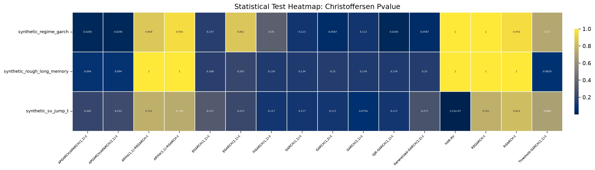
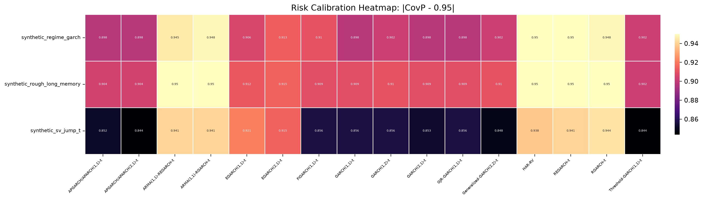
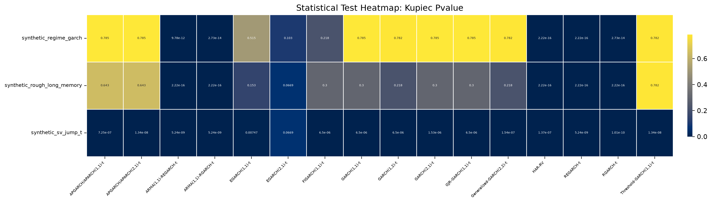
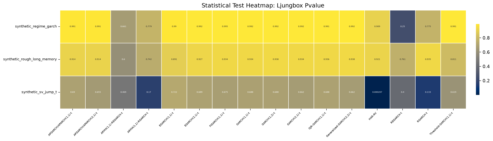

# Classical Volatility Benchmarks

Classical volatility forecasting benchmarks for realized-volatility measures, GARCH-family models, realized GARCH-based models, risk evaluation, statistical tests, visualization, and sensitivity analysis.

This README displays the generated diagrams directly in the GitHub interface. The full numerical CSV files remain available under `docs/results/`, but the large tables are intentionally not embedded here.

## Scope

- **Realized volatility measures**: RV, RBV, RTV, and TrueSD/proxy TrueSD.
- **Classical volatility models**: HAR-RV, GARCH, GJR-GARCH, Threshold-GARCH/TARCH, FIGARCH, EGARCH, Generalized GARCH, and APGARCH/APARCH.
- **Realized GARCH-based models**: RGARCH, ARMA-RGARCH, REGARCH, and ARMA-REGARCH.
- **Risk metrics**: VaR, ES, CRPS, and coverage probability.
- **Statistical tests**: Kupiec, Christoffersen, Diebold-Mariano, and Ljung-Box tests.
- **Sensitivity analysis**: realized-volatility window, tail probability, and train/test split.

## Installation

```bash
git clone https://github.com/statsdl/classical-volatility-benchmarks.git
cd classical-volatility-benchmarks
python3 -m venv .venv
source .venv/bin/activate
python -m pip install --upgrade pip
python -m pip install -e ".[dev]"
```

## Visual Results and Discussion

### Summary Christoffersen Pvalue Heatmap



This statistical-test diagram summarizes whether forecast violations are consistent with the expected risk level. Larger p-values generally indicate fewer signs of misspecification.

### Summary Coverage Error Heatmap



This coverage diagram evaluates VaR calibration. Values closer to the target coverage level indicate better risk-model reliability.

### Summary Covp Heatmap


This coverage diagram evaluates VaR calibration. Values closer to the target coverage level indicate better risk-model reliability.

### Summary Crps Covp Scatter


This risk-scoring diagram summarizes the sharpness and calibration of probabilistic forecasts. Smaller CRPS values indicate stronger distributional forecasting performance.

### Summary Crps Heatmap


This risk-scoring diagram summarizes the sharpness and calibration of probabilistic forecasts. Smaller CRPS values indicate stronger distributional forecasting performance.

### Summary Kupiec Pvalue Heatmap



This statistical-test diagram summarizes whether forecast violations are consistent with the expected risk level. Larger p-values generally indicate fewer signs of misspecification.

### Summary Ljungbox Pvalue Heatmap



This statistical-test diagram summarizes whether forecast violations are consistent with the expected risk level. Larger p-values generally indicate fewer signs of misspecification.

### Summary Mae Heatmap


This accuracy diagram compares forecasting errors across datasets and models. Models with consistently smaller annotated values are more stable and accurate across volatility regimes.

### Summary Qlike Heatmap


This accuracy diagram compares forecasting errors across datasets and models. Models with consistently smaller annotated values are more stable and accurate across volatility regimes.

### Summary Rmse Heatmap


This accuracy diagram compares forecasting errors across datasets and models. Models with consistently smaller annotated values are more stable and accurate across volatility regimes.

### Sensitivity Covp By Alpha


This coverage diagram evaluates VaR calibration. Values closer to the target coverage level indicate better risk-model reliability.

### Sensitivity Crps By Train Fraction


This risk-scoring diagram summarizes the sharpness and calibration of probabilistic forecasts. Smaller CRPS values indicate stronger distributional forecasting performance.

### Sensitivity Rmse By Window


This accuracy diagram compares forecasting errors across datasets and models. Models with consistently smaller annotated values are more stable and accurate across volatility regimes.

### Synthetic Regime Garch Crps


This risk-scoring diagram summarizes the sharpness and calibration of probabilistic forecasts. Smaller CRPS values indicate stronger distributional forecasting performance.

### Synthetic Regime Garch Covp


This coverage diagram evaluates VaR calibration. Values closer to the target coverage level indicate better risk-model reliability.

### Synthetic Regime Garch Mae


This accuracy diagram compares forecasting errors across datasets and models. Models with consistently smaller annotated values are more stable and accurate across volatility regimes.

### Synthetic Regime Garch Qlike


This accuracy diagram compares forecasting errors across datasets and models. Models with consistently smaller annotated values are more stable and accurate across volatility regimes.

### Synthetic Regime Garch Rmse


This accuracy diagram compares forecasting errors across datasets and models. Models with consistently smaller annotated values are more stable and accurate across volatility regimes.

### Synthetic Regime Garch Actual Vs Forecast


This figure summarizes model behavior across datasets. Lower error-oriented values indicate stronger forecasting accuracy, while coverage-oriented plots should be interpreted relative to the nominal coverage level.

### Synthetic Rough Long Memory Crps


This risk-scoring diagram summarizes the sharpness and calibration of probabilistic forecasts. Smaller CRPS values indicate stronger distributional forecasting performance.

### Synthetic Rough Long Memory Covp


This coverage diagram evaluates VaR calibration. Values closer to the target coverage level indicate better risk-model reliability.

### Synthetic Rough Long Memory Mae


This accuracy diagram compares forecasting errors across datasets and models. Models with consistently smaller annotated values are more stable and accurate across volatility regimes.

### Synthetic Rough Long Memory Qlike


This accuracy diagram compares forecasting errors across datasets and models. Models with consistently smaller annotated values are more stable and accurate across volatility regimes.

### Synthetic Rough Long Memory Rmse


This accuracy diagram compares forecasting errors across datasets and models. Models with consistently smaller annotated values are more stable and accurate across volatility regimes.

### Synthetic Rough Long Memory Actual Vs Forecast


This figure summarizes model behavior across datasets. Lower error-oriented values indicate stronger forecasting accuracy, while coverage-oriented plots should be interpreted relative to the nominal coverage level.

### Synthetic Sv Jump T Crps


This risk-scoring diagram summarizes the sharpness and calibration of probabilistic forecasts. Smaller CRPS values indicate stronger distributional forecasting performance.

### Synthetic Sv Jump T Covp


This coverage diagram evaluates VaR calibration. Values closer to the target coverage level indicate better risk-model reliability.

### Synthetic Sv Jump T Mae


This accuracy diagram compares forecasting errors across datasets and models. Models with consistently smaller annotated values are more stable and accurate across volatility regimes.

### Synthetic Sv Jump T Qlike


This accuracy diagram compares forecasting errors across datasets and models. Models with consistently smaller annotated values are more stable and accurate across volatility regimes.

### Synthetic Sv Jump T Rmse


This accuracy diagram compares forecasting errors across datasets and models. Models with consistently smaller annotated values are more stable and accurate across volatility regimes.

### Synthetic Sv Jump T Actual Vs Forecast


This figure summarizes model behavior across datasets. Lower error-oriented values indicate stronger forecasting accuracy, while coverage-oriented plots should be interpreted relative to the nominal coverage level.

## Overall Discussion

Overall, the average-rank summary identifies `GARCH(1,2)-t, GARCH(1,1)-t, Generalized-GARCH(2,2)-t` as the most competitive models across the available datasets. For forecasting accuracy, `HAR-RV` obtains the strongest average rank across the available error metrics. For risk evaluation, `Threshold-GARCH(1,1)-t` gives the best average risk rank after combining CRPS and coverage behavior. For statistical-test behavior, `GARCH(1,2)-t` shows the strongest average rank across the available diagnostic tests. The accuracy figures emphasize point-forecast precision, the risk figures evaluate VaR/ES-style calibration and probabilistic sharpness, and the statistical-test figures indicate whether exceedances and residual behavior are consistent with the model assumptions. Therefore, the preferred model is not necessarily the one with the smallest error in one dataset, but the one that remains accurate, risk-calibrated, and statistically stable across the full benchmark.

The heatmaps compare models across datasets using compact annotations so that the values remain inside each cell. Accuracy metrics such as RMSE, MAE, and QLIKE should be minimized. Risk metrics such as CRPS should also be minimized, while coverage probability should remain close to the nominal level. Statistical diagnostics are interpreted jointly with the accuracy and risk metrics because a model can have low error but still produce poorly calibrated risk forecasts.

## Conclusion

The benchmark indicates that model choice should be based on a combined evaluation of forecasting accuracy, probabilistic risk quality, statistical validity, and robustness under sensitivity settings. The average-rank table below summarizes this combined evidence and is the compact replacement for the full tables.

## Average Rank Summary

Lower rank is better. The final rank combines the available accuracy, risk, and statistical-test ranks.

| Final Rank | Model | Accuracy Rank | Risk Rank | Statistical Rank | Overall Average Rank |
| --- | --- | --- | --- | --- | --- |
| 1 | GARCH(1,2)-t | 9.833 | 5.333 | 6.917 | 7.361 |
| 2 | GARCH(1,1)-t | 9.083 | 6.500 | 7.194 | 7.593 |
| 3 | Generalized-GARCH(2,2)-t | 10.167 | 5.417 | 7.306 | 7.630 |
| 4 | FIGARCH(1,1)-t | 8.667 | 7.667 | 7.056 | 7.796 |
| 5 | GJR-GARCH(1,1)-t | 10.250 | 6.000 | 8.056 | 8.102 |
| 6 | GARCH(2,1)-t | 9.583 | 6.750 | 8.028 | 8.120 |
| 7 | EGARCH(2,1)-t | 9.750 | 7.500 | 7.278 | 8.176 |
| 8 | APGARCH/APARCH(1,1)-t | 12.833 | 4.083 | 8.611 | 8.509 |
| 9 | EGARCH(1,1)-t | 8.750 | 8.667 | 8.111 | 8.509 |
| 10 | ARMA(1,1)-RGARCH-t | 3.583 | 13.583 | 8.639 | 8.602 |
| 11 | REGARCH-t | 3.250 | 14.083 | 8.722 | 8.685 |
| 12 | ARMA(1,1)-REGARCH-t | 3.917 | 13.500 | 10.111 | 9.176 |
| 13 | RGARCH-t | 5.667 | 14.417 | 7.528 | 9.204 |
| 14 | HAR-RV | 2.250 | 14.417 | 11.167 | 9.278 |
| 15 | APGARCH/APARCH(2,1)-t | 13.333 | 5.000 | 9.694 | 9.343 |
| 16 | Threshold-GARCH(1,1)-t | 15.083 | 3.083 | 9.972 | 9.380 |

## Result Files

The complete CSV tables are available in `docs/results/`:

- `all_forecast_metrics.csv`
- `all_risk_metrics.csv`
- `all_statistical_tests.csv`
- `sensitivity_results.csv`
- `average_model_ranks.csv`

## License

This repository is released under the MIT License.
